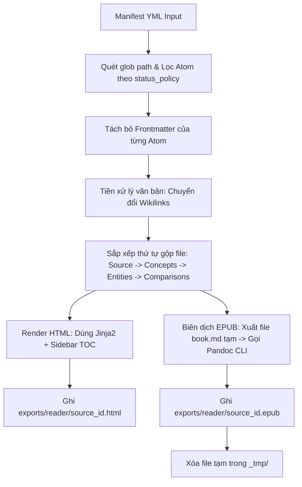

# SPEC — Multi-Format Reader Exporter (HTML & EPUB)

> Version: 1.0 | Date: 2026-05-22 | Status: APPROVED_WITH_MODIFICATIONS  
> Author: Antigravity @pm & @engineer | Schema: v1.0 (Reader Engine)

---

## 1. BỐI CẢNH & MỤC TIÊU

### 1.1 Vấn đề
Đọc Markdown thô của các Atom trực tiếp trên thiết bị di động (iPad/iPhone) gây mệt mỏi cho mắt và làm giảm hiệu quả học tập. Obsidian Mobile hoạt động nặng nề và khó tùy biến giao diện đọc tĩnh.

### 1.2 Mục tiêu
Xây dựng công cụ gọn nhẹ để xuất bản các Atom tri thức thành 2 định dạng đọc tối ưu trên iPad/iPhone:
1.  **HTML Reader (Đọc phi tuyến tính):** Giữ nguyên Wikilinks, có Sidebar TOC, responsive hoàn hảo trên Safari di động.
2.  **EPUB Reader (Đọc tuyến tính):** Đóng gói thành sách điện tử để đọc mượt mà, lật trang, đổi font trên ứng dụng **Apple Books** mặc định (miễn phí).

---

## 2. KIẾN TRÚC HỆ THỐNG & ĐẦU VÀO (MANIFEST)

Hệ thống hoạt động theo nguyên tắc **Manifest-first** nhằm kiểm soát chính xác danh sách các Atom được đưa vào gói xuất bản, tránh việc Agent tự ý suy luận sai lệch cấu trúc đặt tên (Naming Lock).

### 2.1 File Cấu hình Manifest (`[source_id].reader.yml`)
Được lưu trữ tại: `exports/reader/[source_id].reader.yml`

```yaml
source_id: "ARCH_TIS"
title: "Thinking in Systems Reader"
author: "AN"
language: "vi"
outputs:
  html: "exports/reader/ARCH_TIS.html"
  epub: "exports/reader/ARCH_TIS.epub"

include:
  - "3-resources/wiki/sources/SOURCE_ARCH_TIS.md"
  - "3-resources/wiki/concepts/CONCEPT_*.md"
  - "3-resources/wiki/entities/ENTITY_*.md"
  - "3-resources/wiki/comparisons/COMPARE_*.md"

status_policy:
  allow:
    - "VERIFIED"
    - "SYNTHESIZED"
  allow_draft: false
  exclude:
    - "DRAFT"
    - "REJECTED"
    - "STALE"

link_policy:
  preserve_wikilinks: false
  epub_link_mode: "internal_anchor"
  missing_link_behavior: "warn"

epub:
  toc: true
  toc_depth: 2
  css: "scripts/learning/templates/epub_style.css"
```

### 2.2 Vị trí các File Exporter & Templates
```text
NoteBookLLM_Br/
├── scripts/
│   └── learning/
│       ├── export_source_reader.py          ← Script Python thực thi chính
│       └── templates/
│           ├── learning_pack_reader.html    ← Template HTML Jinja2
│           └── epub_style.css               ← File CSS định dạng cho EPUB/Apple Books
├── exports/
│   └── reader/
│       ├── _tmp/                            ← Thư mục chứa file trung gian tạm thời (được dọn dẹp sau khi build)
│       └── [source_id].reader.yml           ← File Manifest đầu vào
```

---

## 3. LUỒNG XỬ LÝ DỮ LIỆU & LOGIC XUẤT BẢN



### 3.1 Quy trình tiền xử lý Wikilinks (Wikilink Preprocessing)
Bởi vì Pandoc không tự nhận diện cú pháp `[[...]]` của Obsidian, script Python sẽ quét và thực hiện chuyển đổi trước khi chuyển dữ liệu sang bộ biên dịch:
*   **Nếu Atom đích có trong danh sách xuất bản (Manifest):**
    *   *HTML/EPUB mode:* Chuyển đổi thành internal anchor link: `<a href="#concept_system_structure">System Structure</a>`.
*   **Nếu Atom đích nằm ngoài danh sách xuất bản (Missing Link):**
    *   *Mặc định (missing_link_behavior: "warn"):* Chuyển đổi thành text thường kèm warning style để dễ nhận biết: `<span class="missing-link" title="Liên kết không có trong gói xuất bản này">System Structure</span>`.

### 3.2 Lệnh cài đặt Pandoc (System Dependency)
Yêu cầu cài đặt đúng ID chính thức từ Winget:
```powershell
winget install --source winget --exact --id JohnMacFarlane.Pandoc
```

### 3.3 Lệnh chạy Biên dịch EPUB
Script Python sẽ tự động tạo file Markdown tổng hợp tạm tại `exports/reader/_tmp/[source_id].book.md` và gọi Pandoc CLI:
```powershell
pandoc exports\reader\_tmp\ARCH_TIS.book.md `
  -o exports\reader\ARCH_TIS.epub `
  --from markdown+yaml_metadata_block `
  --to epub3 `
  --toc `
  --toc-depth=2 `
  --css scripts\learning\templates\epub_style.css `
  --metadata title="Thinking in Systems Reader" `
  --metadata lang="vi"
```

---

## 4. TIÊU CHÍ CHẤP NHẬN (ACCEPTANCE CRITERIA) & GIỚI HẠN

### 4.1 Quy mô MVP hỗ trợ
*   Số lượng Atom tối ưu: **20 - 80 Atoms**.
*   Dung lượng file EPUB đầu ra: **< 20MB** (khi không nhúng các tệp ảnh/tài sản quá lớn).
*   Chạy offline mượt mà trên Safari di động (với HTML) và Apple Books (với EPUB).

### 4.2 Non-Goals (Không thực hiện ở MVP)
*   Không hỗ trợ Graph View tương tác trong file EPUB.
*   Không hỗ trợ hiển thị Backlinks động trong EPUB.
*   Không hỗ trợ tính năng Popover Preview (bong bóng xem nhanh) và Double-tap navigation trên iPad ở bản MVP (hoãn lại Phase 2 để tối ưu hóa sự tương thích touch-event của Safari di động).
*   Không ghi bất kỳ tệp tin nào vào thư mục tri thức chính `3-resources/wiki/` (chỉ ghi vào `exports/reader/`).

---

## 5. HƯỚNG DẪN VẬN HÀNH

### Lệnh chạy xuất bản:
```powershell
.venv\Scripts\python.exe scripts\learning\export_source_reader.py --manifest exports\reader\ARCH_TIS.reader.yml
```
