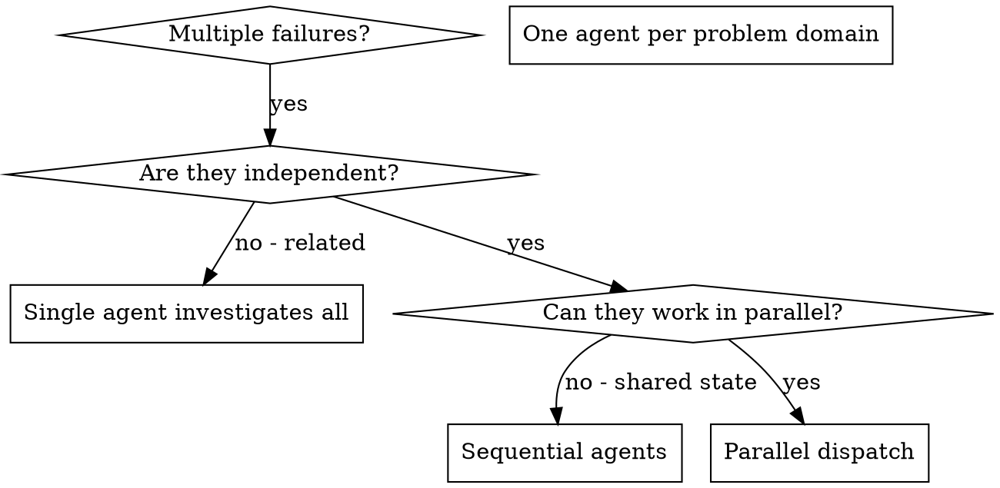

# Dispatching Parallel Agents (Vault Standard)

## Overview

You delegate tasks to specialized agents with isolated context. By precisely crafting their instructions and context, you ensure they stay focused and succeed at their task. They should never inherit your session's context or history — you construct exactly what they need. This also preserves your own context for coordination work.

When you have multiple unrelated failures (different test files, different subsystems, different bugs), investigating them sequentially wastes time. Each investigation is independent and can happen in parallel.

**Core principle:** Dispatch one agent per independent problem domain. Let them work concurrently, but always audit the token budget to prevent context bloating.

---

## When to Use



**Use when:**
- 3+ test files failing with different root causes
- Multiple subsystems broken independently
- Each problem can be understood without context from others
- No shared state between investigations

**Don't use when:**
- Failures are related (fixing one might fix others)
- Need to understand full system state
- Agents would interfere with each other (editing same files, using same resources)
- Total token budget of the session is almost exhausted (> 80%)

---

## The Pattern

### 1. Identify Independent Domains
Group failures by what's broken. Ensure fixing one domain has zero impact on another.

### 2. Create Focused Agent Tasks
Each agent gets a specific scope, a clear goal, strict constraints, and an expected output structure.

### 3. Run Token Budget & Circuit Breaker Check [VAULT ADAPTATION]
Before launching any subagents, you must calculate estimated token consumption to protect the session's context limit.

### 4. Dispatch in Parallel / Sequential Fallback
Launch subagents concurrently if budget permits; otherwise, execute sequentially or address the tasks directly in the main session.

### 5. Review and Integrate
When agents return, review their findings, check for code conflicts, run the full test suite, and integrate changes surgically.

---

## Vault Adaptation: Token Budget & Circuit Breaker Guard

Trước khi gọi công cụ `invoke_subagent` song song, bạn **BẮT BUỘC** phải thực hiện quy trình kiểm tra 3 bước sau:

### Bước 1: Khảo sát ngân sách Token (Token Budget Audit)
Hãy ước lượng dung lượng token của phiên chính và các subagent định khởi chạy:
- **Dung lượng token phiên hiện tại:** Ước lượng bằng công thức `words * 1.3` (cho văn bản) hoặc `chars / 4` (cho code).
- **Dung lượng token dự kiến của subagent:** Ước lượng lượng context truyền vào (system prompt + file contexts).
- **Tổng dung lượng dự kiến:** `Main Session Tokens + (Subagent count * Subagent estimated tokens)`.
- **Ngưỡng giới hạn Context Window:** Ví dụ với Gemini 2.0 Flash là **1,000,000 tokens**.

### Bước 2: Kích hoạt Ngắt mạch (Circuit Breaker Check)
- **Nếu Tổng dự toán < 70% Context Window:** Thực hiện dispatch song song một cách an toàn.
- **Nếu Tổng dự toán từ 70% - 80% Context Window:** Phát cảnh báo phình token trong chat. Hãy tối giản dung lượng file truyền vào subagents (chỉ truyền line range cần thiết thay vì full file) trước khi chạy.
- **Nếu Tổng dự toán > 80% Context Window:** **DỪNG LẠI (NGẮT MẠCH)**. Tuyệt đối cấm chạy song song. Phải chuyển sang chế độ chạy tuần tự (Sequential Fallback) hoặc giải quyết trực tiếp tại phiên chính.

### Bước 3: Rà soát & Hợp nhất an toàn (Surgical Integration)
- Khi các subagents trả về kết quả, tiến hành so sánh diff cực kỳ cẩn thận.
- Đảm bảo các subagents không sửa đổi trùng lặp chéo lên cùng một file hoặc cùng một dòng code gây tranh chấp.
- Chạy lại 100% test suites liên quan để xác nhận tích hợp an toàn.

---

## Agent Prompt Structure

Good agent prompts are:
1. **Focused** - One clear problem domain.
2. **Self-contained** - All context needed to understand the problem.
3. **Specific about output** - What should the agent return?

### Example Prompt

```markdown
Fix the 3 failing tests in src/agents/agent-tool-abort.test.ts:

1. "should abort tool with partial output capture" - expects 'interrupted at' in message
2. "should handle mixed completed and aborted tools" - fast tool aborted instead of completed
3. "should properly track pendingToolCount" - expects 3 results but gets 0

Your task:
1. Read the test file and understand what each test verifies.
2. Identify root cause - timing issues or actual bugs?
3. Fix surgically without overcomplicating or affecting other files.

Do NOT just increase timeouts - find the real issue.
Return: Summary of what you found and what you fixed (and the exact diff).
```

---

## Common Mistakes

- **❌ Too broad:** "Fix all the tests" - agent gets lost in massive context.
- **✅ Specific:** "Fix agent-tool-abort.test.ts" - focused scope.
- **❌ No budget audit:** Launching 5 parallel subagents with huge file lists, blowing up the token budget.
- **✅ Budget Guard:** Checking current tokens and running sequentially if the budget is tight.
