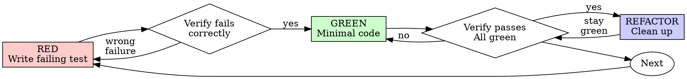

# Test-Driven Development (TDD)

Write the test first. Watch it fail. Write minimal code to pass.

**Core principle:** If you didn't watch the test fail, you don't know if it tests the right thing.

<EXTREMELY-IMPORTANT>
NO PRODUCTION CODE WITHOUT A FAILING TEST FIRST

Nếu lỡ viết code trước test? Xóa sạch và làm lại từ đầu. Delete means delete.
</EXTREMELY-IMPORTANT>

## Phase 0: Thinking Stage (Giai đoạn suy nghĩ bắt buộc)

Trước khi viết bất kỳ dòng test code nào, agent bắt buộc phải:
1. Xác định hành vi (Behavior) cụ thể cần được kiểm tra.
2. Liệt kê toàn bộ các Edge Cases (dữ liệu rỗng, sai định dạng, giá trị biên).
3. Thiết lập chiến lược Mocking (hạn chế tối đa mock trừ khi không thể cô lập).

## Red-Green-Refactor Cycle

### 1. RED - Write Failing Test
Write one minimal test showing what should happen. Edge cases and clean names are mandatory.

### 2. Verify RED - Watch It Fail
MANDATORY. Run the test suite and confirm it fails due to missing features or reproducing the exact bug (not typos).

### 3. GREEN - Minimal Code
Write the simplest and minimal production code to pass the test. Do not over-engineer. Follow YAGNI strictly.

### 4. Verify GREEN & Recursive Self-Healing (Max 3 Loops)
Run the test again. 
- If the test **passes**, proceed to Refactor.
- If the test **fails**, trigger the **Recursive Self-Healing Loop**:
    1. **Analyze:** Read the error log carefully to locate the bug.
    2. **Hypothesize:** Formulate a solid hypothesis on why the code failed.
    3. **Patch:** Apply a precise fix using precise edit tools.
    4. **Circuit Breaker:** Nếu sau **3 lần tự vá lỗi liên tiếp** test vẫn FAIL, agent **BẮT BUỘC PHẢI DỪNG LẠI** và báo cáo lỗi cho con người kèm phân tích chi tiết của 3 nỗ lực.

### 5. REFACTOR - Clean Up
Remove duplication, improve names, and simplify structure. Ensure tests remain green.

## Rules of Discipline
- **Zero Placeholder:** Cấm sử dụng "TODO" hoặc stub code trong các production files.
- **Verification Guard:** Tuyệt đối không báo DONE hoặc chốt task khi toàn bộ test suite chưa đạt trạng thái xanh (GREEN).
- **Isolated Tests:** Mỗi test file phải độc lập, không phụ thuộc vào trạng thái test trước đó.
- **No Test Altering:** Tuyệt đối cấm sửa đổi Test Case để làm nó pass thay vì sửa production code.
