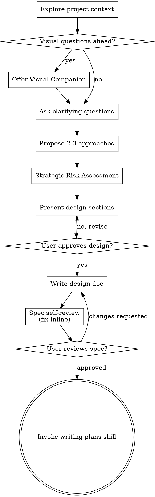

Help turn ideas into fully formed designs and specs through natural collaborative dialogue.

Start by understanding the current project context, then ask questions one at a time to refine the idea. Once you understand what you're building, present the design and get user approval.

<HARD-GATE>
Do NOT invoke any implementation skill, write any code, scaffold any project, or take any implementation action until you have presented a design and the user has approved it. This applies to EVERY project regardless of perceived simplicity.
</HARD-GATE>

## Checklist
You MUST create a task for each of these items and complete them in order:

1. **Explore project context** — check files, docs, recent commits
2. **Offer visual companion** (if visual questions are ahead) — must be its own separate message
3. **Ask clarifying questions** — one at a time, focus on purpose/constraints/success criteria
4. **Propose 2-3 approaches** — with trade-offs and your recommendation
5. **Strategic Risk Assessment** — Assess Impact Level, Breaking Changes, and Security
6. **Present design** — in sections, get user approval after each section
7. **Write design doc** — save to `docs/superpowers/specs/YYYY-MM-DD-<topic>-design.md` and commit
8. **Spec self-review** — check for placeholders, contradictions, ambiguity, scope
9. **User reviews written spec** — ask user to review the spec file before proceeding
10. **Transition to implementation** — invoke writing-plans skill to create implementation plan

## Process Flow


## NoteBookLLM_Br Override & Risk Boundaries

- **Atomic Steps:** Mỗi bước trong kế hoạch triển khai nháp phải đạt tiêu chí nhỏ gọn (hoàn thành trong ≤ 30 phút).
- **Ranh giới Ingest:** Kỹ năng brainstorming chỉ được phép dùng cho exploration/design nháp và ghi spec markdown cục bộ. **Cấm tuyệt đối** brainstorming tự động tạo, promote, hoặc ghi đè canonical atom trực tiếp lên `3-resources/`.
- **Two-Phase Execution Rule:** Đối với các dự án di trú lớn hoặc refactor diện rộng, tài liệu thiết kế phải phân rã độc lập thành Track A (Stabilize - tương thích & kiểm thử) và Track B (Refactor - thay đổi có nguy cơ kèm rollback map).

## The Process

**Understanding the idea:**
- Check out the current project state first (files, docs, recent commits).
- Before asking detailed questions, assess scope. If too large, decompose first.
- Ask questions one at a time - focus on purpose, constraints, success criteria.
- Prefer multiple choice questions when possible.

**Exploring approaches & Risk Assessment:**
- Propose 2-3 different approaches with trade-offs. Lead with your recommended option.
- **Assess Risks:**
    - *Impact Level:* (Low/Med/High) — How many files/modules does this affect?
    - *Breaking Changes:* Will this break any currently working features?
    - *Security:* Does this create vulnerabilities?

**Presenting the design:**
- Once you believe you understand what you're building, present the design.
- Scale each section to its complexity. Cover: architecture, components, data flow, error handling, testing.
- Ask after each section whether it looks right so far.

## After the Design
- **Documentation:** Write the validated design (spec) to `docs/superpowers/specs/YYYY-MM-DD-<topic>-design.md`.
- **Spec Self-Review:** Check for placeholders, internal consistency, scope, and ambiguity. Fix inline.
- **User Review Gate:** Ask user to review the written spec. Wait for approval.
- **Implementation:** Invoke the `writing-plans` skill to create a detailed implementation plan. Do NOT invoke any other skill.
```
