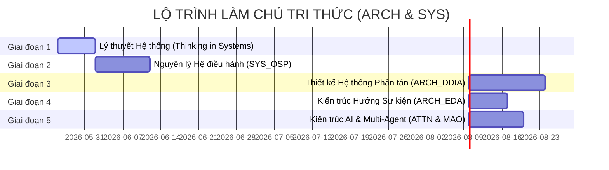

# 🗺️ BẢN ĐỒ THIẾT KẾ ATOM TRI THỨC (ARCH & SYS)

> **Mô hình**: Semantic Learning Map & Scout Blueprint
> **Mục tiêu**: Định tuyến và tính toán các Atom cần tạo cho các nguồn chưa ingest thuộc nhóm Architecture (ARCH) và Systems (SYS) trong `sources-pending/`, đồng thời thiết lập mối quan hệ phi tuyến tính với các Atom `ARCH_TIS` hiện hữu.
> **Trạng thái**: `PREVIEW_ONLY` | **Canonical Status**: `NON_CANONICAL`
> **Generated**: 2026-05-26 | **Tài liệu tham chiếu**: `00_Inbox/sources-pending/source_registry.md`

---

## 1. Bản Đồ Tổng Quan & Mối Quan Hệ Tri Thức (Cross-Linking Graph)

Biểu đồ dưới đây mô tả cách các nguồn tri thức mới kết nối chéo với lõi lý thuyết hệ thống kinh điển của `ARCH_TIS` (Thinking in Systems - Donella Meadows) đã có sẵn trong Vault.

```mermaid
graph TD
    %% Định nghĩa Style
    classDef tisStyle fill:#1a365d,stroke:#3182ce,stroke-width:2px,color:#fff;
    classDef archStyle fill:#2d3748,stroke:#4a5568,stroke-width:2px,color:#fff;
    classDef sysStyle fill:#2c5282,stroke:#2b6cb0,stroke-width:2px,color:#fff;
    classDef newStyle fill:#2f855a,stroke:#48bb78,stroke-width:2px,color:#fff,stroke-dasharray: 5 5;

    %% Lõi ARCH_TIS hiện hữu
    TIS_Core["LÕI HỆ THỐNG<br>(ARCH_TIS)"]:::tisStyle
    TIS_Feedback["Feedback Loop<br>(CONCEPT_ARCH_TIS_Feedback_Loop)"]:::tisStyle
    TIS_Delay["Delay & Latency<br>(CONCEPT_ARCH_TIS_Delay)"]:::tisStyle
    TIS_Structure["System Structure<br>(CONCEPT_ARCH_TIS_System_Structure)"]:::tisStyle
    TIS_Traps["System Traps / Antipatterns<br>(CONCEPT_ARCH_TIS_System_Traps)"]:::tisStyle

    %% Các nguồn tri thức mới (Source Nodes)
    SRC_DDIA["Designing Data-Intensive Apps<br>(arch_designing_data_intensive_applications)"]:::archStyle
    SRC_EDA["Event-Driven Architecture<br>(arch_event_driven_architecture)"]:::archStyle
    SRC_MAO["Multi-Agent Orchestration<br>(arch_multi_agent_orchestration)"]:::archStyle
    SRC_ATTN["Attention Is All You Need<br>(arch_attention_paper)"]:::archStyle
    SRC_OSP["Operating Systems Principles<br>(sys_operating_systems_principles)"]:::sysStyle

    %% Các Atom cốt lõi dự kiến cần tạo
    ATOM_Replication["Replication & Consensus<br>(CONCEPT_ARCH_DDIA_Consensus)"]:::newStyle
    ATOM_LSM["SSTables & LSM-Trees<br>(CONCEPT_ARCH_DDIA_LSM_Trees)"]:::newStyle
    ATOM_Saga["Saga & CQRS Patterns<br>(CONCEPT_ARCH_EDA_CQRS)"]:::newStyle
    ATOM_SelfAttn["Self-Attention Mechanism<br>(CONCEPT_ARCH_ATTN_Self_Attention)"]:::newStyle
    ATOM_Decomp["Task Decomposition<br>(CONCEPT_ARCH_MAO_Task_Decomposition)"]:::newStyle
    ATOM_Memory["Virtual Memory & Paging<br>(CONCEPT_SYS_OSP_Virtual_Memory)"]:::newStyle

    %% Liên kết quan hệ
    TIS_Core --> TIS_Feedback
    TIS_Core --> TIS_Delay
    TIS_Core --> TIS_Structure
    TIS_Core --> TIS_Traps

    %% Kết nối nguồn mới với core lý thuyết
    SRC_DDIA -->|Ứng dụng cấu trúc| TIS_Structure
    SRC_DDIA --> ATOM_Replication
    SRC_DDIA --> ATOM_LSM
    ATOM_Replication -.->|Xử lý trễ dữ liệu| TIS_Delay
    ATOM_Replication -.->|Giải quyết bế tắc phân tán| TIS_Traps

    SRC_EDA --> ATOM_Saga
    ATOM_Saga -.->|Phản hồi không đồng bộ| TIS_Feedback

    SRC_MAO --> ATOM_Decomp
    ATOM_Decomp -.->|Phân cấp hệ thống tự tổ chức| TIS_Core

    SRC_ATTN --> ATOM_SelfAttn
    ATOM_SelfAttn -.->|Lập lịch trọng số ngữ cảnh| TIS_Structure

    SRC_OSP --> ATOM_Memory
    ATOM_Memory -.->|Tối ưu tài nguyên giới hạn| TIS_Core
```



---

## 2. Tính Toán & Thiết Kế Atom Chi Tiết Theo Từng Nguồn (Source-scoped Atom Blueprint)

Dưới đây là danh sách phân tích chi tiết các Atom tri thức cần tạo cho từng `source_id` cụ thể thuộc nhóm `ARCH` và `SYS`.

### 2.1. Nguồn `arch_designing_data_intensive_applications`
*   **Tên tài liệu**: `ARCH_Designing_Data_Intensive_Applications.pdf` (Martin Kleppmann)
*   **Source Prefix đề xuất**: `ARCH_DDIA` (Designing Data-Intensive Applications)
*   **Số lượng Atom dự kiến**: 8 Concepts | 1 Source | 1 Comparison

| Tên Atom dự kiến | Loại Atom | Nội dung cốt lõi | Liên kết chéo Obsidian (Wikilinks) |
| :--- | :--- | :--- | :--- |
| `SOURCE_ARCH_DDIA` | **Source** | Neo dữ liệu nguồn, mục lục, metadata, tóm tắt chương của cuốn sách DDIA. | `[[source_registry]]`, `[[CONCEPT_ARCH_TIS_System_Structure]]` |
| `CONCEPT_ARCH_DDIA_LSM_Trees` | **Concept** | Cơ chế ghi Log-Structured Merge-Trees, SSTables, Memtable và quá trình compaction. | `[[CONCEPT_ARCH_DDIA_B_Trees]]`, `[[CONCEPT_ARCH_TIS_Flow]]` |
| `CONCEPT_ARCH_DDIA_B_Trees` | **Concept** | Cấu trúc chỉ mục B-Trees truyền thống, cơ chế phân trang trên đĩa cứng và khóa. | `[[CONCEPT_ARCH_DDIA_LSM_Trees]]` |
| `CONCEPT_ARCH_DDIA_Replication_Lag` | **Concept** | Hiện tượng trễ sao chép trong hệ thống Distributed (Read-after-write, Monotonic read consistency). | `[[CONCEPT_ARCH_TIS_Delay]]`, `[[CONCEPT_ARCH_DDIA_Eventual_Consistency]]` |
| `CONCEPT_ARCH_DDIA_Eventual_Consistency` | **Concept** | Tính nhất quán cuối cùng trong hệ thống phân tán, các cam kết và giới hạn. | `[[CONCEPT_ARCH_DDIA_Replication_Lag]]` |
| `CONCEPT_ARCH_DDIA_Distributed_Consensus` | **Concept** | Đồng thuận phân tán: Thuật toán Raft, Paxos và bài toán Hai vị tướng / Đồng thuận Byzantine. | `[[CONCEPT_ARCH_TIS_Bounded_Rationality]]`, `[[CONCEPT_SYS_OSP_Deadlock_Prevention]]` |
| `CONCEPT_ARCH_DDIA_Partitioning_Sharding` | **Concept** | Kỹ thuật phân mảnh dữ liệu (Key-range partitioning, Hash partitioning) và vấn đề Hotspots. | `[[CONCEPT_ARCH_TIS_Hierarchy]]` |
| `CONCEPT_ARCH_DDIA_Isolation_Levels` | **Concept** | Các mức cô lập giao dịch ACID: Read Committed, Snapshot Isolation (MVCC), Serializable. | `[[CONCEPT_SYS_OSP_Mutex_Semaphore]]` |
| `COMPARE_ARCH_DDIA_LSM_vs_B_Tree` | **Comparison** | Bảng so sánh hiệu năng ghi/đọc, Write Amplification, Space Amplification giữa LSM-Trees và B-Trees. | `[[CONCEPT_ARCH_DDIA_LSM_Trees]]`, `[[CONCEPT_ARCH_DDIA_B_Trees]]` |

---

### 2.2. Nguồn `arch_event_driven_architecture`
*   **Tên tài liệu**: `ARCH_Event_Driven_Architecture.pdf`
*   **Source Prefix đề xuất**: `ARCH_EDA` (Event-Driven Architecture)
*   **Số lượng Atom dự kiến**: 4 Concepts | 1 Source

| Tên Atom dự kiến | Loại Atom | Nội dung cốt lõi | Liên kết chéo Obsidian (Wikilinks) |
| :--- | :--- | :--- | :--- |
| `SOURCE_ARCH_EDA` | **Source** | Tài liệu nguồn về kiến trúc hướng sự kiện, mô hình broker và mediator. | `[[source_registry]]` |
| `CONCEPT_ARCH_EDA_Event_Sourcing` | **Concept** | Lưu trữ toàn bộ trạng thái hệ thống dưới dạng một chuỗi các sự kiện lịch sử (Append-only). | `[[CONCEPT_ARCH_DDIA_LSM_Trees]]`, `[[CONCEPT_ARCH_EDA_CQRS]]` |
| `CONCEPT_ARCH_EDA_CQRS` | **Concept** | Command Query Responsibility Segregation — Tách biệt hoàn toàn mô hình đọc và ghi dữ liệu. | `[[CONCEPT_ARCH_EDA_Event_Sourcing]]` |
| `CONCEPT_ARCH_EDA_Saga_Pattern` | **Concept** | Giao dịch bù trừ (Compensating Transaction) để duy trì tính nhất quán dữ liệu giữa các microservices. | `[[CONCEPT_ARCH_TIS_Feedback_Loop]]`, `[[CONCEPT_ARCH_DDIA_Isolation_Levels]]` |

---

### 2.3. Nguồn `arch_attention_paper`
*   **Tên tài liệu**: `ARCH_Attention_Paper.pdf` (Attention Is All You Need — Vaswani et al.)
*   **Source Prefix đề xuất**: `ARCH_ATTN` (Attention Is All You Need)
*   **Số lượng Atom dự kiến**: 3 Concepts | 1 Source

| Tên Atom dự kiến | Loại Atom | Nội dung cốt lõi | Liên kết chéo Obsidian (Wikilinks) |
| :--- | :--- | :--- | :--- |
| `SOURCE_ARCH_ATTN` | **Source** | Paper nghiên cứu gốc kiến trúc Transformer, đánh dấu bước ngoặt của AI tạo sinh. | `[[source_registry]]` |
| `CONCEPT_ARCH_ATTN_Self_Attention` | **Concept** | Cơ chế Scaled Dot-Product Attention: Tính toán ma trận Query, Key, Value để tìm trọng số ngữ cảnh. | `[[CONCEPT_ARCH_ATTN_Multi_Head_Attention]]` |
| `CONCEPT_ARCH_ATTN_Multi_Head_Attention` | **Concept** | Chia nhỏ không gian chú ý thành nhiều đầu giúp mô hình song song hoá góc nhìn thông tin. | `[[CONCEPT_ARCH_ATTN_Self_Attention]]` |

---

### 2.4. Nguồn `arch_multi_agent_orchestration`
*   **Tên tài liệu**: `ARCH_Multi_Agent_Orchestration.pdf`
*   **Source Prefix đề xuất**: `ARCH_MAO` (Multi-Agent Orchestration)
*   **Số lượng Atom dự kiến**: 3 Concepts | 1 Source

| Tên Atom dự kiến | Loại Atom | Nội dung cốt lõi | Liên kết chéo Obsidian (Wikilinks) |
| :--- | :--- | :--- | :--- |
| `SOURCE_ARCH_MAO` | **Source** | Tài liệu thiết kế hệ thống đa Agent, giao thức điều phối và giải quyết mâu thuẫn. | `[[source_registry]]` |
| `CONCEPT_ARCH_MAO_Task_Decomposition` | **Concept** | Kỹ thuật phân rã mục tiêu lớn của User thành đồ thị các nhiệm vụ con (Sub-tasks) độc lập. | `[[CONCEPT_ARCH_TIS_Hierarchy]]` |
| `CONCEPT_ARCH_MAO_State_Sharing` | **Concept** | Cơ chế đồng bộ hóa bộ nhớ đệm (Short-term/Long-term Memory) và trạng thái giữa các Agent. | `[[CONCEPT_ARCH_DDIA_Distributed_Consensus]]` |

---

### 2.5. Nguồn `sys_operating_systems_principles`
*   **Tên tài liệu**: `Operating-Systems-Principles .pdf`
*   **Source Prefix đề xuất**: `SYS_OSP` (Operating System Principles)
*   **Số lượng Atom dự kiến**: 5 Concepts | 1 Source | 1 Comparison

| Tên Atom dự kiến | Loại Atom | Nội dung cốt lõi | Liên kết chéo Obsidian (Wikilinks) |
| :--- | :--- | :--- | :--- |
| `SOURCE_SYS_OSP` | **Source** | Sách giáo trình nguyên lý Hệ điều hành cơ bản (Tiến trình, luồng, quản lý bộ nhớ). | `[[source_registry]]` |
| `CONCEPT_SYS_OSP_Process_Thread` | **Concept** | Khái niệm Tiến trình (Process) và Luồng (Thread), cách phân chia không gian địa chỉ bộ nhớ. | `[[CONCEPT_SYS_OSP_Virtual_Memory]]` |
| `CONCEPT_SYS_OSP_Mutex_Semaphore` | **Concept** | Cơ chế đồng bộ hóa tiến trình, giải quyết Race Condition bằng Semaphore và Mutex Lock. | `[[CONCEPT_ARCH_DDIA_Isolation_Levels]]` |
| `CONCEPT_SYS_OSP_Virtual_Memory` | **Concept** | Cơ chế bộ nhớ ảo: Phân trang (Paging), bảng trang (Page Table), tráo đổi trang (Page Replacement). | `[[CONCEPT_SYS_OSP_Process_Thread]]`, `[[CONCEPT_ARCH_TIS_Limiting_Factor]]` |
| `CONCEPT_SYS_OSP_Deadlock_Prevention` | **Concept** | Bốn điều kiện Coffman gây ra bế tắc (Deadlock) và các thuật toán phòng ngừa (như Banker's). | `[[CONCEPT_ARCH_TIS_System_Traps]]`, `[[CONCEPT_ARCH_DDIA_Distributed_Consensus]]` |
| `COMPARE_SYS_OSP_Process_vs_Thread` | **Comparison** | Bảng so sánh chi tiết tài nguyên, tốc độ khởi tạo, chi phí chuyển ngữ cảnh (Context Switch) giữa Tiến trình và Luồng. | `[[CONCEPT_SYS_OSP_Process_Thread]]` |

---

## 2.6. Thứ Tự Đọc & Lộ Trình Làm Chủ Tri Thức (Reading Sequence)

Để giúp AN đạt hiệu quả học tập cao nhất, tránh quá tải thông tin (information overload) và xây dựng nền móng tri thức vững chắc từ thấp lên cao, tôi thiết lập **Thứ Tự Đọc Đề Xuất** gồm 5 giai đoạn phân lớp sau:



### 📈 Chi tiết từng bước của Lộ trình:

1.  **Giai đoạn 1: Nền tảng Tư duy Hệ thống (Core Systemic Foundation)**
    *   **Tài liệu học**: `arch_thinking_in_systems` (Thinking in Systems — **ĐÃ INGEST**)
    *   **Mục tiêu**: Nắm vững các khái niệm hệ thống cơ bản: *Feedback Loops (Vòng lặp phản hồi)*, *Delay (Trễ)*, *Stock & Flow*, *Bounded Rationality* và các *System Traps (Bẫy hệ thống)*.
    *   **Tại sao đi đầu**: Đây là ngôn ngữ vĩ mô. Mọi hệ thống phần mềm, mạng phân tán, hay OS thực chất đều là một hệ thống động phức tạp. Khi hiểu các bẫy hệ thống (như Tragedy of Commons hay Escalation), ta sẽ hiểu bản chất tại sao hệ thống phân tán lại bị bế tắc hay trễ.

2.  **Giai đoạn 2: Nguyên lý Máy Đơn Lẻ (Single-Machine / Operating Systems)**
    *   **Tài liệu học**: `sys_operating_systems_principles` (Operating System Principles — *Pending*)
    *   **Mục tiêu**: Hiểu cách một máy tính vật lý quản lý tài nguyên hữu hạn: *Process vs Thread*, *Memory Allocation (Paging)*, *CPU Scheduling*, và *Mutex/Semaphore*.
    *   **Tại sao đi thứ hai**: Trước khi học cách kết nối hàng ngàn máy tính, ta phải biết cách một máy tính vận hành. Nếu không hiểu mutex/semaphore ở tầng OS, ta không thể hiểu các mức cô lập giao dịch (Isolation Levels) hay đồng thuận phân tán (Consensus) ở tầng trên.

3.  **Giai đoạn 3: Thiết kế Hệ thống Dữ liệu Phân tán (High-Level / Distributed Systems)**
    *   **Tài liệu học**: `arch_designing_data_intensive_applications` (Designing Data-Intensive Applications — *Pending*)
    *   **Mục tiêu**: Chuyển đổi từ đơn máy lên đa máy: *Replication*, *Partitioning*, *Transactions*, *Eventual Consistency*, và *Consensus Algorithms (Raft, Paxos)*.
    *   **Tại sao đi thứ ba**: Đây là cuốn sách đồ sộ và quan trọng nhất. Nó áp dụng trực tiếp nguyên lý của OS (như ghi log SSTables/LSM-Trees giống hệt cơ chế ghi đĩa của OS) và nguyên lý của Systems (như replication lag chính là hiện tượng Delay trong hệ thống).

4.  **Giai đoạn 4: Kiến trúc Hướng Sự kiện & Phi Tập Trung (Decoupled & Event Architecture)**
    *   **Tài liệu học**: `arch_event_driven_architecture` (Event-Driven Architecture — *Pending*)
    *   **Mục tiêu**: Nắm bắt các mô hình xử lý không đồng bộ quy mô lớn: *Event Sourcing*, *CQRS*, *Outbox Pattern*, và *Saga Pattern (Giao dịch bù trừ)*.
    *   **Tại sao đi tư**: Khi hệ thống phân tán quá lớn, việc giao tiếp đồng bộ (HTTP/RPC) sẽ gây tắc nghẽn. Kiến trúc hướng sự kiện giúp tách biệt hoàn toàn các dịch vụ, tạo ra một hệ thống tự điều phối mềm dẻo.

5.  **Giai đoạn 5: Tương lai của Hệ thống - AI & Agentic Systems (Advanced AI Architecture)**
    *   **Tài liệu học**: 
        1.  `arch_attention_paper` (Attention Is All You Need — *Transformer Core*)
        2.  `arch_multi_agent_orchestration` (Multi-Agent Orchestration — *Agentic Swarm*)
    *   **Mục tiêu**: Làm chủ cấu trúc Transformer (Self-Attention) và cơ chế điều phối đa Agent (Task Decomposition, State Sharing, Conflict Resolution).
    *   **Tại sao là điểm cuối**: Đây là đỉnh cao của thiết kế hệ thống hiện đại, nơi chúng ta không chỉ xây dựng hệ thống tĩnh mà xây dựng các tác tử AI có khả năng tự suy luận, tự tổ chức và phối hợp giống như một bầy đàn sinh học (Swarm).

---

## 3. Lộ Trình Thực Thi & Triển Khai (Execution Pipeline)

Quy trình bóc tách từ các bản đồ thiết kế trên sang Atom chính thức trong Vault tuân thủ ranh giới an toàn nghiêm ngặt của `AGENTS.md`:

```
[1. Đọc nhanh / Scout] ---> [2. Thiết kế nháp ở 1-projects/] ---> [3. Ingest Lifecycle gọi promote.py] ---> [4. Vào wiki/]
```

### 🎯 Các bước hành động cho AN:
1.  **Chọn nguồn ưu tiên**: AN quyết định chọn một `source_id` cụ thể trong danh mục trên để tiến hành đọc nhanh / học trước (Ví dụ: `arch_designing_data_intensive_applications` là nguồn đồ sộ nhất).
2.  **Khởi động Ingest/Preview**: Gọi lệnh `/ingest` hoặc bắt đầu với quy trình `learning-first` để sinh ra các phân tích cụ thể của từng chương sách trước khi bóc tách thành các Atom thật.
