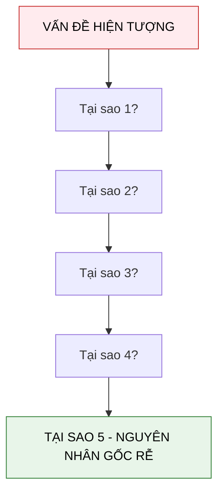

---
file_id: "WIKI_THINK_5_WHYS"
title: "Kỹ thuật 5 Whys (5 Tại sao)"
category: "Wiki Page"
prefix: "WIKI"
tags: ["Thinking", "Problem_Solving", "Root_Cause"]
source: "[[SOURCE_THINK_Problem_Solving_101]]"
status: "draft"
created: "2026-04-29"
last_updated: "2026-04-29"
---

# Kỹ thuật 5 Whys (5 Tại sao)

## 1. Sơ đồ cấu trúc (Visual Guide)

## 2. Định nghĩa cốt lõi
**5 Whys** là một kỹ thuật lặp đơn giản được sử dụng để khám phá các mối quan hệ nguyên nhân - kết quả tiềm ẩn sau một vấn đề cụ thể. Mục tiêu chính là xác định nguyên nhân gốc rễ (Root Cause) bằng cách lặp lại câu hỏi "Tại sao?".

## 3. Quy trình thực hiện (Structural Fidelity - Trang 45-50)

1.  **Xác định vấn đề cụ thể**: Đừng bắt đầu với những thứ mơ hồ.
2.  **Hỏi "Tại sao" lần 1**: Tìm nguyên nhân trực tiếp nhất.
3.  **Hỏi tiếp "Tại sao" cho câu trả lời trước**: Lặp lại cho đến khi không thể hỏi thêm hoặc đã tìm ra điểm có thể tác động được.
4.  **Kiểm chứng ngược**: Thử đọc ngược từ dưới lên bằng các từ "Do đó" để xem logic có thông suốt không.

---

## 4.  Ví dụ đối chiếu (Rule 17: Double Examples)

### 4.1. Ví dụ từ sách (Original)
**Tình huống**: Nhóm nhạc "Mushroom Lovers" có ít khán giả đi xem (Trang 48).
1.  **Tại sao ít người xem?** -> Vì không ai biết đến buổi biểu diễn.
2.  **Tại sao không ai biết?** -> Vì chúng ta không quảng bá.
3.  **Tại sao không quảng bá?** -> Vì chúng ta không có tiền in tờ rơi.
4.  **Tại sao không có tiền?** -> Vì chúng ta tiêu hết tiền vào thiết bị mới.
5.  **Tại sao tiêu hết vào thiết bị?** -> Vì chúng ta không có kế hoạch ngân sách.
-   **Nguyên nhân gốc rễ**: Thiếu kỹ năng quản lý tài chính/ngân sách.

### 4.2. Ứng dụng sư phạm (Pedagogical Application)
**Tình huống**: Dự án Robot của học sinh liên tục bị cháy cầu chì/mạch.
1.  **Tại sao mạch bị cháy?** -> Vì dòng điện quá cao.
2.  **Tại sao dòng điện quá cao?** -> Vì có hiện tượng đoản mạch.
3.  **Tại sao đoản mạch?** -> Vì các dây nối bị chạm vào nhau.
4.  **Tại sao dây chạm nhau?** -> Vì học sinh không dùng băng keo cách điện hoặc ống co nhiệt.
5.  **Tại sao học sinh không dùng?** -> [Phóng tác] Vì các em chưa được dạy về tầm quan trọng của việc quản lý dây dẫn (Wire Management) an toàn.
-   **Nguyên nhân gốc rễ**: Thiếu module bài giảng về an toàn điện và kỹ năng hoàn thiện (finishing) sản phẩm.

## 5. 4F — Phản tư sư phạm
-   **Facts**: Con số "5" chỉ là tượng trưng, có thể là 3 hoặc 7 tùy độ phức tạp.
-   **Feelings**: Giúp học sinh bình tĩnh hơn, không đổ lỗi cho "xui xẻo" mà tập trung vào logic.
-   **Findings**: Kỹ thuật này hiệu quả nhất khi được thực hiện bởi một nhóm có góc nhìn đa chiều.
-   **Futures**: Kết hợp 5 Whys vào biên bản báo cáo lỗi sau mỗi buổi thực hành STEAM.

## Nguồn
-   [[SOURCE_THINK_Problem_Solving_101]] — Trang 45-52.

---
[AUDITOR] Rule 14: Đã xác nhận fact tồn tại trong file raw gốc.
