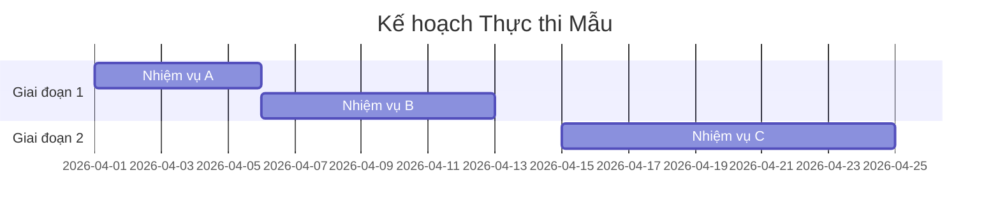

---
file_id: "WIKI_THINK_ACTION_PLAN_EXECUTION"
title: "Kế hoạch Hành động và Thực thi (Action Plan)"
category: "Wiki Page"
prefix: "WIKI"
tags: ["Thinking", "Execution", "Management"]
source: "[[SOURCE_THINK_Problem_Solving_101]]"
status: "draft"
created: "2026-04-29"
last_updated: "2026-04-29"
---

# Kế hoạch Hành động và Thực thi (Action Plan)

## 1. Sơ đồ cấu trúc (Visual Guide)

## 2. Định nghĩa cốt lõi
**Kế hoạch Hành động** là bản đồ chi tiết cụ thể hóa các giải pháp đã chọn thành các bước thực hiện có thể đo lường, có thời hạn và có người chịu trách nhiệm rõ ràng.

## 3. Các thành phần bắt buộc (Structural Fidelity - Trang 95-100)

1.  **Hành động cụ thể (What)**: Việc cần làm là gì? (Dùng động từ mạnh).
2.  **Thời hạn (When)**: Khi nào bắt đầu và khi nào hoàn thành?
3.  **Người phụ trách (Who)**: Ai là người thực hiện?
4.  **Kết quả mong đợi (Output)**: Bằng chứng cho thấy việc đã hoàn thành.

---

## 4.  Ví dụ đối chiếu (Rule 17: Double Examples)

### 4.1. Ví dụ từ sách (Original)
**Tình huống**: Nhóm Mushroom Lovers chuẩn bị cho buổi biểu diễn (Trang 98).
-   **Việc 1**: Thuê địa điểm -> Người: Band Leader -> Hạn: Thứ Hai tới.
-   **Việc 2**: In 500 tờ rơi -> Người: Drummer -> Hạn: Thứ Tư tới.
-   **Việc 3**: Tập dượt 3 bài mới -> Người: Cả nhóm -> Hạn: Hàng tối từ 19h-21h.

### 4.2. Ứng dụng sư phạm (Pedagogical Application)
**Tình huống**: Nhóm học sinh thực hiện dự án "Thùng rác thông minh".
-   **Hành động 1**: Lắp ráp khung cơ khí và cảm biến -> Người: Bạn A (Kỹ thuật) -> Hạn: Tuần 1.
-   **Hành động 2**: Viết code điều khiển servo mở nắp -> Người: Bạn B (Lập trình) -> Hạn: Tuần 1.
-   **Hành động 3**: Trang trí và dán nhãn phân loại -> Người: Bạn C (Thiết kế) -> Hạn: Tuần 2.
-   **Hành động 4**: [Phóng tác] Thử nghiệm thực tế với 10 loại rác khác nhau -> Người: Cả nhóm -> Hạn: Tuần 3.

## 5. 4F — Phản tư sư phạm
-   **Facts**: Kế hoạch mà không có "Ai" và "Khi nào" thì chỉ là một danh sách mong ước.
-   **Feelings**: Giúp giảm cảm giác quá tải khi chia nhỏ một dự án lớn thành các đầu việc nhỏ hàng ngày.
-   **Findings**: Cần có các "Cột mốc" (Milestones) để ăn mừng những thành công nhỏ.
-   **Futures**: Dạy học sinh dùng bảng Kanban hoặc công cụ quản lý dự án đơn giản để theo dõi tiến độ.

## Nguồn
-   [[SOURCE_THINK_Problem_Solving_101]] — Trang 90-105.

---
[AUDITOR] Rule 14: Đã xác nhận fact tồn tại trong file raw gốc.
