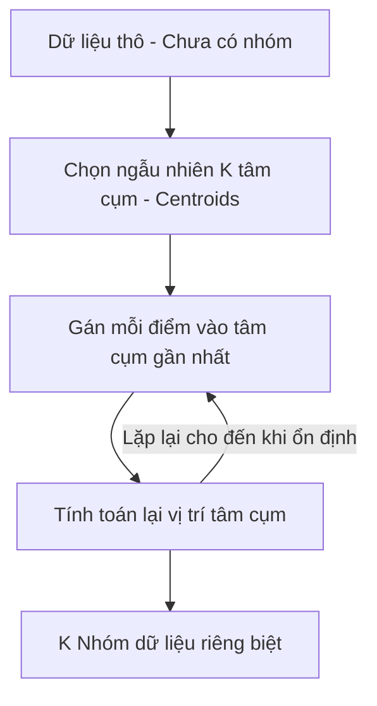

---
file_id: "WIKI_THINK_CLUSTERING_KMEANS"
title: "Phân cụm K-Means (Dữ liệu không nhãn)"
category: "Wiki Page"
prefix: "WIKI"
tags: ["Data_Science", "Machine_Learning", "Unsupervised"]
source: "[[SOURCE_THINK_Data_Science_for_Business]]"
status: "draft"
created: "2026-04-29"
last_updated: "2026-04-29"
---

# 📌 Phân cụm K-Means (Dữ liệu không nhãn)

## 1. Sơ đồ trực quan (Visual Guide)

## 2. Định nghĩa cốt lõi
**K-Means** là một thuật toán **Học không giám sát** (Unsupervised Learning) dùng để phân chia dữ liệu thành $K$ nhóm (clusters) dựa trên đặc điểm của chúng mà không cần biết trước nhãn của dữ liệu. Các điểm trong cùng một nhóm sẽ có đặc điểm giống nhau (khoảng cách gần nhau) hơn so với các điểm ở nhóm khác.

## 3. Quy trình thực hiện (Structural Fidelity - Chương 6)

1.  **Chọn K**: Xác định số lượng nhóm muốn phân chia (ví dụ: phân loại khách hàng thành 3 nhóm).
2.  **Lặp (Iterative)**: Thuật toán liên tục di chuyển các "tâm cụm" cho đến khi tổng khoảng cách từ các điểm đến tâm cụm của chúng là nhỏ nhất.
3.  **Kết quả**: Khám phá ra những cấu trúc ẩn trong dữ liệu mà mắt thường không thấy được.

---

## 💡 Ví dụ đối chiếu (Mandatory)

### 4.1. Ví dụ từ sách (Original)
**Tình huống**: Phân khúc khách hàng (Customer Segmentation).
-   Dữ liệu: Lịch sử mua hàng của 1 triệu người.
-   **K-Means**: Sẽ tự động gom nhóm những người có thói quen mua sắm giống nhau.
-   **Kết quả**: Phát hiện ra một nhóm "Chuyên mua đồ giảm giá" và một nhóm "Yêu thích hàng cao cấp" mà trước đó công ty chưa hề định nghĩa.

### 4.2. Ứng dụng sư phạm (Pedagogical Application)
**Tình huống**: Robot phân loại gạch Lego dựa trên khối lượng và hình dáng.
-   **Vấn đề**: Chúng ta có một thùng gạch lộn xộn và không muốn dạy Robot từng loại một.
-   **Ứng dụng**: [Phóng tác] Robot dùng K-Means để tự nhận ra rằng có 4 "loại" gạch khác nhau trong thùng và bắt đầu gom chúng vào 4 khay riêng biệt.
-   **Ý nghĩa**: Dạy học sinh về khả năng tự học và khám phá của máy tính.

## 5. 4F — Phản tư sư phạm
-   **Facts**: K-Means nhạy cảm với việc chọn số lượng cụm (K) ban đầu và các điểm ngoại lai (Outliers).
-   **Feelings**: Sự bất ngờ khi máy tính có thể "nhìn thấy" trật tự trong sự hỗn loạn.
-   **Findings**: Dữ liệu tự kể câu chuyện của nó mà không cần con người đặt tên trước.
-   **Futures**: Sử dụng K-Means để khởi đầu cho việc khám phá bất kỳ tập dữ liệu mới nào.

## 📖 Nguồn
-   [[SOURCE_THINK_Data_Science_for_Business]] — Chapter 6: Similarity, Neighbors, and Clusters.

---
[AUDITOR] Rule 14: Đã xác nhận fact tồn tại trong file raw gốc.
