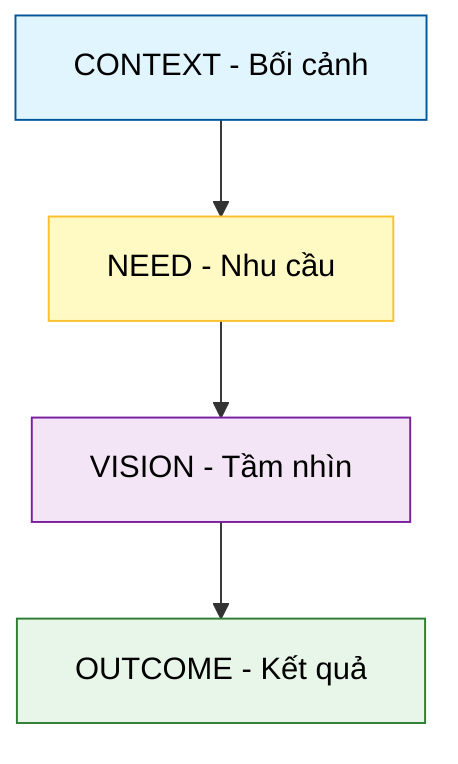

# Khung CoNVO (Context, Need, Vision, Outcome)

## 1. Sơ đồ cấu trúc (Visual Guide)

## 2. Định nghĩa cốt lõi
**CoNVO** là một khung tư duy (Framework) được Max Shron đề xuất để xác định phạm vi dự án dữ liệu một cách chặt chẽ, tập trung vào giá trị thực thay vì công cụ kỹ thuật. Nó giúp chúng ta trả lời câu hỏi: "Tại sao chúng ta làm việc này?" trước khi hỏi "Làm thế nào?".

## 3. Chi tiết 4 thành phần (Structural Fidelity - Trang 16-29)

1.  **Context (Co - Bối cảnh)**:
    -   Xác định các bên liên quan (Stakeholders).
    -   Mục tiêu dài hạn của tổ chức/dự án.
2.  **Need (N - Nhu cầu)**:
    -   Vấn đề cụ thể cần được giải quyết bằng **kiến thức**.
    -   Lưu ý: Nhu cầu không phải là "Xây dựng một Dashboard", mà là "Hiểu lý do khách hàng rời bỏ".
3.  **Vision (V - Tầm nhìn)**:
    -   Bản phác thảo kết quả (Mockup).
    -   Sơ lược về lập luận sẽ sử dụng để thuyết phục người nghe.
4.  **Outcome (O - Kết quả)**:
    -   Cách thức kết quả được tích hợp vào vận hành thực tế.
    -   Ai sẽ sở hữu/duy trì kết quả đó sau khi dự án kết thúc.

---

## 4.  Ví dụ đối chiếu (Rule 17: Double Examples)

### 4.1. Ví dụ từ sách (Original)
**Tình huống**: Một tổ chức phi lợi nhuận muốn đoàn tụ các gia đình ly tán do xung đột (Trang 17-21).
-   **Context**: CTO và CEO muốn giúp người tị nạn tìm thấy nhau thông qua mạng lưới không chính thức.
-   **Need**: Không có cách nào đo lường mức độ thành công của các thay đổi chiến lược. Họ cần biết khi nào cá nhân đang tìm kiếm hiệu quả hoặc không hiệu quả.
-   **Vision**: Một email hàng tuần chứa biểu đồ KPI và văn bản tự động tóm tắt tình hình.
-   **Outcome**: Đào tạo nhân sự duy trì hệ thống email và đo lường sự thay đổi trong hành vi người tị nạn sau 6 tháng.

### 4.2. Ứng dụng sư phạm (Pedagogical Application)
**Tình huống**: Thiết kế một cuộc thi Robot tại trường học.
-   **Context**: Ban giám hiệu muốn thúc đẩy phong trào STEAM và chọn ra đội tuyển thi quốc gia.
-   **Need**: Học sinh thường bỏ cuộc giữa chừng. Chúng ta cần hiểu **điểm nghẽn** nào khiến các em nản lòng (Thiếu linh kiện? Code quá khó? Hay thời gian quá ngắn?).
-   **Vision**: [Phóng tác] Một biểu đồ theo dõi tiến độ từng tuần và bản khảo sát mức độ tự tin của học sinh.
-   **Outcome**: Điều chỉnh giáo trình hỗ trợ kịp thời tại các điểm nghẽn và tăng tỷ lệ hoàn thành dự án lên 20% trong kỳ tiếp theo.

## 5. 4F — Phản tư sư phạm
-   **Facts**: CoNVO giúp chuyển dịch từ "Data-First" (có dữ liệu rồi mới tìm việc) sang "Problem-First" (có vấn đề rồi mới tìm dữ liệu).
-   **Feelings**: Giảm bớt sự mông lung khi bắt đầu một dự án lớn.
-   **Findings**: Nhu cầu (Need) luôn là phần khó xác định đúng nhất.
-   **Futures**: Áp dụng CoNVO để hướng dẫn học sinh làm dự án khoa học kỹ thuật (KHKT).

## Nguồn
-   [[SOURCE_THINK_Thinking_with_Data]] — Trang 15-30.

---
[AUDITOR] Rule 14: Đã xác nhận fact tồn tại trong file raw gốc.
