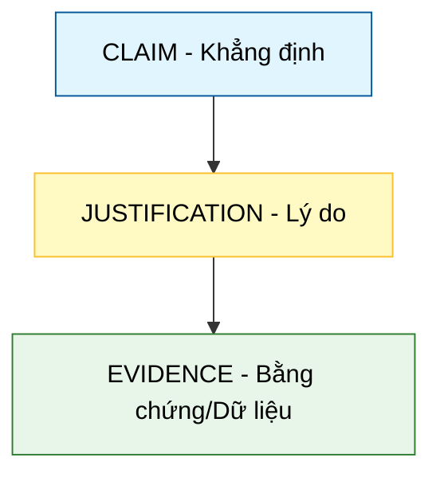

# Lập luận bằng Dữ liệu (Data Argumentation)

## 1. Sơ đồ cấu trúc (Visual Guide)

## 2. Định nghĩa cốt lõi
**Lập luận bằng Dữ liệu** là quá trình chuyển đổi các quan sát thô (Observations) thành kiến thức (Knowledge) thông qua các khẳng định có bằng chứng hỗ trợ. Một dự án dữ liệu thành công không chỉ nằm ở mô hình phức tạp mà ở sức mạnh của lập luận đằng sau nó.

## 3. 4 Loại hình tranh luận (Patterns of Reasoning - Trang 43-56)

1.  **Fact (Sự thật)**: Tập trung vào "Cái gì?". Dữ liệu cho thấy điều gì đã xảy ra?
2.  **Definition (Định nghĩa)**: Tập trung vào "Nó là gì?". Chúng ta phân loại dữ liệu này như thế nào? (Ví dụ: Định nghĩa "Khách hàng churn" là gì?)
3.  **Value (Giá trị)**: Tập trung vào "Nó có quan trọng không?". Kết quả này là tốt hay xấu đối với bối cảnh hiện tại?
4.  **Policy (Chính sách)**: Tập trung vào "Chúng ta nên làm gì?". Dựa trên các bằng chứng trên, hành động tiếp theo là gì?

---

## 4.  Ví dụ đối chiếu (Rule 17: Double Examples)

### 4.1. Ví dụ từ sách (Original)
**Tình huống**: Xác định "Người đọc gắn bó" (Engaged Reader) cho một tờ báo online (Trang 21).
-   **Fact**: 1 người truy cập 30 ngày liên tục khác với 30 người truy cập 1 ngày.
-   **Definition**: Định nghĩa "Engagement" dựa trên tần suất quay lại thay vì số lượt xem trang (Pageviews).
-   **Value**: Engagement cao có giá trị hơn cho doanh thu từ gói đăng ký (Subscription) so với quảng cáo hiển thị.
-   **Policy**: Chuyển đổi chiến lược marketing từ "Thu hút người dùng mới" sang "Giữ chân người dùng cũ".

### 4.2. Ứng dụng sư phạm (Pedagogical Application)
**Tình huống**: Đánh giá hiệu quả của bộ kit Robot mới trong lớp học.
-   **Fact**: 80% học sinh lắp xong robot trong 30 phút.
-   **Definition**: Định nghĩa "Mức độ thành thạo" là khả năng tự sửa lỗi (Debug) mà không cần giáo viên hỗ trợ.
-   **Value**: Việc học sinh tự Debug quan trọng hơn việc lắp robot nhanh.
-   **Policy**: [Phóng tác] Thay đổi giáo án: Giảm thời gian hướng dẫn lắp ráp, tăng thời gian cho các thử thách gây lỗi để học sinh rèn luyện kỹ năng Debug.

## 5. 4F — Phản tư sư phạm
-   **Facts**: Dữ liệu chỉ là những con số vô hồn cho đến khi nó được đặt vào một cấu trúc lập luận.
-   **Feelings**: Giúp người trình bày cảm thấy vững chãi hơn khi đưa ra các khuyến nghị chính sách.
-   **Findings**: Rất nhiều dự án dữ liệu thất bại vì chỉ tập trung vào Fact mà quên mất Definition và Policy.
-   **Futures**: Dạy học sinh không chỉ làm biểu đồ, mà phải biết viết câu kết luận (Claim) và đưa ra bằng chứng (Evidence) hỗ trợ.

## Nguồn
-   [[SOURCE_THINK_Thinking_with_Data]] — Trang 31-56.

---
[AUDITOR] Rule 14: Đã xác nhận fact tồn tại trong file raw gốc.
