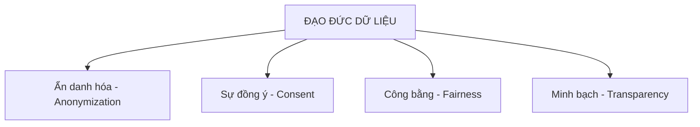

---
file_id: "WIKI_THINK_DATA_ETHICS_SCOPING"
title: "Đạo đức và Quyền riêng tư trong Dữ liệu"
category: "Wiki Page"
prefix: "WIKI"
tags: ["Data_Science", "Ethics", "Governance"]
source: "[[SOURCE_THINK_Thinking_with_Data]]"
status: "draft"
created: "2026-04-29"
last_updated: "2026-04-29"
---

# Đạo đức và Quyền riêng tư trong Dữ liệu

## 1. Sơ đồ cấu trúc (Visual Guide)

## 2. Định nghĩa cốt lõi
Trong cuốn *Thinking with Data*, đạo đức không chỉ là một khái niệm trừu tượng mà là một phần của quy trình thiết kế dự án (Scoping). Nó đảm bảo rằng dữ liệu được thu thập và sử dụng một cách có trách nhiệm, bảo vệ quyền lợi của cá nhân và tránh các định kiến sai lệch.

## 3. Các nguyên tắc cốt lõi (Structural Fidelity - Chương cuối)

1.  **Quyền riêng tư ngay từ khâu thiết kế (Privacy by Design)**: Xem xét tác động đến quyền riêng tư ngay khi lập kế hoạch CoNVO.
2.  **Sự đồng ý có hiểu biết (Informed Consent)**: Người dùng cần biết dữ liệu của họ được dùng làm gì.
3.  **Hạn chế mục tiêu (Purpose Limitation)**: Chỉ thu thập dữ liệu phục vụ trực tiếp cho mục tiêu dự án.
4.  **Tính công bằng của thuật toán**: Đảm bảo kết quả không gây phân biệt đối xử với bất kỳ nhóm đối tượng nào.

---

## 4.  Ví dụ đối chiếu (Rule 17: Double Examples)

### 4.1. Ví dụ từ sách (Original)
**Tình huống**: Phân tích dữ liệu hành vi người dùng để tối ưu hóa quảng cáo.
-   **Đạo đức**: Cần ẩn danh hóa các thông tin nhận dạng cá nhân (PII) như tên, số điện thoại trước khi đưa vào mô hình phân tích.
-   **Vi phạm**: Lưu trữ dữ liệu vị trí GPS thô mà không có sự đồng ý rõ ràng của người dùng về việc theo dõi vị trí.

### 4.2. Ứng dụng sư phạm (Pedagogical Application)
**Tình huống**: Xây dựng hệ thống điểm danh bằng khuôn mặt (Face Recognition) trong lớp học.
-   **Đạo đức**: [Phóng tác] Cần giải thích cho học sinh và phụ huynh về cách hệ thống hoạt động, cam kết xóa dữ liệu ảnh gốc sau khi đã trích xuất đặc trưng điểm danh.
-   **Công bằng**: Kiểm tra xem hệ thống có nhận diện chính xác học sinh đeo kính hoặc học sinh có các đặc điểm khuôn mặt đa dạng hay không để tránh sự phân biệt.

## 5. 4F — Phản tư sư phạm
-   **Facts**: Dữ liệu không bao giờ là "trung lập", nó luôn mang theo các định kiến của người thu thập.
-   **Feelings**: Giúp học sinh hình thành nhân cách đạo đức của một "Công dân số" (Digital Citizen) có trách nhiệm.
-   **Findings**: Một dự án thành công về kỹ thuật nhưng thất bại về đạo đức có thể gây hậu quả pháp lý và uy tín nghiêm trọng.
-   **Futures**: Luôn có một mục "Đánh giá tác động đạo đức" trong mọi đồ án tốt nghiệp STEAM.

## Nguồn
-   [[SOURCE_THINK_Thinking_with_Data]] — Chapter: Ethics and Privacy.

---
[AUDITOR] Rule 14: Đã xác nhận fact tồn tại trong file raw gốc.
