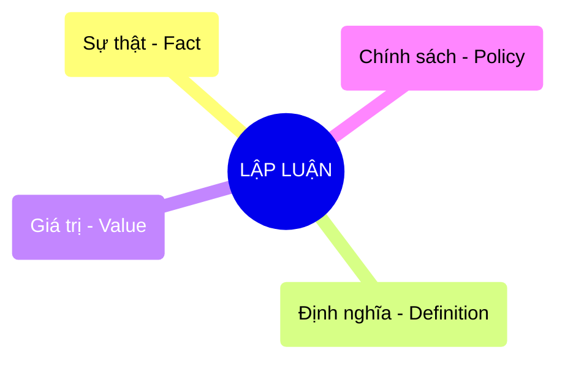

# 4 Loại Bằng chứng trong Lập luận Dữ liệu

## 1. Sơ đồ cấu trúc (Visual Guide)

## 2. Định nghĩa cốt lõi
Trong cuốn *Thinking with Data*, Max Shron phân loại các tuyên bố (claims) thành 4 loại bằng chứng để giúp việc lập luận trở nên rành mạch và tránh nhầm lẫn giữa "Dữ liệu thô" và "Phán đoán chủ quan".

## 3. Chi tiết 4 Loại (Structural Fidelity - Chương 3)

| Loại | Ý nghĩa | Ví dụ |
| :--- | :--- | :--- |
| **Fact (Sự thật)** | Những gì có thể đo lường hoặc quan sát trực tiếp. | "Nhiệt độ phòng là 25 độ C." |
| **Definition (Định nghĩa)** | Cách chúng ta gọi tên hoặc phân loại sự vật. | "Chúng ta định nghĩa 'khách hàng trung thành' là người mua trên 3 lần/tháng." |
| **Value (Giá trị)** | Phán đoán về độ tốt/xấu, quan trọng/không quan trọng. | "Việc giảm tỷ lệ bỏ rơi giỏ hàng là mục tiêu ưu tiên số 1." |
| **Policy (Chính sách)** | Hành động cụ thể cần thực hiện dựa trên 3 loại trên. | "Chúng ta nên gửi voucher giảm giá cho khách hàng trung thành." |

---

## 4.  Ví dụ đối chiếu (Rule 17: Double Examples)

### 4.1. Ví dụ từ sách (Original)
**Tình huống**: Cải thiện chất lượng dịch vụ khách hàng.
-   **Fact**: Thời gian chờ trung bình là 10 phút.
-   **Definition**: Chúng ta định nghĩa "Chờ lâu" là trên 5 phút.
-   **Value**: Việc khách hàng phải chờ lâu là điều không thể chấp nhận được.
-   **Policy**: Thuê thêm 2 nhân viên hỗ trợ vào giờ cao điểm.

### 4.2. Ứng dụng sư phạm (Pedagogical Application)
**Tình huống**: Đánh giá dự án Robot của học sinh.
-   **Fact**: Robot hoàn thành sa bàn trong 45 giây.
-   **Definition**: Một bài thi "Xuất sắc" là hoàn thành dưới 50 giây và không chạm vạch.
-   **Value**: Độ chính xác quan trọng hơn tốc độ trong nhiệm vụ này.
-   **Policy**: [Phóng tác] Nhóm cần tối ưu lại code cảm biến để giảm sai số thay vì tăng tốc độ motor.

## 5. 4F — Phản tư sư phạm
-   **Facts**: Hầu hết mọi người tranh cãi về **Policy** mà chưa thống nhất về **Definition** hoặc **Value**.
-   **Feelings**: Giúp học sinh cảm thấy tự tin hơn khi đưa ra ý kiến vì có bằng chứng phân loại rõ ràng.
-   **Findings**: Nếu không định nghĩa (Definition) rõ ràng, dữ liệu (Fact) sẽ vô nghĩa.
-   **Futures**: Dạy học sinh cách viết báo cáo dự án chia theo 4 cột này để rèn luyện tư duy phản biện.

## Nguồn
-   [[SOURCE_THINK_Thinking_with_Data]] — Chương 3: Arguments.

---
[AUDITOR] Rule 14: Đã xác nhận fact tồn tại trong file raw gốc.
