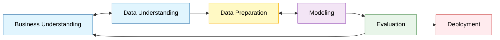

---
file_id: "WIKI_THINK_DATA_MINING_PROCESS_CRISP"
title: "Quy trình CRISP-DM trong Khai thác Dữ liệu"
category: "Wiki Page"
prefix: "WIKI"
tags: ["Thinking", "Data_Mining", "Process", "Standard"]
source: "[[SOURCE_THINK_Data_Science_for_Business]]"
status: "draft"
created: "2026-04-28"
last_updated: "2026-04-28"
---

# 📌 Quy trình CRISP-DM (Cross-Industry Standard Process for Data Mining)

## 1. Sơ đồ cấu trúc (Visual Guide)

## 2. Định nghĩa cốt lõi
**CRISP-DM** là một quy trình lặp (Iterative Process) tiêu chuẩn công nghiệp nhằm cấu trúc hóa các nỗ lực khai thác dữ liệu. Nó không phải là một đường thẳng mà là một vòng tuần hoàn, nơi các phát hiện ở bước sau thường buộc chúng ta phải quay lại điều chỉnh các bước trước.

## 3. Chi tiết 6 bước (Structural Fidelity - Trang 27-34)

1.  **Business Understanding (Hiểu bài toán kinh doanh)**: Quan trọng nhất. Xác định mục tiêu, đánh giá tình hình và lập kế hoạch dự án.
2.  **Data Understanding (Hiểu dữ liệu)**: Thu thập dữ liệu thô, khám phá các đặc tính và xác định các vấn đề về chất lượng dữ liệu.
3.  **Data Preparation (Chuẩn bị dữ liệu)**: Làm sạch, chuyển đổi, chọn lọc thuộc tính và định dạng dữ liệu để nạp vào mô hình.
4.  **Modeling (Xây dựng mô hình)**: Lựa chọn kỹ thuật, thiết kế thử nghiệm và xây dựng các mô hình.
5.  **Evaluation (Đánh giá)**: Xem xét kết quả mô hình dựa trên mục tiêu kinh doanh ban đầu. Liệu mô hình có giải quyết được vấn đề thực tế?
6.  **Deployment (Triển khai)**: Đưa mô hình vào vận hành, lập kế hoạch bảo trì và giám sát hiệu suất thực tế.

---

## 4. 💡 Ví dụ đối chiếu (Mandatory)

### 4.1. Ví dụ từ sách (Original)
**Tình huống**: Giảm tỷ lệ rời mạng (Churn) của khách hàng viễn thông (Trang 27).
-   **Business Understanding**: Mục tiêu là giữ chân khách hàng mang lại lợi nhuận cao thay vì chỉ giảm số lượng rời mạng đơn thuần.
-   **Data Understanding**: Kiểm tra lịch sử cuộc gọi, hóa đơn, phàn nàn của khách hàng.
-   **Evaluation**: Mô hình có thể dự đoán chính xác ai sẽ rời đi, nhưng liệu chi phí ưu đãi để giữ chân họ có thấp hơn giá trị họ mang lại không?

### 4.2. Ứng dụng sư phạm (Pedagogical Application)
**Tình huống**: Cải thiện kết quả học tập môn Coding tại trường.
-   **Business Understanding**: Mục tiêu là tăng tỷ lệ học sinh vượt qua bài kiểm tra cuối khóa Robot.
-   **Data Preparation**: Tổng hợp dữ liệu từ điểm danh, thời gian làm bài trên LMS và số lượng lỗi trong code của học sinh.
-   **Evaluation**: Nếu mô hình dự báo đúng 90% học sinh trượt nhưng không đưa ra được lý do "Tại sao" (để giáo viên can thiệp), thì mô hình đó chưa đạt yêu cầu sư phạm.

## 5. 4F — Phản tư sư phạm
-   **Facts**: Quy trình này nhấn mạnh rằng Modeling chỉ là một phần nhỏ (và thường là dễ nhất) so với hiểu bài toán và chuẩn bị dữ liệu.
-   **Feelings**: Giúp các đội dự án tránh được cảm giác "lạc lối" khi đối mặt với dữ liệu khổng lồ.
-   **Findings**: Bước quay lại từ Evaluation sang Business Understanding là nơi sinh ra nhiều Insight quý giá nhất.
-   **Futures**: Dạy học sinh làm dự án theo quy trình này để rèn luyện tính kỷ luật trong tư duy khoa học.

## 📖 Nguồn
-   [[SOURCE_THINK_Data_Science_for_Business]] — Trang 26-34.

---
[AUDITOR] Rule 14: Đã xác nhận fact tồn tại trong file raw gốc.
