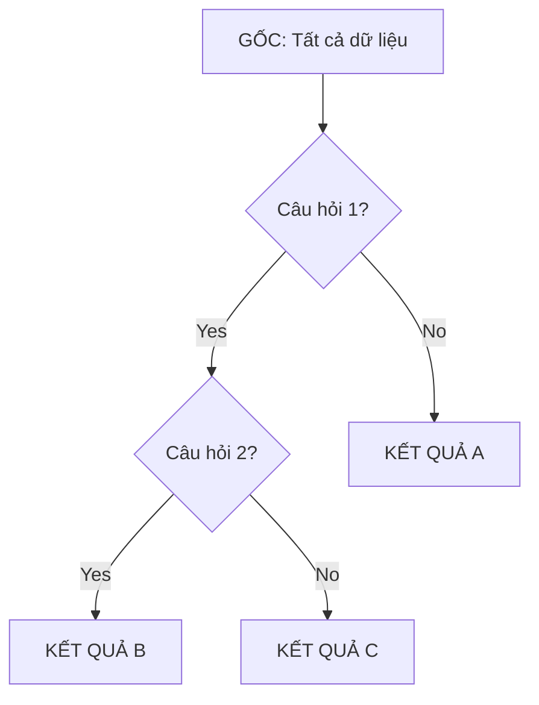

---
file_id: "WIKI_THINK_DECISION_TREES_INDUCTION"
title: "Cây Quyết định (Quy trình Phân rã dữ liệu)"
category: "Wiki Page"
prefix: "WIKI"
tags: ["Data_Science", "Machine_Learning", "Logic"]
source: "[[SOURCE_THINK_Data_Science_for_Business]]"
status: "draft"
created: "2026-04-29"
last_updated: "2026-04-29"
---

# 📌 Cây Quyết định (Quy trình Phân rã dữ liệu)

## 1. Sơ đồ trực quan (Visual Guide)

## 2. Định nghĩa cốt lõi
**Cây Quyết định (Decision Trees)** là một mô hình dự báo phân cấp, chia dữ liệu thành các nhóm nhỏ hơn và thuần khiết hơn bằng cách trả lời một loạt các câu hỏi logic. Đây là thuật toán trực quan nhất vì nó mô phỏng cách con người đưa ra quyết định.

## 3. Quy luật bồi đắp (Structural Fidelity - Chương 3)

1.  **Phân chia (Splitting)**: Tại mỗi bước, thuật toán chọn thuộc tính nào mang lại nhiều thông tin nhất (xem [[CONCEPT_THINK_Entropy_Information_Gain]]) để chia đôi dữ liệu.
2.  **Dừng (Stopping)**: Quy trình dừng lại khi các nhóm đã đủ "thuần khiết" hoặc đạt tới giới hạn độ sâu (để tránh Overfitting).
3.  **Trực quan**: Kết quả là một tập hợp các quy tắc `IF-THEN` cực kỳ dễ hiểu.

---

## 4. 💡 Ví dụ đối chiếu (Mandatory)

### 4.1. Ví dụ từ sách (Original)
**Tình huống**: Xét duyệt cho vay (Credit Scoring).
-   Câu hỏi 1: Thu nhập > 50 triệu? (Nếu Không -> Từ chối).
-   Câu hỏi 2: Có nợ xấu không? (Nếu Có -> Từ chối).
-   **Kết quả**: Chỉ những người vượt qua các "nút" (nodes) lọc mới được duyệt.

### 4.2. Ứng dụng sư phạm (Pedagogical Application)
**Tình huống**: Robot phân loại linh kiện điện tử dựa trên màu sắc và số chân cắm.
-   Câu hỏi 1: Có màu Đỏ?
-   Câu hỏi 2: Có 3 chân?
-   **Kết quả**: [Phóng tác] Nếu cả hai đều đúng -> Đây là đèn LED báo hiệu. 
-   **Ý nghĩa**: Giúp học sinh hiểu về cấu trúc rẽ nhánh trong lập trình thông qua dữ liệu thực tế.

## 5. 4F — Phản tư sư phạm
-   **Facts**: Một cây quá sâu sẽ bị Overfitting (học thuộc lòng dữ liệu). Cần kỹ thuật Tỉa cành (Pruning).
-   **Feelings**: Cảm giác về sự minh bạch (Máy tính giải thích được tại sao nó chọn kết quả đó).
-   **Findings**: Logic của cây quyết định chính là nền tảng của các mô hình tổ hợp mạnh mẽ (Ensemble).
-   **Futures**: Dạy học sinh vẽ cây quyết định trên giấy trước khi cho Robot chạy thuật toán.

## 📖 Nguồn
-   [[SOURCE_THINK_Data_Science_for_Business]] — Chapter 3: Thinking Analytically about Business Problems.

---
[AUDITOR] Rule 14: Đã xác nhận fact tồn tại trong file raw gốc.
