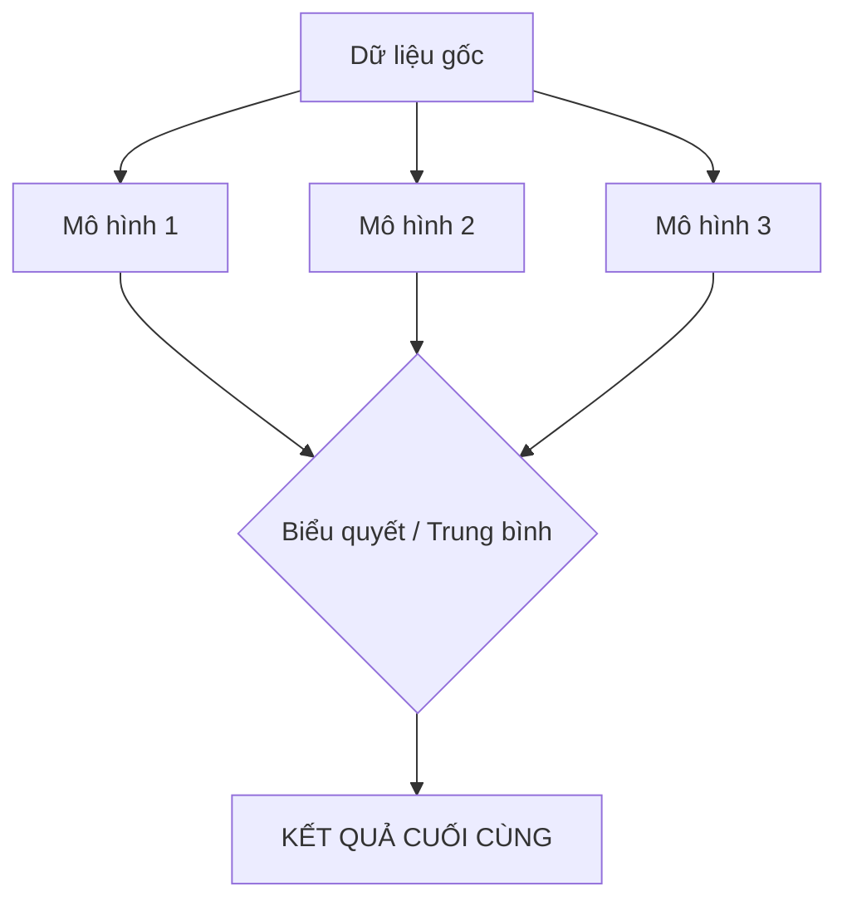

---
file_id: "WIKI_THINK_ENSEMBLE_METHODS"
title: "Phương pháp Tổ hợp (Ensemble Methods)"
category: "Wiki Page"
prefix: "WIKI"
tags: ["Data_Science", "Machine_Learning", "Advanced"]
source: "[[SOURCE_THINK_Data_Science_for_Business]]"
status: "draft"
created: "2026-04-29"
last_updated: "2026-04-29"
---

# Phương pháp Tổ hợp (Ensemble Methods)

## 1. Sơ đồ trực quan (Visual Guide)

## 2. Định nghĩa cốt lõi
**Ensemble Methods** là kỹ thuật kết hợp nhiều mô hình Machine Learning yếu (Weak Learners) lại với nhau để tạo ra một mô hình mạnh (Strong Learner) có độ chính xác cao hơn và ổn định hơn. Triết lý đằng sau là "Sức mạnh của đám đông" (Wisdom of the Crowds).

## 3. Hai kỹ thuật chính (Structural Fidelity - Chương 12)

1.  **Bagging (Bootstrap Aggregating)**: Xây dựng các mô hình độc lập (ví dụ: Random Forest) và lấy kết quả trung bình/biểu quyết. Giúp giảm biến động (Variance).
2.  **Boosting**: Xây dựng các mô hình tuần tự, mô hình sau tập trung sửa lỗi cho mô hình trước (ví dụ: XGBoost, AdaBoost). Giúp giảm sai số (Bias).

---

## 4.  Ví dụ đối chiếu (Rule 17: Double Examples)

### 4.1. Ví dụ từ sách (Original)
**Tình huống**: Dự báo rủi ro tín dụng.
-   Thay vì dùng 1 cây quyết định khổng lồ (dễ bị quá khớp), ta dùng 100 cây quyết định nhỏ và cho chúng "bình bầu". Kết quả cuối cùng sẽ ổn định hơn rất nhiều trước những thay đổi nhỏ của dữ liệu.

### 4.2. Ứng dụng sư phạm (Pedagogical Application)
**Tình huống**: Nhóm học sinh làm bài thi trắc nghiệm.
-   **Cách 1**: Một bạn giỏi nhất làm hết (Single Model).
-   **Cách 2 (Ensemble)**: [Phóng tác] Cả nhóm 5 bạn cùng làm độc lập, sau đó chọn đáp án mà đa số các bạn cùng chọn. 
-   **Kết quả**: Xác suất cả nhóm cùng sai ở một câu sẽ thấp hơn xác suất một cá nhân sai. Đây là cách dạy học sinh về giá trị của sự hợp tác (Collaboration) trong dữ liệu.

## 5. 4F — Phản tư sư phạm
-   **Facts**: Các thuật toán chiến thắng trong các cuộc thi dữ liệu (như Kaggle) hầu hết đều là các mô hình Ensemble.
-   **Feelings**: Cảm giác yên tâm khi có nhiều "chuyên gia" cùng đồng thuận về một kết quả.
-   **Findings**: Không có mô hình nào hoàn hảo, nhưng sự kết hợp của chúng có thể tiệm cận sự hoàn hảo.
-   **Futures**: Dạy học sinh cách xây dựng các "hội đồng Robot" để ra quyết định thay vì chỉ dựa vào một cảm biến duy nhất.

## Nguồn
-   [[SOURCE_THINK_Data_Science_for_Business]] — Chapter 12: Data Science and Business Strategy.

---
[AUDITOR] Rule 14: Đã xác nhận fact tồn tại trong file raw gốc.
