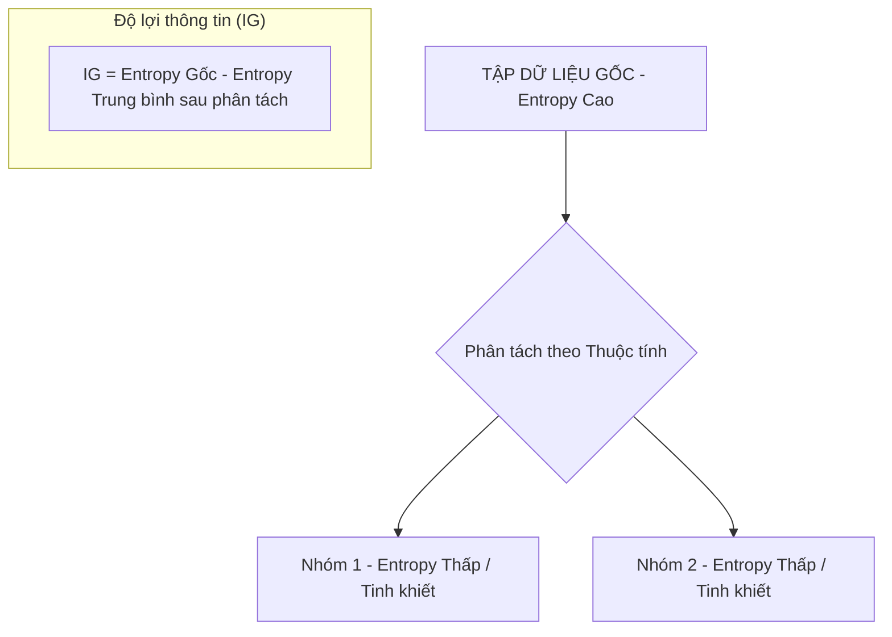

# Entropy và Information Gain (Độ lợi thông tin)

## 1. Sơ đồ trực quan (Visual Guide)

## 2. Định nghĩa cốt lõi
Trong khai thác dữ liệu, **Entropy** là thước đo độ hỗn loạn hoặc độ không chắc chắn của một tập dữ liệu. **Information Gain (IG)** là lượng thông tin thu được (giảm bớt độ hỗn loạn) khi ta phân tách dữ liệu dựa trên một thuộc tính cụ thể.

## 3. Công thức và Ý nghĩa (Structural Fidelity - Chương 3)

1.  **Entropy (H)**: 
    -   Nếu tập dữ liệu chỉ toàn một loại (tinh khiết): Entropy = 0.
    -   Nếu tập dữ liệu chia đều 50/50: Entropy = 1 (Hỗn loạn nhất).
2.  **Information Gain (IG)**:
    -   Mục tiêu của các thuật toán như Decision Tree là **Tối đa hóa IG**.
    -   Thuộc tính nào có IG cao nhất sẽ được chọn làm "nút" để phân tách dữ liệu.

---

## 4.  Ví dụ đối chiếu (Rule 17: Double Examples)

### 4.1. Ví dụ từ sách (Original)
**Tình huống**: Phân loại khách hàng có rời bỏ dịch vụ (Churn) hay không.
-   **Entropy Gốc**: 100 khách hàng (50 ở lại, 50 rời đi) -> Entropy = 1.0.
-   **Phân tách theo "Độ tuổi"**: Tạo ra 2 nhóm có độ tinh khiết cao hơn (ví dụ: nhóm trẻ rời đi nhiều, nhóm già ở lại nhiều) -> Entropy trung bình giảm xuống còn 0.6.
-   **Information Gain**: 1.0 - 0.6 = 0.4.

### 4.2. Ứng dụng sư phạm (Pedagogical Application)
**Tình huống**: Phân loại linh kiện điện tử trong kho (LED, Motor, Cảm biến).
-   **Vấn đề**: Thùng linh kiện trộn lẫn lộn.
-   **Thuộc tính 1: Số lượng chân cắm (Pins)**: Nếu tách theo số chân, ta có thể tách riêng được LED (2 chân) khỏi Motor (3-4 chân).
-   **Kết quả**: Việc tách theo số chân giúp "dọn dẹp" sự hỗn loạn rất tốt -> Information Gain cao.
-   **Ứng dụng**: [Phóng tác] Dạy học sinh cách robot "suy nghĩ" để nhận diện vật cản: Nó sẽ chọn đặc điểm nào (màu sắc hay khoảng cách) giúp nó phân loại vật cản nhanh nhất?

## 5. 4F — Phản tư sư phạm
-   **Facts**: Entropy không chỉ là toán học, nó là tư duy về sự **trật tự**.
-   **Feelings**: Thú vị khi thấy một công thức trừu tượng lại có thể giúp máy tính "ra quyết định" thông minh.
-   **Findings**: Thông tin càng giá trị khi nó làm giảm bớt sự không chắc chắn của chúng ta.
-   **Futures**: Sử dụng ví dụ về việc "Dọn phòng" để giải thích Entropy cho học sinh tiểu học (Phòng bừa bộn = Entropy cao).

## Nguồn
-   [[SOURCE_THINK_Data_Science_for_Business]] — Chapter 3: Introduction to Predictive Modeling.

---
[AUDITOR] Rule 14: Đã xác nhận fact tồn tại trong file raw gốc.
