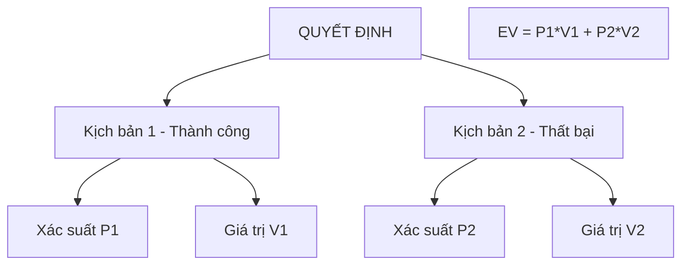

---
file_id: "WIKI_THINK_EXPECTED_VALUE_FRAMEWORK"
title: "Khung Giá trị Kỳ vọng (Expected Value Framework)"
category: "Wiki Page"
prefix: "WIKI"
tags: ["Data_Science", "Business_Strategy", "Decision_Making"]
source: "[[SOURCE_THINK_Data_Science_for_Business]]"
status: "draft"
created: "2026-04-29"
last_updated: "2026-04-29"
---

# Khung Giá trị Kỳ vọng (Expected Value Framework)

## 1. Sơ đồ trực quan (Visual Guide)

## 2. Định nghĩa cốt lõi
**Khung Giá trị Kỳ vọng (EV)** là một công cụ ra quyết định bằng cách tính trung bình trọng số của tất cả các kết quả có thể xảy ra. Trong khoa học dữ liệu, EV được dùng để đánh giá xem một mô hình (ví dụ: mô hình dự báo gian lận) có mang lại lợi nhuận thực tế hay không.

## 3. Các thành phần chính (Structural Fidelity - Chương 7 & 11)

1.  **Xác suất (Probabilities)**: Khả năng xảy ra của từng kịch bản (được dự báo bởi mô hình dữ liệu).
2.  **Giá trị (Values/Costs)**: Lợi nhuận thu được hoặc chi phí mất đi trong từng kịch bản.
3.  **Công thức tổng quát**: $EV = \sum P(o_i) \times V(o_i)$
    -   $P(o_i)$: Xác suất xảy ra kết quả $i$.
    -   $V(o_i)$: Giá trị của kết quả $i$.

---

## 4.  Ví dụ đối chiếu (Rule 17: Double Examples)

### 4.1. Ví dụ từ sách (Original)
**Tình huống**: Gửi thư quảng cáo giảm giá cho khách hàng.
-   **Kịch bản 1**: Khách hàng mua đồ -> Xác suất 10%, Lợi nhuận $100.
-   **Kịch bản 2**: Khách hàng không mua -> Xác suất 90%, Chi phí gửi thư -$1.
-   **EV** = $(0.1 \times 100) + (0.9 \times -1) = 10 - 0.9 = \$9.1$.
-   **Kết luận**: Vì EV > 0, chúng ta nên thực hiện chiến dịch này.

### 4.2. Ứng dụng sư phạm (Pedagogical Application)
**Tình huống**: Chọn chiến thuật cho Robot trong cuộc thi "Đá bóng Robot".
-   **Chiến thuật A (Mạo hiểm)**: Sút xa. Xác suất vào 20% (5 điểm), xác suất hụt 80% (mất bóng, đối thủ phản công -2 điểm).
    -   $EV_A = (0.2 \times 5) + (0.8 \times -2) = 1 - 1.6 = -0.6$.
-   **Chiến thuật B (An toàn)**: Chuyền bóng. Xác suất thành công 70% (1 điểm), xác suất mất bóng 30% (-1 điểm).
    -   $EV_B = (0.7 \times 1) + (0.3 \times -1) = 0.7 - 0.3 = 0.4$.
-   **Kết luận**: [Phóng tác] Dựa trên EV, học sinh nên chọn Chiến thuật B dù điểm số mỗi lần ghi được thấp hơn.

## 5. 4F — Phản tư sư phạm
-   **Facts**: Mô hình có độ chính xác cao chưa chắc đã có EV tốt nếu chi phí cho sai lầm quá lớn.
-   **Feelings**: Giúp giảm bớt sự liều lĩnh và thay bằng sự tính toán khoa học.
-   **Findings**: Dữ liệu chỉ là một nửa cuộc chơi, nửa còn lại là hiểu về giá trị kinh tế/vận hành.
-   **Futures**: Dạy học sinh cách lập bảng EV khi đứng trước các lựa chọn rủi ro trong cuộc sống.

## Nguồn
-   [[SOURCE_THINK_Data_Science_for_Business]] — Chapter 7: Decision Analytic Thinking.

---
[AUDITOR] Rule 14: Đã xác nhận fact tồn tại trong file raw gốc.
