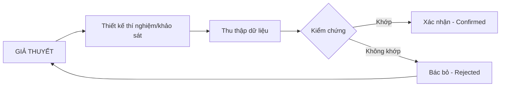

---
file_id: "WIKI_THINK_HYPOTHESIS_TESTING"
title: "Kiểm chứng Giả thuyết (Hypothesis Testing)"
category: "Wiki Page"
prefix: "WIKI"
tags: ["Thinking", "Analysis", "Data_Verification"]
source: "[[SOURCE_THINK_Problem_Solving_101]]"
status: "draft"
created: "2026-04-29"
last_updated: "2026-04-29"
---

# 📌 Kiểm chứng Giả thuyết (Hypothesis Testing)

## 1. Sơ đồ cấu trúc (Visual Guide)

## 2. Định nghĩa cốt lõi
**Kiểm chứng Giả thuyết** là quá trình sử dụng dữ liệu thực tế để xác nhận hoặc bác bỏ một dự đoán (giả thuyết) về nguyên nhân của vấn đề. Đây là bước ngăn chặn việc đưa ra giải pháp dựa trên cảm tính.

## 3. Quy trình thực hiện (Structural Fidelity - Trang 55-60)

1.  **Xác định thông tin cần thiết**: Chúng ta cần biết gì để chứng minh giả thuyết này?
2.  **Xác định nguồn dữ liệu**: Lấy thông tin đó ở đâu? (Quan sát, phỏng vấn, khảo sát, dữ liệu lịch sử).
3.  **Thu thập và Phân tích**: Thực hiện việc lấy dữ liệu.
4.  **Kết luận**: Giả thuyết đúng hay sai?

---

## 4. 💡 Ví dụ đối chiếu (Mandatory)

### 4.1. Ví dụ từ sách (Original)
**Tình huống**: Giả thuyết "Mọi người không biết đến buổi biểu diễn" (Trang 58).
-   **Thông tin cần**: Tỷ lệ người trong khu vực biết về ban nhạc.
-   **Cách làm**: Phỏng vấn ngẫu nhiên 50 người trên phố.
-   **Kết quả**: 45/50 người nói họ chưa bao giờ nghe tên ban nhạc.
-   **Kết luận**: Giả thuyết được xác nhận.

### 4.2. Ứng dụng sư phạm (Pedagogical Application)
**Tình huống**: Giả thuyết "Học sinh không làm bài tập về nhà vì đề bài quá khó".
-   **Thông tin cần**: Độ khó tự đánh giá của học sinh và thời gian làm bài trung bình.
-   **Cách làm**: [Phóng tác] Tạo một Google Form khảo sát nhanh sau buổi học.
-   **Kết quả**: 80% học sinh nói đề bài dễ hiểu, nhưng các em "quên" do không có thông báo nhắc nhở.
-   **Kết luận**: Giả thuyết "quá khó" bị bác bỏ. Nguyên nhân thực sự là thiếu hệ thống nhắc nhở.

## 5. 4F — Phản tư sư phạm
-   **Facts**: Đừng bao giờ yêu một giả thuyết của mình đến mức phớt lờ dữ liệu bác bỏ nó.
-   **Feelings**: Thú vị như một thám tử đang đi tìm sự thật.
-   **Findings**: Một giả thuyết bị bác bỏ cũng có giá trị như một giả thuyết được xác nhận (vì nó giúp loại trừ hướng đi sai).
-   **Futures**: Dạy học sinh cách lập bảng "Information Needs" (Cần biết gì - Lấy ở đâu) trước khi bắt tay vào làm dự án.

## 📖 Nguồn
-   [[SOURCE_THINK_Problem_Solving_101]] — Trang 50-65.

---
[AUDITOR] Rule 14: Đã xác nhận fact tồn tại trong file raw gốc.
