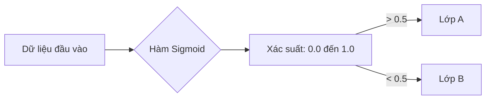

---
file_id: "WIKI_THINK_LOGISTIC_REGRESSION_CLASSIFIER"
title: "Hồi quy Logistic (Phân loại bằng xác suất)"
category: "Wiki Page"
prefix: "WIKI"
tags: ["Data_Science", "Machine_Learning", "Statistics"]
source: "[[SOURCE_THINK_Data_Science_for_Business]]"
status: "draft"
created: "2026-04-29"
last_updated: "2026-04-29"
---

# 📌 Hồi quy Logistic (Phân loại bằng xác suất)

## 1. Sơ đồ trực quan (Visual Guide)

## 2. Định nghĩa cốt lõi
Dù tên có chữ "Hồi quy" (Regression), **Hồi quy Logistic** thực chất là một thuật toán **Phân loại** (Classification). Nó dự báo xác suất của một đối tượng thuộc về một lớp cụ thể bằng cách sử dụng hàm Sigmoid (đường cong chữ S) để ép mọi giá trị đầu ra nằm trong khoảng từ 0 đến 1.

## 3. Cách hoạt động (Structural Fidelity - Chương 4)

1.  **Dạng toán học**: Kết quả là một đường cong phân định ranh giới giữa các nhóm dữ liệu.
2.  **Ngưỡng quyết định (Threshold)**: Thường mặc định là 0.5. Nếu xác suất > 0.5 thì phân vào Lớp 1, ngược lại là Lớp 0.
3.  **Điểm khác biệt**: Khác với Hồi quy Tuyến tính (Linear Regression) dùng để dự báo con số (giá nhà, nhiệt độ), Hồi quy Logistic dùng để dự báo "Có/Không".

---

## 4. 💡 Ví dụ đối chiếu (Mandatory)

### 4.1. Ví dụ từ sách (Original)
**Tình huống**: Khách hàng có đồng ý vay tiền không?
-   Dựa trên Thu nhập và Điểm tín dụng.
-   Mô hình Logistic cho kết quả: Xác suất đồng ý là 0.72.
-   **Kết luận**: Hệ thống sẽ đánh dấu đây là khách hàng tiềm năng để nhân viên gọi điện tư vấn.

### 4.2. Ứng dụng sư phạm (Pedagogical Application)
**Tình huống**: Robot dự đoán một vật thể trước mặt là "Rác" hay "Không phải rác" để nhặt.
-   Dựa trên trọng lượng và độ phản chiếu ánh sáng.
-   Mô hình cho ra xác suất: 0.85 là rác.
-   **Kết quả**: [Phóng tác] Robot sẽ thực hiện hành động nhặt. Đây là cách dạy học sinh về việc máy tính "cân nhắc" trước khi hành động thay vì chỉ có các điều kiện `if/else` cứng nhắc.

## 5. 4F — Phản tư sư phạm
-   **Facts**: Logistic Regression là "ngựa thồ" của ngành ngân hàng và y tế vì tính minh bạch và dễ giải thích.
-   **Feelings**: Giúp học sinh thấy được sự chuyển đổi mượt mà từ toán học sang quyết định thực tế.
-   **Findings**: Ranh giới quyết định (Decision Boundary) có thể thay đổi tùy theo mức độ rủi ro mà chúng ta chấp nhận.
-   **Futures**: Sử dụng Logistic Regression làm bước đầu tiên cho mọi bài toán phân loại nhị phân (Binary Classification).

## 📖 Nguồn
-   [[SOURCE_THINK_Data_Science_for_Business]] — Chapter 4: Fitting a Model to Data.

---
[AUDITOR] Rule 14: Đã xác nhận fact tồn tại trong file raw gốc.
