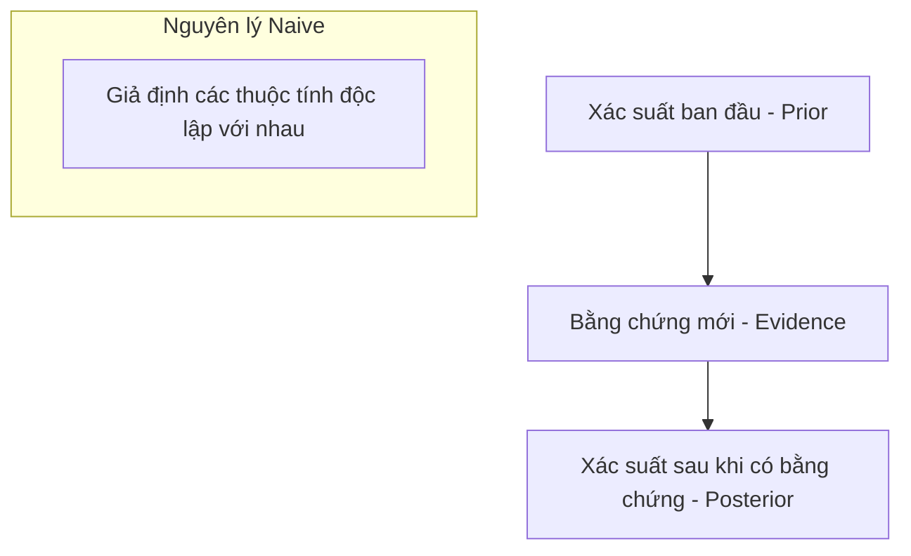

---
file_id: "WIKI_THINK_NAIVE_BAYES_LOGIC"
title: "Lập luận Naive Bayes (Xác suất có điều kiện)"
category: "Wiki Page"
prefix: "WIKI"
tags: ["Data_Science", "Machine_Learning", "Probability"]
source: "[[SOURCE_THINK_Data_Science_for_Business]]"
status: "draft"
created: "2026-04-29"
last_updated: "2026-04-29"
---

# 📌 Lập luận Naive Bayes (Xác suất có điều kiện)

## 1. Sơ đồ trực quan (Visual Guide)

## 2. Định nghĩa cốt lõi
**Naive Bayes** là một thuật toán phân loại dựa trên định lý Bayes, tính toán xác suất của một sự kiện xảy ra dựa trên kiến thức về các điều kiện liên quan đến sự kiện đó. Chữ "Naive" (Ngây thơ) đến từ giả định rằng các đặc điểm của đối tượng hoàn toàn độc lập với nhau.

## 3. Quy luật hoạt động (Structural Fidelity - Chương 9)

1.  **Định lý Bayes**: Cập nhật niềm tin dựa trên bằng chứng mới.
2.  **Ứng dụng thực tế**: Thường được dùng cho phân loại văn bản (Spam vs. Not Spam) vì tốc độ nhanh và hiệu quả bất ngờ dù có giả định "ngây thơ".
3.  **Điểm mạnh**: Hoạt động tốt ngay cả với tập dữ liệu nhỏ và nhiều chiều.

---

## 4. 💡 Ví dụ đối chiếu (Mandatory)

### 4.1. Ví dụ từ sách (Original)
**Tình huống**: Lọc thư rác (Spam Filter).
-   **Bằng chứng**: Thư chứa từ "Khuyến mãi" và "Miễn phí".
-   **Tính toán**: Thuật toán tính xác suất một thư là Spam nếu nó chứa hai từ này, dựa trên tỷ lệ Spam trong quá khứ có chứa chúng.
-   **Kết quả**: Dù "Khuyến mãi" và "Miễn phí" có thể hay đi cùng nhau (không độc lập), Bayes vẫn cho kết quả phân loại rất chính xác.

### 4.2. Ứng dụng sư phạm (Pedagogical Application)
**Tình huống**: Robot dự đoán thời tiết để quyết định có đi ra ngoài sân chơi không.
-   **Bằng chứng**: Trời nhiều mây (Cloudy) và Độ ẩm cao (Humidity).
-   **Tính toán**: [Phóng tác] Nếu trong quá khứ, 90% các ngày vừa mây vừa ẩm đều mưa, Robot sẽ quyết định ở lại trong nhà.
-   **Kết luận**: Đây là cách dạy học sinh về tư duy "Xác suất" thay vì tư duy "Đúng/Sai" tuyệt đối.

## 5. 4F — Phản tư sư phạm
-   **Facts**: Bayes là nền tảng của tư duy khoa học hiện đại: Luôn sẵn sàng thay đổi kết luận khi có bằng chứng mới.
-   **Feelings**: Giúp học sinh bớt "ngây thơ" về dữ liệu bằng cách hiểu về xác suất có điều kiện.
-   **Findings**: Sự đơn giản (Naive) đôi khi lại hiệu quả hơn sự phức tạp.
-   **Futures**: Ứng dụng Bayes trong việc lập trình các hệ thống tự học (Self-learning) đơn giản cho Robot.

## 📖 Nguồn
-   [[SOURCE_THINK_Data_Science_for_Business]] — Chapter 9: Evidence and Probabilities.

---
[AUDITOR] Rule 14: Đã xác nhận fact tồn tại trong file raw gốc.
