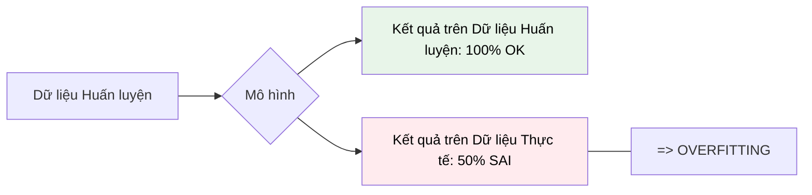

---
file_id: "WIKI_THINK_OVERFITTING_AVOIDANCE"
title: "Quá khớp và Cách phòng tránh (Overfitting Avoidance)"
category: "Wiki Page"
prefix: "WIKI"
tags: ["Data_Science", "Machine_Learning", "Evaluation"]
source: "[[SOURCE_THINK_Data_Science_for_Business]]"
status: "draft"
created: "2026-04-29"
last_updated: "2026-04-29"
---

# Quá khớp và Cách phòng tránh (Overfitting Avoidance)

## 1. Sơ đồ trực quan (Visual Guide)

## 2. Định nghĩa cốt lõi
**Overfitting** xảy ra khi một mô hình "học vẹt" cả những nhiễu (noise) và những đặc điểm ngẫu nhiên trong dữ liệu huấn luyện, thay vì học những quy luật tổng quát. Kết quả là mô hình hoạt động cực tốt trên dữ liệu cũ nhưng thất bại thảm hại trên dữ liệu mới.

## 3. Các kỹ thuật phòng tránh (Structural Fidelity - Chương 5)

1.  **Holdout Method**: Chia dữ liệu thành 2 phần: Huấn luyện (Training) và Kiểm tra (Testing). Chỉ đánh giá mô hình trên phần Testing mà nó chưa từng thấy.
2.  **Cross-Validation**: Chia dữ liệu thành nhiều phần (folds) và luân phiên huấn luyện/kiểm tra để đảm bảo tính khách quan.
3.  **Pruning (Tỉa cành)**: Đối với cây quyết định, loại bỏ những nhánh quá sâu và quá chi tiết chỉ phục vụ cho một vài trường hợp cá biệt.
4.  **Regularization**: Thêm "hình phạt" cho những mô hình quá phức tạp.

---

## 4.  Ví dụ đối chiếu (Rule 17: Double Examples)

### 4.1. Ví dụ từ sách (Original)
**Tình huống**: Xây dựng mô hình dự báo gian lận thẻ tín dụng.
-   **Overfitting**: Mô hình học được rằng "Mọi giao dịch vào lúc 3:14 sáng tại cây ATM số 42 đều là gian lận" (vì trong dữ liệu quá khứ tình cờ có 2 vụ như vậy).
-   **Hậu quả**: Khi một khách hàng bình thường rút tiền tại đó, họ bị khóa thẻ oan. Mô hình đã học "nhiễu" thay vì quy luật "gian lận".

### 4.2. Ứng dụng sư phạm (Pedagogical Application)
**Tình huống**: Học sinh ôn thi bằng cách "học thuộc lòng" đáp án các bộ đề năm trước.
-   **Overfitting**: Học sinh nhớ vanh vách: Câu 1 chọn A, Câu 2 chọn C.
-   **Hậu quả**: Khi vào phòng thi thật với bộ đề mới (cùng kiến thức nhưng khác số liệu), học sinh không làm được bài.
-   **Giải pháp**: [Phóng tác] Giáo viên cho học sinh làm "đề lạ" thường xuyên để kiểm tra xem các em có thực sự hiểu bản chất không (đây chính là phương pháp Holdout).

## 5. 4F — Phản tư sư phạm
-   **Facts**: Mô hình càng phức tạp (nhiều tham số) thì càng dễ bị Overfitting.
-   **Feelings**: Sự thất vọng khi thấy mô hình "đẹp như mơ" trong phòng thí nghiệm nhưng lại hỏng khi ra thực tế.
-   **Findings**: "Cái gì quá tốt thì thường không thật" (If it's too good to be true, it probably is).
-   **Futures**: Dạy học sinh cách luôn giữ lại một phần dữ liệu "bí mật" để thử thách Robot của mình.

## Nguồn
-   [[SOURCE_THINK_Data_Science_for_Business]] — Chapter 5: Overfitting and Its Avoidance.

---
[AUDITOR] Rule 14: Đã xác nhận fact tồn tại trong file raw gốc.
