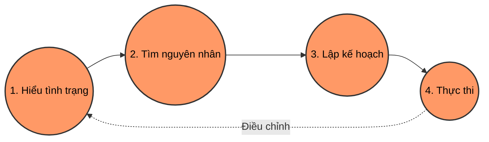

---
file_id: "WIKI_THINK_PROBLEM_SOLVING_PROCESS"
title: "Quy trình Giải quyết Vấn đề 4 Bước"
category: "Wiki Page"
prefix: "WIKI"
tags: ["Thinking", "Process", "Problem_Solving"]
source: "[[SOURCE_THINK_Problem_Solving_101]]"
status: "draft"
created: "2026-04-28"
last_updated: "2026-04-28"
---

# 📌 Quy trình Giải quyết Vấn đề 4 Bước

## 1. Sơ đồ quy trình (Visual Guide)

## 1. Định nghĩa cốt lõi
Giải quyết vấn đề không phải là một kỹ năng dành riêng cho một số ít người may mắn, mà là một **quy trình có hệ thống** có thể học hỏi và rèn luyện. Quy trình này giúp chúng ta đi từ sự hỗn loạn đến các hành động cụ thể và hiệu quả.

## 2. Chi tiết 4 Bước (The 4-Step Process)

1.  **Hiểu tình trạng hiện tại (Understand the Current Situation):**
    -   Xác định rõ vấn đề là gì.
    -   Thu thập dữ liệu thực tế thay vì dựa vào cảm nhận.
2.  **Xác định nguyên nhân gốc rễ (Identify the Root Cause):**
    -   Sử dụng Cây Logic để phân rã vấn đề.
    -   Đưa ra các giả thuyết về nguyên nhân.
    -   Kiểm chứng giả thuyết bằng dữ liệu.
3.  **Lập kế hoạch hành động hiệu quả (Develop an Effective Action Plan):**
    -   Liệt kê các giải pháp khả thi.
    -   Ưu tiên giải pháp dựa trên tác động và tính khả thi.
    -   Xây dựng lộ trình thực hiện chi tiết.
4.  **Thực thi và tinh chỉnh (Execute and Modify):**
    -   Thực hiện kế hoạch.
    -   Theo dõi kết quả và điều chỉnh nếu cần thiết.

## 3. 💡 Ví dụ đối chiếu (Mandatory)

### 3.1. Ví dụ từ sách (Original)
**Tình huống**: Một học sinh có điểm môn Toán đang giảm sút (Trang 21-22).
-   **(B1) Hiểu tình trạng hiện tại**: Thay vì chỉ lo lắng, học sinh này phân tích các dạng bài tập: Đại số (điểm đang tăng), Phân số (điểm đi ngang), Hình học (điểm đang giảm mạnh).
-   **(B2) Xác định nguyên nhân gốc rễ**: Tiếp tục chia nhỏ Hình học thành: diện tích hình thang, thể tích hình trụ, định lý Pythagoras. Phát hiện ra mình chỉ yếu ở 3 phần này.
-   **(B3) Lập kế hoạch hành động**: Tập trung ôn luyện đúng 3 phần yếu thay vì học lại toàn bộ môn Toán hoặc bỏ đội bóng đá để có thêm thời gian.
-   **(B4) Thực thi và tinh chỉnh**: Làm bài tập tập trung và theo dõi điểm số ở các bài kiểm tra tiếp theo.

### 3.2. Ứng dụng sư phạm (Pedagogical Application)
**Tình huống**: Robot G-Bot của học sinh không di chuyển thẳng được khi lập trình.
-   **(B1) Hiểu tình trạng hiện tại**: Đo đạc độ lệch (lệch trái hay lệch phải?), kiểm tra xem robot lệch ngay từ đầu hay sau một khoảng cách nhất định.
-   **(B2) Xác định nguyên nhân gốc rễ**: Kiểm tra các giả thuyết: Do pin yếu một bên? Do bánh xe bị kẹt? Do code điều tốc (PWM) không đều giữa 2 motor?
-   **(B3) Lập kế hoạch hành động**: Thử nghiệm đổi pin, vệ sinh bánh xe, và thêm khối lệnh bù trừ tốc độ (Calibration) cho motor yếu hơn.
-   **(B4) Thực thi và tinh chỉnh**: Chạy thử trên sa bàn, ghi nhận kết quả và điều chỉnh thông số bù trừ cho đến khi robot đi thẳng.

## 4. 🔗 Liên kết tư duy
-   [[CONCEPT_THINK_Logic_Tree]]
-   [[CONCEPT_THINK_Root_Cause_Analysis]]

## 5. 4F — Phản tư sư phạm
-   **Facts**: Quy trình 4 bước giúp đơn giản hóa các vấn đề phức tạp.
-   **Feelings**: Tạo sự tự tin khi đối mặt với thử thách mới.
-   **Findings**: Điểm mấu chốt nằm ở bước 2 (Xác định nguyên nhân gốc rễ).
-   **Futures**: Áp dụng quy trình này vào việc thiết kế bài giảng STEAM cho học sinh.

## 📖 Nguồn
-   [[SOURCE_THINK_Problem_Solving_101]] — Page 14-25.

---
[AUDITOR] Rule 14: Đã xác nhận fact tồn tại trong file raw gốc.
