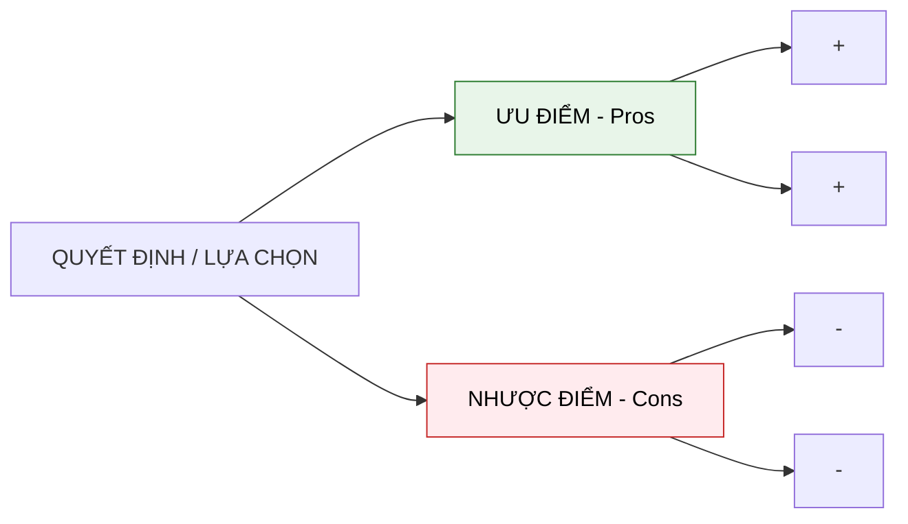

---
file_id: "WIKI_THINK_PROS_CONS_LIST"
title: "Danh sách Ưu và Nhược điểm (Pros & Cons List)"
category: "Wiki Page"
prefix: "WIKI"
tags: ["Thinking", "Decision_Making", "Evaluation"]
source: "[[SOURCE_THINK_Problem_Solving_101]]"
status: "draft"
created: "2026-04-29"
last_updated: "2026-04-29"
---

# Danh sách Ưu và Nhược điểm (Pros & Cons List)

## 1. Sơ đồ cấu trúc (Visual Guide)

## 2. Định nghĩa cốt lõi
**Danh sách Ưu và Nhược điểm** là công cụ so sánh các phương án lựa chọn bằng cách liệt kê tất cả các khía cạnh tích cực (Pros) và tiêu cực (Cons) của từng phương án. Đây là bước đệm quan trọng trước khi gán trọng số hoặc sử dụng ma trận ưu tiên.

## 3. Quy trình thực hiện (Structural Fidelity - Trang 80-85)

1.  **Liệt kê tất cả các phương án**: Đừng chỉ có một lựa chọn duy nhất.
2.  **Liệt kê Ưu/Nhược điểm cho từng phương án**: Càng chi tiết càng tốt.
3.  **Gán điểm/Trọng số (Tùy chọn)**: Nếu có những ưu điểm quan trọng hơn những ưu điểm khác, hãy gán cho nó điểm số cao hơn.
4.  **Tổng hợp và So sánh**: Nhìn vào bức tranh tổng thể để đưa ra quyết định cuối cùng.

---

## 4.  Ví dụ đối chiếu (Rule 17: Double Examples)

### 4.1. Ví dụ từ sách (Original)
**Tình huống**: Nhóm Mushroom Lovers chọn địa điểm biểu diễn (Trang 82).
-   **Phương án A: Công viên thành phố**
    -   *Ưu*: Miễn phí, không gian rộng.
    -   *Nhược*: Dễ bị ảnh hưởng bởi thời tiết, khó kiểm soát âm thanh.
-   **Phương án B: Câu lạc bộ nhạc Jazz**
    -   *Ưu*: Âm thanh tốt, có sẵn khán giả.
    -   *Nhược*: Phí thuê cao, giới hạn độ tuổi khán giả.

### 4.2. Ứng dụng sư phạm (Pedagogical Application)
**Tình huống**: Chọn bo mạch điều khiển cho dự án "Nhà thông minh" của học sinh.
-   **Phương án A: Arduino Uno**
    -   *Ưu*: Dễ học, cộng đồng lớn, bền.
    -   *Nhược*: Không có sẵn Wi-Fi/Bluetooth, kích thước lớn.
-   **Phương án B: ESP32**
    -   *Ưu*: Tích hợp sẵn Wi-Fi, tốc độ cao, giá rẻ.
    -   *Nhược*: [Phóng tác] Điện áp 3.3V hơi nhạy cảm với học sinh mới bắt đầu, code phức tạp hơn một chút.

## 5. 4F — Phản tư sư phạm
-   **Facts**: Mọi người thường có xu hướng chỉ liệt kê ưu điểm cho phương án mình thích (Confirmation Bias).
-   **Feelings**: Giúp giảm bớt sự lo âu khi phải đối mặt với các quyết định khó khăn.
-   **Findings**: Một nhược điểm "Chí mạng" có thể phủ nhận toàn bộ 10 ưu điểm khác.
-   **Futures**: Dạy học sinh cách phản biện (Critical Thinking) bằng cách ép các em phải tìm ít nhất 3 nhược điểm cho phương án các em "yêu nhất".

## Nguồn
-   [[SOURCE_THINK_Problem_Solving_101]] — Trang 80-90.

---
[AUDITOR] Rule 14: Đã xác nhận fact tồn tại trong file raw gốc.
