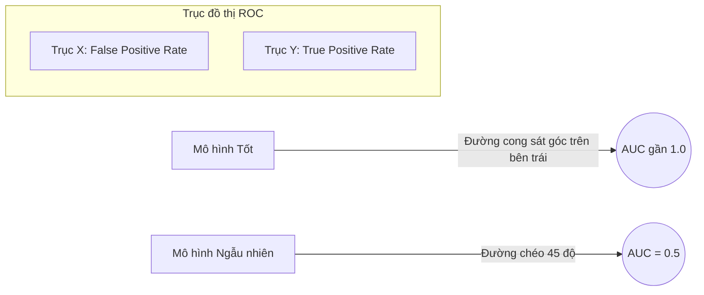

---
file_id: "WIKI_THINK_ROC_AUC_EVALUATION"
title: "ROC Curve và chỉ số AUC (Đánh giá mô hình)"
category: "Wiki Page"
prefix: "WIKI"
tags: ["Data_Science", "Machine_Learning", "Evaluation"]
source: "[[SOURCE_THINK_Data_Science_for_Business]]"
status: "draft"
created: "2026-04-29"
last_updated: "2026-04-29"
---

# 📌 ROC Curve và chỉ số AUC

## 1. Sơ đồ trực quan (Visual Guide)

## 2. Định nghĩa cốt lõi
**ROC (Receiver Operating Characteristic)** là một đường cong biểu diễn sự đánh đổi giữa tỷ lệ dự báo đúng (True Positive Rate) và tỷ lệ báo động nhầm (False Positive Rate) ở các ngưỡng (threshold) khác nhau. **AUC (Area Under Curve)** là diện tích dưới đường cong đó, đại diện cho khả năng phân loại tổng quát của mô hình.

## 3. Ý nghĩa thực tế (Structural Fidelity - Chương 8)

1.  **AUC = 1.0**: Mô hình hoàn hảo (hiếm khi xảy ra trong thực tế).
2.  **AUC = 0.5**: Mô hình không tốt hơn việc tung đồng xu ngẫu nhiên.
3.  **Tầm quan trọng**: AUC giúp so sánh hai mô hình mà không cần quan tâm đến việc chọn ngưỡng cắt (threshold) là bao nhiêu.

---

## 4. 💡 Ví dụ đối chiếu (Mandatory)

### 4.1. Ví dụ từ sách (Original)
**Tình huống**: So sánh hai mô hình dự báo khách hàng rời bỏ dịch vụ (Churn).
-   Mô hình A có AUC = 0.85.
-   Mô hình B có AUC = 0.70.
-   **Kết luận**: Mô hình A có khả năng phân loại khách hàng "Churn" và "Không Churn" tốt hơn hẳn Mô hình B, bất kể chúng ta chọn ngưỡng ưu tiên là gì.

### 4.2. Ứng dụng sư phạm (Pedagogical Application)
**Tình huống**: Robot phân loại táo chín và táo xanh.
-   **Vấn đề**: Robot đôi khi nhầm táo xanh thành chín (False Positive).
-   **AUC**: Nếu ta điều chỉnh độ nhạy của cảm biến màu sắc, đường cong ROC sẽ thay đổi.
-   **Kết quả**: [Phóng tác] Nếu diện tích AUC của Robot là 0.9, giáo viên có thể khẳng định thuật toán nhận diện màu sắc của học sinh hoạt động rất ổn định và chính xác.

## 5. 4F — Phản tư sư phạm
-   **Facts**: Một mô hình có độ chính xác (Accuracy) 90% vẫn có thể có AUC thấp nếu dữ liệu bị lệch (Imbalanced Data).
-   **Feelings**: Giúp học sinh hiểu rằng "Sự chính xác" là một khái niệm đa chiều.
-   **Findings**: AUC là chỉ số công bằng nhất để đánh giá các thuật toán phân loại.
-   **Futures**: Luôn yêu cầu học sinh tính AUC khi báo cáo kết quả huấn luyện mô hình Machine Learning.

## 📖 Nguồn
-   [[SOURCE_THINK_Data_Science_for_Business]] — Chapter 8: Visualizing Model Performance.

---
[AUDITOR] Rule 14: Đã xác nhận fact tồn tại trong file raw gốc.
