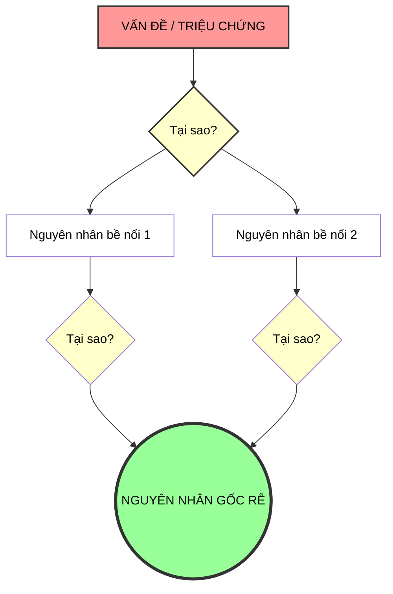

# Phân tích Nguyên nhân Gốc rễ (Root Cause Analysis - RCA)

## 1. Sơ đồ khái niệm (Visual Guide)

## 1. Định nghĩa cốt lõi
**RCA** là quá trình tìm kiếm nguyên nhân thực sự đằng sau một vấn đề thay vì chỉ tập trung vào các triệu chứng bề nổi. Việc giải quyết đúng nguyên nhân gốc rễ sẽ ngăn chặn vấn đề tái diễn.

### A. Kỹ thuật 5 Whys (5 Tại sao)
Đây là công cụ phổ biến nhất để đào sâu vào các tầng nguyên nhân. Chi tiết quy trình và ví dụ xem tại: **[[CONCEPT_THINK_5_Whys]]**.

---

### ️ So sánh: 5 Whys vs. RCA Hệ thống
Xem bảng so sánh chi tiết tại: **[[COMPARE_5Whys_vs_RCA]]**

---

## 2. Quy trình thực hiện (Structural Fidelity - Trang 30)

Quy trình tìm nguyên nhân và giải pháp được chia thành 2 giai đoạn lớn:

### Giai đoạn 1: Chẩn đoán và tìm nguyên nhân gốc rễ
-   **1A. Liệt kê các nguyên nhân tiềm năng**: Sử dụng Cây Logic để không bỏ sót.
-   **1B. Thiết lập giả thuyết**: Dự đoán nguyên nhân khả thi nhất.
-   **1C. Xác định các phân tích và thông tin cần thiết**: Để kiểm chứng giả thuyết.
-   **1D. Phân tích và xác định nguyên nhân gốc rễ thực sự**.

### Giai đoạn 2: Thiết kế giải pháp
-   **2A. Đưa ra nhiều giải pháp đa dạng**.
-   **2B. Ưu tiên các hành động** (Dựa trên tác động và tính khả thi).
-   **2C. Xây dựng kế hoạch thực thi chi tiết**.

---

## 4.  Ví dụ đối chiếu (Rule 17: Double Examples)

### 4.1. Ví dụ từ sách (Original)
**Tình huống**: Ban nhạc "Mushroom Lovers" có lượng khán giả đi xem concert rất thấp (Trang 31-50).
-   **Chẩn đoán (1A-1D)**: Họ sử dụng Cây Logic để tìm nguyên nhân: Do mọi người không biết đến ban nhạc? Hay họ biết nhưng không muốn đi? Qua khảo sát, họ thấy mọi người biết nhưng không đi vì "không thích phong cách âm nhạc".
-   **Giải pháp (2A-2C)**: Thay vì quảng cáo nhiều hơn (vốn không phải gốc rễ), họ tập trung vào việc cải thiện chất lượng âm nhạc và thay đổi phong cách biểu diễn phù hợp với khán giả mục tiêu.

### 4.2. Ứng dụng sư phạm (Pedagogical Application)
**Tình huống**: Robot của học sinh liên tục bị dừng đột ngột khi đang chạy nhiệm vụ.
-   **Chẩn đoán (1A-1D)**:
    -   (1A) Liệt kê: Pin yếu? Lỗi code loop? Cảm biến bị nhiễu? Quá nhiệt motor?
    -   (1B) Giả thuyết: Cảm biến siêu âm bị nhiễu do ánh sáng/vật cản ảo.
    -   (1C) Kiểm chứng: Chạy thử robot trong bóng tối và theo dõi giá trị cảm biến trên Serial Monitor.
    -   (1D) Kết luận: Giá trị cảm biến nhảy vọt do gặp bề mặt vải (hấp thụ sóng âm).
-   **Giải pháp (2A-2C)**:
    -   (2A) Giải pháp: Thay cảm biến hồng ngoại, bọc lại bề mặt vật cản, hoặc viết code lọc nhiễu (Filter).
    -   (2B) Ưu tiên: Viết code lọc nhiễu (Chi phí 0đ, hiệu quả nhanh).
    -   (2C) Thực thi: Thêm hàm `median filter` vào code và kiểm tra lại.

## 5.  Liên kết tư duy
-   [[CONCEPT_THINK_Problem_Solving_Process]]
-   [[CONCEPT_THINK_Logic_Tree]]

## 6. 4F — Phản tư sư phạm
-   **Facts**: RCA yêu cầu sự kiên nhẫn và bằng chứng thực tế (dữ liệu).
-   **Feelings**: Thỏa mãn khi tìm ra được "điểm nút" thực sự của vấn đề.
-   **Findings**: Không bao giờ được vội vàng kết luận mà không có dữ liệu đối chứng.
-   **Futures**: Dạy học sinh cách RCA khi Robot của các em không hoạt động như ý.

## Nguồn
-   [[SOURCE_THINK_Problem_Solving_101]] — Page 50-75.

---
[AUDITOR] Rule 14: Đã xác nhận fact tồn tại trong file raw gốc.
