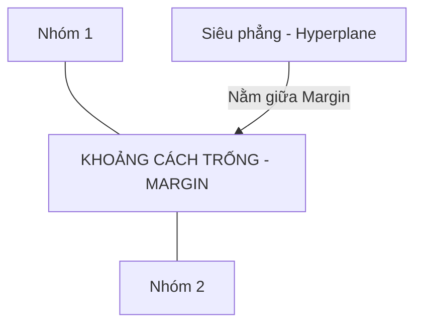

---
file_id: "WIKI_THINK_SVM_LINEAR_SEPARATION"
title: "SVM - Máy Vector Hỗ trợ (Ranh giới tối ưu)"
category: "Wiki Page"
prefix: "WIKI"
tags: ["Data_Science", "Machine_Learning", "Advanced"]
source: "[[SOURCE_THINK_Data_Science_for_Business]]"
status: "draft"
created: "2026-04-29"
last_updated: "2026-04-29"
---

# 📌 SVM - Máy Vector Hỗ trợ (Ranh giới tối ưu)

## 1. Sơ đồ trực quan (Visual Guide)

## 2. Định nghĩa cốt lõi
**SVM (Support Vector Machine)** là một thuật toán phân loại tìm kiếm một "siêu phẳng" (hyperplane) để chia tách các lớp dữ liệu sao cho khoảng cách (margin) từ siêu phẳng đó đến các điểm gần nhất của mỗi lớp (gọi là các Support Vectors) là lớn nhất có thể.

## 3. Cách hoạt động (Structural Fidelity - Chương 4)

1.  **Mục tiêu**: Không chỉ là chia tách dữ liệu, mà là chia tách một cách "an toàn" nhất bằng cách tối đa hóa lề (margin).
2.  **Kernel Trick**: Một kỹ thuật nâng cao giúp SVM có thể phân tách được cả những dữ liệu không thể chia bằng đường thẳng (phi tuyến) bằng cách đưa chúng vào không gian cao chiều hơn.
3.  **Điểm mạnh**: Hoạt động cực tốt với dữ liệu có ít mẫu nhưng nhiều thuộc tính.

---

## 4. 💡 Ví dụ đối chiếu (Mandatory)

### 4.1. Ví dụ từ sách (Original)
**Tình huống**: Phân loại các tế bào ung thư (Lành tính vs Ác tính).
-   Dữ liệu y tế thường có ít mẫu nhưng mỗi mẫu lại có hàng trăm chỉ số sinh hóa.
-   **SVM**: Sẽ tìm ra ranh giới rõ ràng nhất để bác sĩ có thể dựa vào đó đưa ra chẩn đoán với độ tin cậy cao nhất.

### 4.2. Ứng dụng sư phạm (Pedagogical Application)
**Tình huống**: Robot phân loại linh kiện hư hỏng và linh kiện tốt trên băng chuyền.
-   **Vấn đề**: Các linh kiện lỗi chỉ khác linh kiện tốt ở một vết xước rất nhỏ.
-   **Ứng dụng**: [Phóng tác] SVM sẽ tìm ra "vùng đệm" an toàn nhất giữa hai loại linh kiện này. Nếu một linh kiện rơi vào vùng đệm, Robot sẽ tạm dừng để con người kiểm tra (Human-in-the-loop).
-   **Ý nghĩa**: Giúp học sinh hiểu về khái niệm "Độ tin cậy" trong phân loại.

## 5. 4F — Phản tư sư phạm
-   **Facts**: Khoảng cách (Margin) càng lớn thì mô hình càng ít bị ảnh hưởng bởi nhiễu.
-   **Feelings**: Cảm giác về sự cân bằng và chính xác tuyệt đối của toán học.
-   **Findings**: Đôi khi chúng ta cần hy sinh sự chính xác tuyệt đối trên tập huấn luyện để đổi lấy một lề rộng hơn (Soft Margin).
-   **Futures**: Sử dụng SVM cho các bài toán nhận diện chữ viết tay hoặc nhận diện khuôn mặt đơn giản.

## 📖 Nguồn
-   [[SOURCE_THINK_Data_Science_for_Business]] — Chapter 4: Fitting a Model to Data.

---
[AUDITOR] Rule 14: Đã xác nhận fact tồn tại trong file raw gốc.
