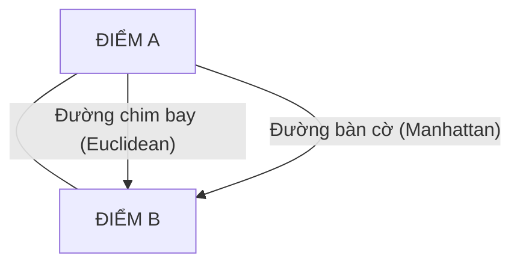

---
file_id: "WIKI_THINK_SIMILARITY_DISTANCE_METRICS"
title: "Độ tương đồng và Các phép đo Khoảng cách"
category: "Wiki Page"
prefix: "WIKI"
tags: ["Data_Science", "Mathematics", "Clustering"]
source: "[[SOURCE_THINK_Data_Science_for_Business]]"
status: "draft"
created: "2026-04-29"
last_updated: "2026-04-29"
---

# 📌 Độ tương đồng và Các phép đo Khoảng cách

## 1. Sơ đồ trực quan (Visual Guide)

## 2. Định nghĩa cốt lõi
Trong dữ liệu, để biết hai đối tượng (khách hàng, sản phẩm, linh kiện) có "giống nhau" hay không, chúng ta quy đổi các thuộc tính của chúng thành tọa độ trong không gian đa chiều và đo **Khoảng cách** giữa chúng. Khoảng cách càng nhỏ, độ tương đồng càng cao.

## 3. Các phép đo phổ biến (Structural Fidelity - Chương 6)

1.  **Euclidean Distance (Đường chim bay)**: Phép đo phổ biến nhất, tính theo công thức căn bậc hai của tổng bình phương hiệu các tọa độ.
2.  **Manhattan Distance (Đường bàn cờ)**: Tổng các giá trị tuyệt đối của hiệu các tọa độ (giống như cách di chuyển trong thành phố ô bàn cờ).
3.  **Jaccard Distance**: Dùng cho dữ liệu dạng tập hợp (ví dụ: so sánh giỏ hàng của hai khách hàng dựa trên những món đồ họ cùng mua).
4.  **Cosine Similarity**: Đo góc giữa hai vector, thường dùng trong phân tích văn bản (Text Mining).

---

## 4. 💡 Ví dụ đối chiếu (Mandatory)

### 4.1. Ví dụ từ sách (Original)
**Tình huống**: Hệ thống gợi ý bạn bè trên mạng xã hội.
-   **Cách làm**: Tính khoảng cách giữa các sở thích của bạn và người khác. Nếu bạn thích "Dữ liệu", "Sách", "Robot" và người kia cũng vậy -> Khoảng cách Euclidean giữa hai bạn rất nhỏ -> Hệ thống sẽ gợi ý "Bạn có thể biết người này".

### 4.2. Ứng dụng sư phạm (Pedagogical Application)
**Tình huống**: Robot phân loại trái cây dựa trên Kích thước và Màu sắc.
-   **Vấn đề**: Robot gặp một quả mới. Nó sẽ tính "khoảng cách" từ quả này đến các mẫu vật chuẩn (Táo, Cam).
-   **Kết quả**: [Phóng tác] Nếu quả mới có tọa độ gần với "Táo" nhất về cả kích thước và sắc đỏ -> Robot kết luận đây là quả Táo. Đây chính là nguyên lý của thuật toán K-Nearest Neighbors (k-NN).

## 5. 4F — Phản tư sư phạm
-   **Facts**: Trước khi đo khoảng cách, cần phải **Chuẩn hóa (Normalization)** dữ liệu (ví dụ: không thể so sánh số mét với số kg mà không quy đổi cùng thang điểm).
-   **Feelings**: Sự kinh ngạc khi thấy mọi thứ trên đời (từ âm nhạc đến hình ảnh) đều có thể biến thành những con số và đo đạc được.
-   **Findings**: Chọn sai phép đo khoảng cách có thể dẫn đến kết quả phân loại sai hoàn toàn.
-   **Futures**: Dạy học sinh cách dùng thước kẻ đo khoảng cách trên giấy để hiểu về sự tương đồng trước khi lập trình cho Robot.

## 📖 Nguồn
-   [[SOURCE_THINK_Data_Science_for_Business]] — Chapter 6: Similarity, Neighbors, and Clusters.

---
[AUDITOR] Rule 14: Đã xác nhận fact tồn tại trong file raw gốc.
