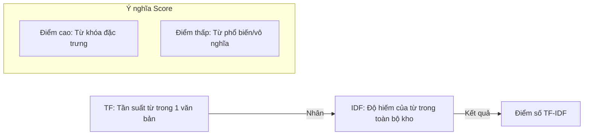

---
file_id: "WIKI_THINK_TF_IDF_TEXT_MINING"
title: "TF-IDF (Khai thác dữ liệu văn bản)"
category: "Wiki Page"
prefix: "WIKI"
tags: ["Data_Science", "NLP", "Text_Mining"]
source: "[[SOURCE_THINK_Data_Science_for_Business]]"
status: "draft"
created: "2026-04-29"
last_updated: "2026-04-29"
---

# 📌 TF-IDF (Khai thác dữ liệu văn bản)

## 1. Sơ đồ trực quan (Visual Guide)

## 2. Định nghĩa cốt lõi
**TF-IDF (Term Frequency - Inverse Document Frequency)** là một kỹ thuật chuyển đổi văn bản thành số liệu để máy tính có thể hiểu được tầm quan trọng của một từ trong một tập hợp các tài liệu. Nó giúp loại bỏ các từ phổ biến (như "the", "a", "và") và làm nổi bật các từ mang tính đặc trưng của chủ đề.

## 3. Cách tính (Structural Fidelity - Chương 10)

1.  **TF (Term Frequency)**: Một từ xuất hiện càng nhiều trong một trang thì nó càng quan trọng đối với trang đó.
2.  **IDF (Inverse Document Frequency)**: Một từ xuất hiện trong quá nhiều trang (ví dụ: từ "dữ liệu" trong thư viện dữ liệu) thì nó mất đi khả năng phân loại, nên điểm IDF sẽ thấp.
3.  **Kết quả**: TF-IDF cao khi từ đó xuất hiện nhiều trong một văn bản nhưng lại hiếm xuất hiện ở các văn bản khác.

---

## 4. 💡 Ví dụ đối chiếu (Mandatory)

### 4.1. Ví dụ từ sách (Original)
**Tình huống**: Phân loại các tin tức về "Kinh tế" và "Thể thao".
-   Từ "cầu thủ": Xuất hiện nhiều trong bài viết A, nhưng hiếm khi xuất hiện trong các bài viết kinh tế khác -> TF-IDF cao -> Đây là từ khóa đặc trưng cho "Thể thao".
-   Từ "thông tin": Xuất hiện ở mọi bài viết -> IDF thấp -> TF-IDF thấp -> Không dùng để phân loại được.

### 4.2. Ứng dụng sư phạm (Pedagogical Application)
**Tình huống**: Hệ thống tìm kiếm tài liệu học tập trong thư viện trường.
-   **Vấn đề**: Học sinh tìm từ khóa "Robot".
-   **Ứng dụng**: [Phóng tác] Hệ thống sẽ ưu tiên các tài liệu mà từ "Robot" xuất hiện nhiều nhưng không phải là những từ chung chung như "sách" hay "giấy".
-   **Ý nghĩa**: Giúp học sinh hiểu cách các công cụ tìm kiếm như Google sắp xếp thứ tự kết quả.

## 5. 4F — Phản tư sư phạm
-   **Facts**: TF-IDF là bước cơ bản nhất để máy tính "đọc" hiểu nội dung văn bản.
-   **Feelings**: Thú vị khi thấy ngôn ngữ có thể được định lượng hóa một cách logic.
-   **Findings**: Sự "hiếm" mang lại giá trị định danh.
-   **Futures**: Dạy học sinh cách tự tạo một "đám mây từ khóa" (Word Cloud) dựa trên trọng số TF-IDF cho đồ án của mình.

## 📖 Nguồn
-   [[SOURCE_THINK_Data_Science_for_Business]] — Chapter 10: Representing and Mining Text.

---
[AUDITOR] Rule 14: Đã xác nhận fact tồn tại trong file raw gốc.
