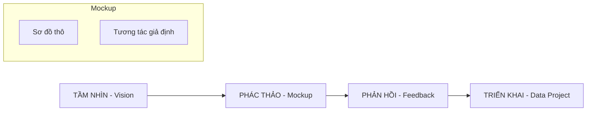

---
file_id: "WIKI_THINK_VISION_MOCKUPS"
title: "Tầm nhìn và Phác thảo (Vision & Mockups)"
category: "Wiki Page"
prefix: "WIKI"
tags: ["Data_Science", "Design", "Communication"]
source: "[[SOURCE_THINK_Thinking_with_Data]]"
status: "draft"
created: "2026-04-29"
last_updated: "2026-04-29"
---

# 📌 Tầm nhìn và Phác thảo (Vision & Mockups)

## 1. Sơ đồ cấu trúc (Visual Guide)

## 2. Định nghĩa cốt lõi
Trong khung CoNVO, **Vision** là giai đoạn quan trọng nhất để thống nhất kỳ vọng giữa người làm dữ liệu và bên liên quan. **Mockup** là công cụ hữu hình hóa tầm nhìn đó bằng các bản vẽ thô (low-fidelity) trước khi bắt tay vào code.

## 3. Quy trình thực hiện (Structural Fidelity - Chương 2)

1.  **Phát biểu Tầm nhìn**: "Nếu dự án thành công, người dùng sẽ thấy gì/làm được gì?".
2.  **Vẽ bản phác thảo thô**: Không cần đẹp, chỉ cần thể hiện được logic của luồng dữ liệu hoặc giao diện dashboard.
3.  **Tạo kịch bản sử dụng (Scenarios)**: Mô tả cách người dùng tương tác với sản phẩm cuối cùng.
4.  **Lấy phản hồi sớm**: Điều chỉnh Mockup dựa trên ý kiến khách hàng để tránh làm sai yêu cầu ngay từ đầu.

---

## 4. 💡 Ví dụ đối chiếu (Mandatory)

### 4.1. Ví dụ từ sách (Original)
**Tình huống**: Xây dựng hệ thống gợi ý bán hàng.
-   **Vision**: Nhân viên bán hàng sẽ nhận được danh sách 3 khách hàng tiềm năng nhất mỗi sáng kèm theo lý do tại sao họ nên gọi điện.
-   **Mockup**: Vẽ một tờ giấy có 3 ô tên khách hàng và một cột "Gợi ý nói chuyện".
-   **Phản hồi**: Nhân viên nói họ cần thêm số điện thoại trực tiếp vào danh sách đó -> Cập nhật Mockup.

### 4.2. Ứng dụng sư phạm (Pedagogical Application)
**Tình huống**: Học sinh thiết kế ứng dụng theo dõi sức khỏe cây trồng.
-   **Vision**: [Phóng tác] Người dùng mở app và thấy ngay màu sắc của cây (Xanh: Khỏe, Đỏ: Cần nước) kèm theo nút "Tưới ngay".
-   **Mockup**: Vẽ 3 màn hình điện thoại bằng bút chì trên giấy A4.
-   **Phản hồi**: Giáo viên góp ý nên có thêm biểu đồ lịch sử độ ẩm -> Học sinh thêm một trang biểu đồ vào phác thảo.

## 5. 4F — Phản tư sư phạm
-   **Facts**: Vẽ Mockup tốn 10 phút, sửa code sai yêu cầu tốn 10 ngày.
-   **Feelings**: Giảm bớt sự lo lắng của các bên liên quan khi họ thấy được "hình hài" của kết quả.
-   **Findings**: Vision càng cụ thể, việc chọn thuật toán sau này càng dễ dàng.
-   **Futures**: Yêu cầu học sinh luôn nộp bản phác thảo tay (Sketch) trước khi bắt đầu lập trình app hoặc dashboard.

## 📖 Nguồn
-   [[SOURCE_THINK_Thinking_with_Data]] — Chương 2: The CoNVO Framework.

---
[AUDITOR] Rule 14: Đã xác nhận fact tồn tại trong file raw gốc.
