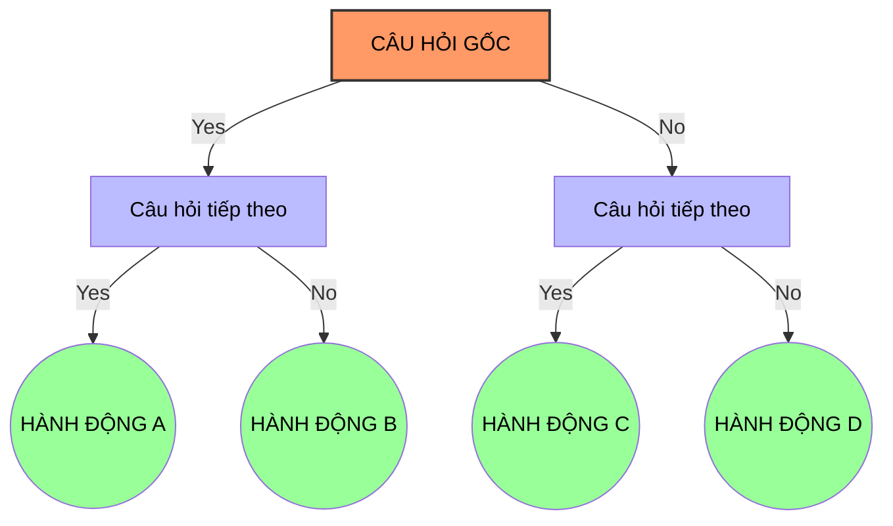

# Cây Yes/No (Yes/No Tree)

## 1. Sơ đồ quyết định (Visual Guide)

## 1. Định nghĩa cốt lõi
**Cây Yes/No** là một công cụ ra quyết định trực quan sử dụng các câu hỏi nhị phân (Đúng/Sai hoặc Có/Không) để phân loại thông tin hoặc thu hẹp phạm vi của vấn đề cho đến khi đạt được kết luận cuối cùng.

## 2. Chi tiết phương pháp (Structural Fidelity - Trang 76-85)
1.  **Xác định câu hỏi gốc**: Điểm bắt đầu của mọi quyết định.
2.  **Đặt câu hỏi nhị phân**: Mỗi nút của cây phải là một câu hỏi có câu trả lời rõ ràng là Yes hoặc No.
3.  **Xây dựng các nhánh**: Mỗi câu trả lời dẫn đến một câu hỏi tiếp theo hoặc một hành động cụ thể.
4.  **Điểm dừng (Endpoints)**: Khi không còn câu hỏi nào cần thiết và giải pháp đã lộ diện.

---

## 3.  Ví dụ đối chiếu (Rule 17: Double Examples)

### 3.1. Ví dụ từ sách (Original)
**Tình huống**: Nhân vật John quyết định cách để có tiền mua máy tính (Trang 84).
-   **Q1**: Bạn có đồ cũ để bán không?
    -   *Yes* -> Đem bán đồ cũ.
    -   *No* -> Chuyển sang Q2.
-   **Q2**: Bạn có thể cắt giảm chi tiêu hiện tại không?
    -   *Yes* -> Lập kế hoạch tiết kiệm.
    -   *No* -> Chuyển sang Q3.
-   **Q3**: Bạn có thể tìm việc làm thêm không?
    -   *Yes* -> Đi tìm việc.
    -   *No* -> [Phóng tác] Xem xét mượn tiền hoặc hạ mục tiêu.

### 3.2. Ứng dụng sư phạm (Pedagogical Application)
**Tình huống**: Học sinh quyết định chọn linh kiện cho dự án Robot dò đường.
-   **Q1**: Ngân sách có trên 200k không?
    -   *Yes* -> Sử dụng cảm biến hồng ngoại kỹ thuật số (chính xác hơn).
    -   *No* -> Chuyển sang Q2.
-   **Q2**: Bạn có sẵn cảm biến cũ không?
    -   *Yes* -> Tận dụng đồ cũ để tiết kiệm.
    -   *No* -> Sử dụng quang trở (LDR) - giá rẻ nhưng cần code lọc nhiễu.

## 4.  Liên kết tư duy
-   [[CONCEPT_THINK_Logic_Tree]]
-   [[CONCEPT_THINK_Problem_Solving_Process]]

## 5. 4F — Phản tư sư phạm
-   **Facts**: Giúp đơn giản hóa việc ra quyết định phức tạp.
-   **Feelings**: Giảm sự do dự và trì hoãn.
-   **Findings**: Một câu hỏi tốt ở đầu cây sẽ tiết kiệm rất nhiều thời gian ở các nhánh sau.
-   **Futures**: Dạy học sinh dùng cây này để lập trình các khối lệnh `if-else` trong Arduino/Python.

## Nguồn
-   [[SOURCE_THINK_Problem_Solving_101]] — Trang 76-85.

---
[AUDITOR] Rule 14: Đã xác nhận fact tồn tại trong file raw gốc.
