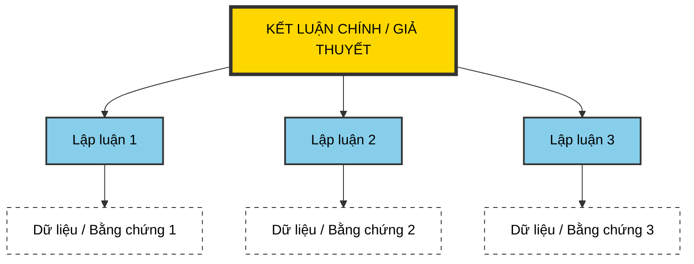

---
file_id: "WIKI_THINK_HYPOTHESIS_PYRAMID"
title: "Kim tự tháp Giả thuyết (Hypothesis Pyramid)"
category: "Wiki Page"
prefix: "WIKI"
tags: ["Logic", "Argument", "Persuasion"]
source: "[[SOURCE_THINK_Problem_Solving_101]]"
status: "draft"
created: "2026-04-28"
last_updated: "2026-04-28"
---

# 📌 Kim tự tháp Giả thuyết (Hypothesis Pyramid)

## 1. Sơ đồ cấu trúc (Visual Guide)

## 2. Định nghĩa cốt lõi
**Kim tự tháp Giả thuyết** là một cấu trúc lập luận giúp sắp xếp các ý tưởng và bằng chứng để chứng minh cho một kết luận hoặc giải pháp cụ thể. Nó giúp thông điệp trở nên rõ ràng và có sức thuyết phục hơn.

## 2. Cấu trúc 3 Tầng (Structural Fidelity - Trang 86-95)
1.  **Đỉnh (Conclusion/Hypothesis)**: Kết luận chính hoặc giải pháp bạn muốn đề xuất.
2.  **Giữa (Supporting Arguments)**: Các lý do hoặc lập luận chính để ủng hộ đỉnh kim tự tháp (thường là 3-5 lý do).
3.  **Đáy (Evidence/Data)**: Các dữ liệu, số liệu hoặc sự kiện cụ thể để chứng minh cho từng lập luận ở tầng giữa.

---

## 3. 💡 Ví dụ đối chiếu (Mandatory)

### 3.1. Ví dụ từ sách (Original)
**Tình huống**: Đề xuất phương án mua máy tính (Trang 88).
-   **Đỉnh**: Nên mua máy tính Apple cũ giá $500.
-   **Tầng giữa**:
    1. Phù hợp cho việc học đồ họa CGI.
    2. Giá cả nằm trong ngân sách có thể tiết kiệm được.
    3. Độ bền và tính ổn định cao.
-   **Tầng đáy**: Dẫn chứng về cấu hình máy, giá thị trường trên eBay, và review của người dùng.

### 3.2. Ứng dụng sư phạm (Pedagogical Application)
**Tình huống**: Học sinh thuyết trình bảo vệ dự án "Hệ thống tưới cây tự động".
-   **Đỉnh**: Nên lắp đặt hệ thống này trong vườn trường.
-   **Tầng giữa**:
    1. Giúp tiết kiệm nước và công sức của bác bảo vệ.
    2. Đảm bảo cây không bị chết vào cuối tuần/nghỉ lễ.
    3. Là mô hình học tập trực quan cho các lớp sinh học.
-   **Tầng đáy**: Số liệu về lượng nước tiêu thụ khi tưới thủ công, biểu đồ độ ẩm đất đo được qua cảm biến, và phản hồi tích cực từ học sinh khối 6.

## 4. 🔗 Liên kết tư duy
-   [[THINK_Logic_Tree]]
-   [[THINK_Problem_Solving_Process]]

## 5. 4F — Phản tư sư phạm
-   **Facts**: Cấu trúc này buộc chúng ta phải có dữ liệu (tầng đáy) mới được đưa ra kết luận (đỉnh).
-   **Feelings**: Giúp người nói tự tin hơn vì lập luận có cơ sở vững chắc.
-   **Findings**: Một kim tự tháp lỏng lẻo ở đáy sẽ khiến toàn bộ lập luận sụp đổ.
-   **Futures**: Rèn luyện cho học sinh kỹ năng tranh biện (Debate) dựa trên bằng chứng thay vì cảm tính.

## 📖 Nguồn
-   [[SOURCE_THINK_Problem_Solving_101]] — Trang 86-95.

---
[AUDITOR] Rule 14: Đã xác nhận fact tồn tại trong file raw gốc.
