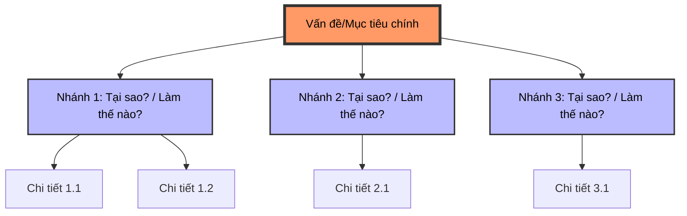

---
file_id: "WIKI_THINK_LOGIC_TREE"
title: "Cây Logic (Logic Tree)"
category: "Wiki Page"
prefix: "WIKI"
tags: ["Tool", "Logic", "Analysis"]
source: "[[SOURCE_THINK_Problem_Solving_101]]"
status: "draft"
created: "2026-04-28"
last_updated: "2026-04-28"
---

# 📌 Cây Logic (Logic Tree)

## 1. Sơ đồ cấu trúc (Visual Guide)

## 2. Định nghĩa cốt lõi
**Cây Logic** là một công cụ trực quan giúp phân rã một vấn đề hoặc một mục tiêu lớn thành các thành phần nhỏ hơn, dễ quản lý hơn mà không bỏ sót bất kỳ yếu tố quan trọng nào (đảm bảo tính MECE - Mutually Exclusive, Collectively Exhaustive).

## 2. Các loại Cây Logic chính

1.  **Cây "Tại sao?" (Why Tree):** Dùng để xác định tất cả các nguyên nhân tiềm năng của một vấn đề.
2.  **Cây "Làm thế nào?" (How Tree):** Dùng để liệt kê tất cả các giải pháp hoặc cách thức để đạt được một mục tiêu.

## 3. Quy tắc xây dựng
-   **Nguyên tắc MECE:** Các nhánh ở cùng một cấp độ không được chồng chéo lên nhau và phải bao phủ toàn bộ các khả năng.
-   **Độ sâu:** Thường phân rã từ 3 đến 5 cấp độ để đi sâu vào chi tiết nhưng vẫn giữ được cái nhìn tổng thể.

## 4. 💡 Ví dụ đối chiếu (Mandatory)

### 4.1. Ví dụ từ sách (Original)
**Tình huống**: Cách phân loại học sinh trong một lớp 3 (Trang 23-24).
-   **Cách 1 (Giới tính)**: Nam / Nữ (Đảm bảo không ai bị bỏ sót và không ai thuộc cả 2 nhóm cùng lúc).
-   **Cách 2 (Chiều cao)**: Cao trên 1m2 / Cao từ 1m2 trở xuống.
-   **Cách 3 (Tay thuận)**: Tay phải / Tay trái / Cả hai tay.
=> *Nhận xét*: Đây là cách rèn luyện tư duy MECE cơ bản nhất trước khi áp dụng vào các vấn đề phức tạp.

### 4.2. Ứng dụng sư phạm (Pedagogical Application)
**Tình huống**: Học sinh cần phân rã các thành phần của một dự án "Nhà thông minh" (Smart Home).
-   **Nhánh 1 (Phần cứng - Hardware)**: Cảm biến ánh sáng, Đèn LED, Mạch Arduino, Dây cắm.
-   **Nhánh 2 (Phần mềm - Software)**: Code đọc cảm biến, Code điều khiển đèn, Logic so sánh giá trị.
-   **Nhánh 3 (Thiết kế - Design)**: Mô hình nhà bằng bìa carton, Cách bố trí nội thất, Vị trí đặt đèn.
=> *Ứng dụng*: Giúp học sinh quản lý dự án tốt hơn và biết chính xác mình đang thiếu sót ở phần nào.

## 5. 🔗 Liên kết tư duy
-   [[THINK_Problem_Solving_Process]]
-   [[THINK_Root_Cause_Analysis]]

## 6. 4F — Phản tư sư phạm
-   **Facts**: Công cụ này biến một mớ bòng bong thành một sơ đồ có trật tự.
-   **Feelings**: Giúp giảm bớt sự choáng ngợp trước các dự án lớn.
-   **Findings**: Một Cây Logic tốt thường bắt đầu bằng một câu hỏi cụ thể và rõ ràng.
-   **Futures**: Sử dụng để phân tích các dự án Robot phức tạp của học sinh.

## 📖 Nguồn
-   [[SOURCE_THINK_Problem_Solving_101]] — Page 30-45.

---
[AUDITOR] Rule 14: Đã xác nhận fact tồn tại trong file raw gốc.
