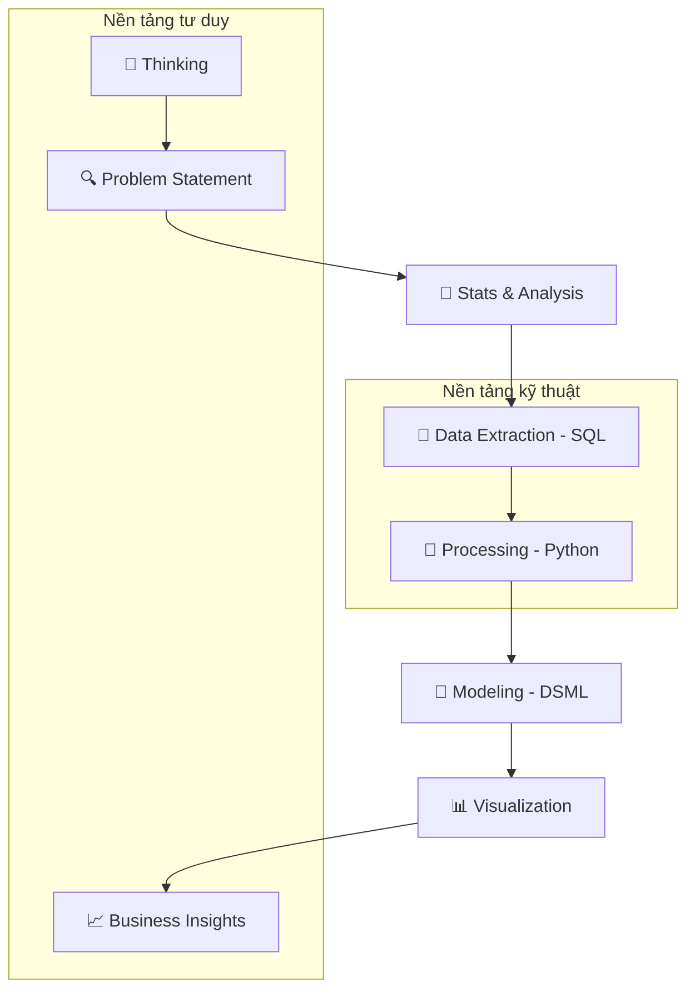

# 🌐 Tổng quan tri thức: Lộ trình đào tạo Data Analyst (Wiki 2.0)

Chào mừng bạn đến với hệ thống tri thức **Wiki 2.0**. Đây là kho lưu trữ tri thức nguyên tử (Atomic Knowledge) được thiết kế chuyên biệt cho lộ trình trở thành Data Analyst thực thụ, kết hợp giữa tư duy kinh doanh, kỹ thuật lập trình và khoa học dữ liệu.

## 📊 Thống kê sức khỏe hệ thống (Health Check)
Hệ thống hiện tại bao gồm **133 trang tri thức nguyên tử**, được phân loại thành 8 nhóm cốt lõi:

| Nhóm tri thức | Số lượng trang | Trạng thái | Trọng tâm |
| :--- | :--- | :--- | :--- |
| **--- CLUSTER 1 ---** | **Quản trị & Phương pháp** | | |
| **🛠️ Meta** |  33  | 🟢 Hoàn tất | Phương pháp luận LLM Wiki, quản trị hệ thống. |
| **📚 Sources** |  43  | 🔵 Đã chuẩn hóa | Danh mục nguồn sách và khóa học. |
| **🧠 Thinking** |  47  | 🟢 Hoàn tất 80/20 | Tư duy phản biện, Problem Solving, CoNVO. |
| **--- CLUSTER 2 ---** | **Hạ tầng & Kỹ thuật** | | |
| **💾 SQL** |  18  | 🟢 Hoàn tất | Truy vấn, tối ưu hóa, Window Functions. |
| **🐍 Python** |  7  | 🟡 Đang mở rộng | Pandas, NumPy, Scikit-Learn. |
| **⚙️ Data Engineering** |  6  | 🟡 Cơ bản | ETL/ELT, Data Modeling, Data Quality. |
| **--- CLUSTER 3 ---** | **Phân tích & Trí tuệ** | | |
| **🔢 Stats** |  10  | 🟡 Đang đào sâu | Thống kê mô tả, kiểm định giả thuyết. |
| **📊 Visualization** |  12  | 🟢 Hoàn tất | Tufte principles, Storytelling. |
| **🤖 DSML** |  6  | 🟡 Cơ bản | Thuật toán học máy, Evaluation Metrics. |

## 🗺️ Bản đồ kết nối tri thức (Knowledge Logic)

## 🚀 Lộ trình ứng dụng (Vòng 3: Case Studies)
Chúng ta đang chuyển dịch từ việc tích lũy khái niệm sang việc ứng dụng tổng hợp thông qua các Case Study thực chiến:
- [[CASE_STUDY_Churn_Prediction]]: Kết nối SQL, Python và DSML.
- [[CASE_STUDY_Teaching_Efficacy]]: Kết nối Stats và Visualization.
- [[CASE_STUDY_Data_Pipeline_Optimization]]: Kết nối DE và SQL.

## 🔗 Các liên kết Master
- [[index]] | Mục lục toàn cầu.
- [[SYNTHESIS_DA_Core_Workflow]] | Quy trình làm việc chuẩn của DA.
- [[SYNTHESIS_DA_Case_Study_Library]] | Thư viện kịch bản thực tế.

---
*Cập nhật lần cuối bởi @pm vào 2026-05-02. Hệ thống đã được làm sạch khỏi 1.600 file nhiễu.*
