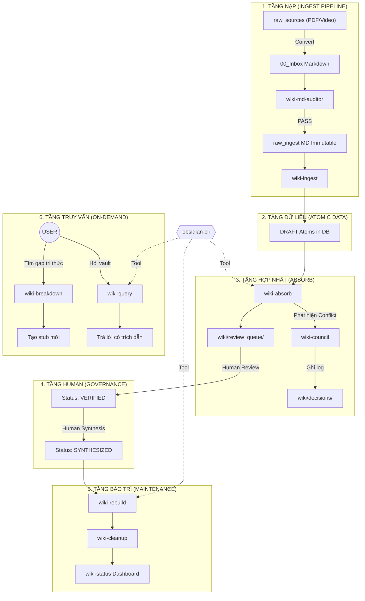

# 🗺️ WORKSPACE OVERVIEW — NoteBookLLM_Br
> **Dành cho**: AI Agent (đọc trước khi hành động) & User (kiểm tra toàn cảnh).
> **Cập nhật**: 2026-05-06 | Schema v5.0 (3-Flatten Architecture)

---

## 1. Cấu trúc thư mục (Directory Map)

```
NoteBookLLM_Br/
│
├── 📥 00_Inbox/                  ← Khu vực chờ. File Markdown sau khi convert từ PDF.
│                                    Cần qua @wiki-md-auditor trước khi vào raw_ingest/.
│
├── 📁 1-projects/                ← Các dự án đang thực thi.
│
├── 📁 2-areas/                   ← Vùng quản lý liên tục (Profiles, Assessment).
│
├── 📁 3-resources/               ← HẠ TẦNG TRI THỨC (Source of Truth)
│   ├── 📂 raw_sources/           ← EVIDENCE — PDF/Video/HTML gốc. IMMUTABLE.
│   ├── 📂 raw_ingest/            ← FUEL — Markdown đạt chuẩn Auditor. IMMUTABLE.
│   ├── 📂 raw_assets/            ← VISUAL PROOF — Hình ảnh/Biểu đồ phẳng.
│   │
│   └── 📂 wiki/                  ← KHO WIKI 2.0 (Atomic Knowledge)
│       ├── index.md              ← Bản đồ đồ thị (generated)
│       ├── log.md                ← Nhật ký thay đổi (UTF-8 no BOM)
│       ├── concepts/             ← Atomic concept pages
│       ├── entities/             ← Entity pages (Tools, People)
│       ├── sources/              ← Source summaries
│       ├── synthesis/            ← Human-made synthesis files
│       ├── decisions/            ← Nhật ký quyết định của @wiki-council
│       └── review_queue/          ← Nơi chứa Atom mới chờ Duyệt
│
├── 📁 4-archive/                 ← Lưu trữ vĩnh viễn.
│
├── 📁 .agent/                    ← Cấu hình & Kỹ năng (Skills)
│   ├── skills/                   ← Bộ kỹ năng v2.8 (obsidian-cli, ingest, absorb...)
│   └── workflows/                ← Các quy trình tự động hóa
│
├── AGENTS.md                     ← BỘ LUẬT SWARM (BẮT BUỘC ĐỌC)
├── SOUL.md                       ← Tính cách & Sứ mệnh Agent
├── USER.md                       ← Hồ sơ & Ranh giới của User
├── WORKSPACE_OVERVIEW.md         ← File này
├── task_plan.md                  ← Kế hoạch hiện tại (v5.3 — Data Analyst 80/20)
├── CONTINUITY.md                 ← Ghi nhớ liên phiên (lỗi đã gặp, context)
└── COMMAND_BOARD.md              ← Bảng điều khiển lệnh nhanh
```

---

## 2. Kiến trúc Hệ thống Wiki 2.0 (Phiên bản Hoàng kim v2.8)

Mọi Agent phải tuân thủ luồng runtime này.



---

## 3. Phân quyền Agent (Quick Reference)

| Agent | Đọc | GHI (được phép) |
|:---|:---|:---|
| `@pm` | Tất cả | `wiki/log.md`, `1-projects/`, `CONTINUITY.md` |
| `@scout` | `raw_sources/`, `raw_ingest/` | `1-projects/*/Analysis_*.md` (draft) |
| `@engineer` | `raw_ingest/`, `wiki/` | `1-projects/*/output`, `wiki/concepts/`, `wiki/entities/` |
| `@librarian` | Tất cả | `raw_ingest/`, `raw_assets/`, `wiki/synthesis/`, `wiki/index.md` |
| `@auditor` | Tất cả (read-only) | `wiki/log.md` (append only) |
| `@devops` | Tất cả | `scripts/`, `tools/` |
| `@healer` | Tất cả | `wiki/` (sửa links), `scripts/` |
| **KHÔNG AI ĐƯỢC** | — | `raw_sources/` (IMMUTABLE EVIDENCE) |

---

## 4. Trạng thái Ingest (Data Analyst 80/20)

| Nhóm | Chủ đề | Raw Files | Source Summary | Concepts | Trạng thái |
|:---|:---|:---:|:---:|:---:|:---|
| **Nhóm 1** | THINK (Tư duy) | 3 | ✅ 3 | ✅ 10 | **DONE** |
| **Nhóm 3** | SQL | 4 | ❌ 0 | ❌ 0 | 🔴 Chưa bắt đầu |
| **Nhóm 4** | Python/Pandas | 2 | ❌ 0 | ❌ 0 | 🔴 Chưa bắt đầu |
| **Nhóm 5** | Visualization | 7 | ❌ 0 | ❌ 0 | 🔴 Chưa bắt đầu |

**Ưu tiên tiếp theo**: Nhóm 3 — SQL (`TOOL_SQL_Getting_Started.md`)

---

## 5. Các lệnh thường dùng

```powershell
# Kiểm tra sức khỏe Wiki
python .agent/skills/wiki-cleanup/scripts/lint_engine.py

# Tái tạo index.md
python .agent/skills/wiki-rebuild/scripts/update_wiki_index.py

# Đồng bộ Database (Nightly/Manual)
python .agent/skills/wiki-rebuild/scripts/rebuild.py

# Git checkpoint
git add -A && git commit -m "..." && git push
```

---
*File này được cập nhật mỗi khi có thay đổi lớn về cấu trúc hoặc khi bắt đầu phiên làm việc mới.*
