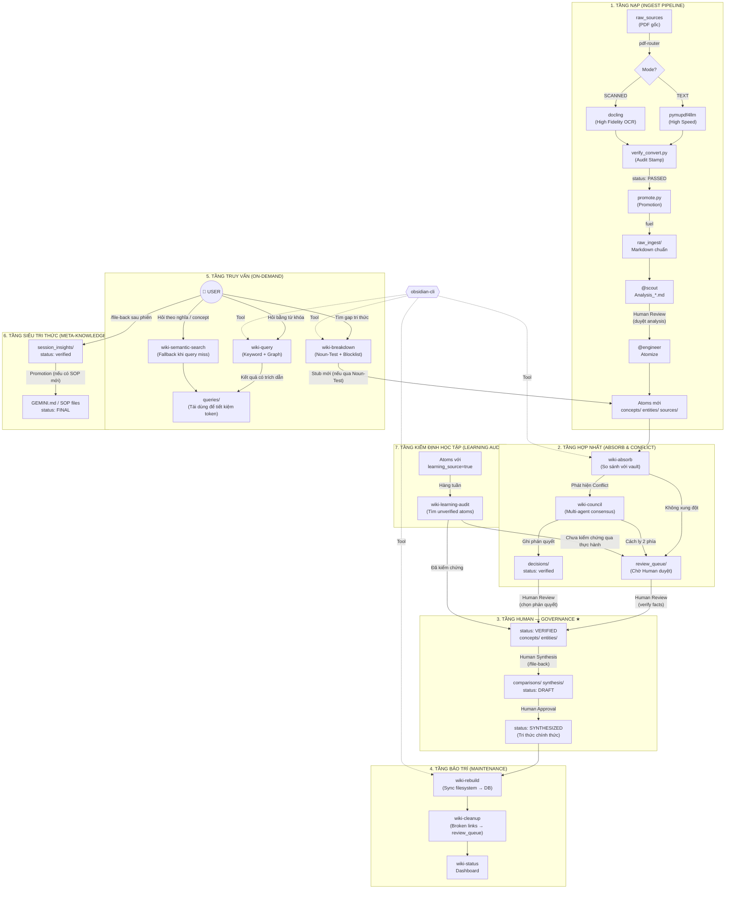

# 🗺️ WORKSPACE OVERVIEW — NoteBookLLM_Br
> **Dành cho**: AI Agent (đọc trước khi hành động) & User (kiểm tra toàn cảnh).
> **Cập nhật**: 2026-05-10 | Schema v5.4 (Phase 2 Analysis Transparency + SCOUT Flow)

---

## 1. Cấu trúc thư mục (Directory Map)

```
NoteBookLLM_Br/
│
├── 📥 00_Inbox/                  ← Khu vực chờ.
│   ├── 📁 Converted_Sources/     ← Output từ PDF Router (Markdown + Images).
│   └── 📁 _deprecated/           ← Bản lưu tạm trước khi xóa Inbox.
│
├── 📁 1-projects/                ← Các dự án đang thực thi.
│   └── 📁 ARCH_Ingestion/        ← Scout analysis drafts
│       └── Analysis_*.md         ← Giai đoạn 2: bản phân tích chờ duyệt
│
├── 📁 2-areas/                   ← Vùng quản lý liên tục (Profiles, Assessment).
│
├── 📁 3-resources/               ← HẠ TẦNG TRI THỨC (Source of Truth)
│   ├── 📂 raw_sources/           ← EVIDENCE — PDF/Video/HTML gốc. IMMUTABLE (R1).
│   ├── 📂 raw_ingest/            ← FUEL — Markdown đạt chuẩn R21 Audit. IMMUTABLE.
│   ├── 📂 raw_assets/            ← VISUAL PROOF — Hình ảnh/Biểu đồ phẳng.
│   ├── 📂 _deprecated/           ← ARCHIVE — Các file cũ hoặc bị lỗi link đã thay thế.
│   │
│   └── 📂 wiki/                  ← KHO WIKI 2.0 (Atomic Knowledge — v3.0)
│       ├── index.md              ← SOURCE OF TRUTH (generated by wiki-rebuild)
│       ├── log.md                ← INDEX — Link đến nhật ký ngày (R14)
│       ├── logs/                 ← ARCHIVE — log_YYYY_MM_DD.md
│       │
│       ├── concepts/             ← "Viên gạch" — CONCEPT_[PREFIX]_*.md
│       ├── entities/             ← "Hồ sơ" — ENTITY_*.md
│       ├── sources/              ← "Điểm neo" — SOURCE_[PREFIX]_*.md
│       ├── comparisons/          ← "Thuốc giải" — COMPARE_*.md
│       ├── synthesis/            ← "Sản phẩm" — SYNTHESIS_*.md (Master Schema v3)
│       │
│       ├── review_queue/         ← "Bàn làm việc" — Atom mới chờ Human Gate (R8)
│       ├── decisions/            ← "Nhật ký phán quyết" — DECISION_*.md
│       ├── queries/              ← "Thư viện truy vấn" — QUERY_*.md
│       └── session_insights/     ← "Nhật ký trưởng thành" — Insight phiên làm việc
│
├── 📁 4-archive/                 ← Lưu trữ vĩnh viễn.
│
├── 📁 .agent/                    ← Cấu hình & Kỹ năng (Skills)
│   ├── skills/                   ← Bộ kỹ năng v3.0 (TDD enforced)
│   │   ├── 🛠️ wiki-hd-convert/   ← Tích hợp pdf_router.py (TEXT/SCANNED detection)
│   │   └── 🛠️ wiki-md-auditor/   ← Tích hợp promote.py (Promotion logic)
│   └── workflows/                ← Các quy trình tự động hóa (/ingest, /lint)
│
├── AGENTS.md                     ← BỘ LUẬT SWARM (BẮT BUỘC ĐỌC)
├── GEMINI.md                     ← HIẾN PHÁP (R1-R21) — Tối cao
├── SOUL.md                       ← Tính cách & Sứ mệnh Agent
├── USER.md                       ← Hồ sơ & Ranh giới của User
├── WORKSPACE_OVERVIEW.md         ← File này
├── task_plan.md                  ← Kế hoạch hiện tại (v5.5 — ARCH Atomization)
├── CONTINUITY.md                 ← Ghi nhớ liên phiên (Context Management)
└── COMMAND_BOARD.md              ← Bảng điều khiển lệnh nhanh
```

> [!NOTE]
> **Cập nhật v5.3**: Triển khai `pdf_router.py` tự động phân loại PDF. Tối ưu hóa `verify_convert.py` cho các file text-only (PyMuPDF). Hoàn tất Promote 4/4 tài liệu ARCH vào `raw_ingest/`.

---

## 2. Kiến trúc Hệ thống Wiki 2.0 (Phiên bản v3.0)

Mọi Agent phải tuân thủ luồng runtime này.



> [!IMPORTANT]
> **Tầng 3 — Human Governance** là cổng duy nhất nâng status lên `VERIFIED` và `SYNTHESIZED`. Không Agent nào có quyền bỏ qua tầng này.
>
> **Tầng 7 — Learning Audit** là cơ chế mới (v5.1): phân biệt kiến thức đang học (`learning_source=true`, confidence -0.1) với kiến thức đã kiểm chứng qua thực hành. Bao gồm cả **kiến thức thường thức** (`source_type: general_knowledge`) — ưu tiên tạo **link** sang domain Atoms thay vì mở rộng độc lập.

---

## 3. Skill Registry (v3.0 — Đầy đủ)

| Tầng | Skill / Tool | Vai trò | Input → Output |
|:---|:---|:---|:---|
| **Ingest** | `pdf_router.py` | **MỚI**: Tự động phân loại & điều hướng engine | PDF → `00_Inbox/` |
| **Ingest** | `wiki-web-scrape` | Cào URL tĩnh → Markdown | URL → `00_Inbox/` |
| **Ingest** | `wiki-crawl-4ai` | Cào URL động + screenshot | URL → `00_Inbox/` |
| **Ingest** | `wiki-hd-convert` | PDF có biểu đồ → Markdown + ảnh | PDF → `00_Inbox/` |
| **Ingest** | `verify_convert.py`| **Audit Stamp**: Xác thực độ lưu giữ (Retention) | MD → `Audit Block` |
| **Ingest** | `promote.py` | **MỚI**: Di chuyển file an toàn vào hạ tầng | `Inbox` → `raw_ingest/` |
| **Ingest** | `wiki-ingest` | Atomize → DRAFT | `raw_ingest/` → `Atoms` |
| **Absorb** | `wiki-absorb` | So sánh, phát hiện conflict | Atoms → `review_queue/` |
| **Absorb** | `wiki-council` | Multi-agent phân xử xung đột | Conflict → `decisions/` |
| **Query** | `wiki-query` | Keyword + graph traversal | Vault → `queries/` |
| **Query** | `wiki-semantic-search` | Fallback ngữ nghĩa khi query miss | Vault → `queries/` |
| **Query** | `wiki-breakdown` | Tìm gap + tạo Stub (có Noun-Test) | Vault → Stub Atoms |
| **Maintenance** | `wiki-rebuild` | Sync filesystem → `wiki_brain.db` | Vault → DB |
| **Maintenance** | `wiki-cleanup` | Sửa broken links | Vault → `review_queue/` |
| **Maintenance** | `wiki-status` | Dashboard sức khỏe vault | DB → Console |
| **Meta** | `/file-back` | Ghi session insight, tạo SOP | Chat → `session_insights/` |
| **Tool** | `obsidian-cli` | CLI interface với Obsidian vault | Cross-cutting |

---

## 4. Phân quyền Agent (Quick Reference)

| Agent | Đọc | GHI (được phép) |
|:---|:---|:---|
| `@pm` | Tất cả | `wiki/log.md`, `1-projects/`, `CONTINUITY.md` |
| `@scout` | `raw_sources/`, `raw_ingest/` | `1-projects/*/Analysis_*.md` (draft) |
| `@engineer` | `raw_ingest/`, `wiki/` | `1-projects/*/output`, `wiki/concepts/`, `wiki/entities/` |
| `@librarian` | Tất cả | `raw_ingest/`, `raw_assets/`, `wiki/synthesis/`, `wiki/comparisons/`, `wiki/index.md` |
| `@auditor` | Tất cả (read-only) | `wiki/log.md` (append only) |
| `@devops` | Tất cả | `scripts/`, `tools/` |
| `@healer` | Tất cả | `wiki/` (sửa links), `scripts/` |
| **KHÔNG AI ĐƯỢC** | — | `raw_sources/` (IMMUTABLE EVIDENCE) |

---

## 5. Trạng thái Ingest (Lộ trình 2026)

| Nhóm | Chủ đề | Prefix | Source Nodes | Concepts | Trạng thái |
|:---|:---|:---:|:---:|:---:|:---|
| **Nhóm 1** | Tư duy & Problem Solving | `THINK` | ✅ 3/3 | ✅ 15 | **COMPLETED** |
| **Nhóm 2** | Infrastructure & Systems | `ARCH` | ✅ 4/4 | ⏳ 0 | **IN PROGRESS (Phase 3)** |
| **Nhóm 3** | Agentic AI & LLM | `AIMET` | ❌ 0 | ❌ 0 | 🔴 Pending |
| **Nhóm 4** | Data Engineering / SQL | `DE` | ❌ 0 | ❌ 0 | 🔴 Pending |

**Current Focus**: Bóc tách nguyên tử (Atomization) cho bộ sưu tập `ARCH` (Thinking in Systems, DDIA, OSTEP, EDA).

---

## 6. Các lệnh quan trọng (v5.3)

```powershell
# 1. Nạp PDF thông minh (Tự chọn engine)
python .agent/skills/wiki-hd-convert/scripts/pdf_router.py "00_Inbox/file.pdf"

# 2. Audit & Promote (Sau khi convert)
python .agent/skills/wiki-md-auditor/scripts/md_auditor.py "00_Inbox/Converted_Sources/folder/file.md" --fix
python .agent/skills/wiki-md-auditor/scripts/promote.py "00_Inbox/Converted_Sources/folder/file.md"

# 3. Đồng bộ Database & Index (R15)
python .agent/skills/wiki-rebuild/scripts/rebuild.py
python .agent/skills/wiki-rebuild/scripts/update_wiki_index.py
obsidian reload

# 4. Làm sạch Link gãy
python .agent/skills/wiki-cleanup/scripts/lint_engine.py
```

---
*File này được bảo trì bởi @pm. Lần cuối cập nhật: 2026-05-10.*
