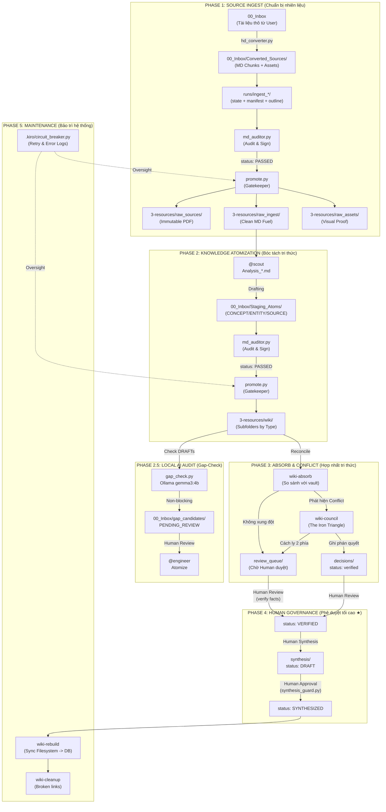

# 🗺️ WORKSPACE OVERVIEW — NoteBookLLM_Br
> [!IMPORTANT]
> **MANDATORY READ FOR ALL AGENTS**: Tài liệu này cùng với `AGENTS.md` và `GEMINI.md` là bộ ba "Source of Truth" tối cao. Mọi hành động Ingest/Atomize phải đối soát với sơ đồ tại Mục 2 và SOP tại Mục 3.
> **Cập nhật**: 2026-05-14 | Schema v7.1 (Promotion Routing & Template Sync)

---

## 1. Cấu trúc thư mục (Directory Map)

```
NoteBookLLM_Br/
│
├── 📥 00_Inbox/                  ← QUARANTINE: Khu vực cách ly & xử lý thô.
│   ├── 📁 Converted_Sources/     ← Output từ PDF Router (Markdown HD + Images).
│   ├── 📁 gap_candidates/        ← Local AI audit output (PENDING_REVIEW).
│   ├── 📁 failed_queue/          ← Dead-Letter Queue (DLQ) — Chứa các chunk lỗi.
│   └── 📁 (Deprecated)           --> Chuyển về 4-archive/inbox/
│
├── 📁 runs/                      ← TRANSIENT RUNTIME: Run packages cho ingest dài, có state/resume.
│
├── 📁 1-projects/                ← ACTIVE PROJECTS: Drafts & Analysis.
│   └── 📄 Analysis_[ID]_*.md     ← Scout analysis drafts (Thiết kế Atom).
│
├── 📁 2-areas/                   ← Vùng quản lý liên tục (Profiles, Assessment).
│
├── 📁 3-resources/               ← HẠ TẦNG TRI THỨC (Source of Truth)
│   ├── 📂 raw_sources/           ← EVIDENCE — PDF/Video gốc. IMMUTABLE (R1).
│   ├── 📂 raw_ingest/            ← FUEL — MD đã qua Audit (R21). Sẵn sàng bóc tách.
│   ├── 📂 raw_assets/            ← VISUAL PROOF — Hình ảnh/Biểu đồ phẳng.
│   └── 📁 (Deprecated)           --> Chuyển về 4-archive/resources/
│   │
│   └── 📂 wiki/                  ← KHO WIKI 2.0 (Atomic Knowledge — v3.0)
│       ├── index.md              ← SOURCE OF TRUTH (generated by wiki-rebuild)
│       ├── log.md                ← INDEX — Link đến nhật ký ngày (R14)
│       ├── logs/                 ← ARCHIVE — log_YYYY_MM_DD.md
│       │
│       ├── concepts/             ← "Viên gạch" — CONCEPT_[PREFIX]_*.md
│       ├── entities/             ← "Hồ sơ" — ENTITY_*.md
│       ├── sources/              ← "Điểm neo" — SOURCE_[PREFIX]_*.md
│       ├── comparisons/          ← "Thuốc giải" — COMPARE_*.md
│       ├── synthesis/            ← "Sản phẩm" — SYNTHESIS_*.md (Master Schema v3)
│       │
│       ├── review_queue/         ← "Bàn làm việc" — Atom mới chờ Human Gate (R8)
│       ├── decisions/            ← "Nhật ký phán quyết" — DECISION_*.md
│       ├── queries/              ← "Thư viện truy vấn" — QUERY_*.md
│       └── session_insights/     ← "Nhật ký trưởng thành" — Insight phiên làm việc
│
├── 📁 4-archive/                 ← THIẾT CHẾ LƯU TRỮ VĨNH VIỄN (Single Archive Point).
│   ├── 📂 inbox/                 ← Bản lưu từ 00_Inbox.
│   ├── 📂 resources/             ← Bản lưu từ 3-resources.
│   ├── 📂 rejected/              ← File lỗi audit từ md_auditor/promote.
│   └── 📂 rollbacks/             ← Bản lưu phục hồi hệ thống.
│
├── 📁 .agent/                    ← Cấu hình & Kỹ năng (Skills)
│   ├── skills/                   ← Bộ kỹ năng v3.0 (TDD enforced)
│   └── workflows/                ← Các quy trình tự động hóa (/ingest, /lint)
│
├── 📁 .kiro/                     ← Agent Kiro Infrastructure (Circuit Breaker & Logs).
│
├── AGENTS.md                     ← BỘ LUẬT SWARM (BẮT BUỘC ĐỌC)
├── GEMINI.md                     ← HIẾN PHÁP (R1-R21) — Tối cao
├── task_plan.md                  ← Kế hoạch hiện tại (v6.0 — Phase 4 Hardening)
└── WORKSPACE_OVERVIEW.md         ← File này
```

---

## 2. Kiến trúc Hệ thống Wiki 2.0 (Pipeline V2.0)

Mọi Agent phải tuân thủ luồng runtime phân tầng này để đảm bảo tính toàn vẹn tri thức.



---

## 3. Quy trình Vận hành Chuẩn (SOP V2.0)

Để tránh chồng chéo, Agent phải phân biệt rõ **Nhiên liệu (MD Fuel)** và **Tri thức (Atoms)**:

### 3.1. Luồng Source Ingest (Nạp nguồn)
*   **Mục tiêu**: Đưa tài liệu từ ngoài vào hệ thống dưới dạng Markdown sạch.
*   **Quy trình**: PDF -> `hd_converter.py` -> `00_Inbox/Converted_Sources/` -> `runs/ingest_*/` -> `md_auditor.py` -> `promote.py` -> `raw_ingest/`.
*   **Phase A Note**: `runs/` là runtime package trước audit. Nó có thể copy hoặc reference converter chunks, nhưng không phải canonical knowledge storage.
*   **Kết quả**: Một ingest-reading artifact đã audit/promo ở `raw_ingest`, sau khi run package đạt `READY_FOR_AUDIT`.

### 3.2. Luồng Knowledge Atomization (Bóc tách)
*   **Mục tiêu**: Bóc tách tri thức từ "Nhiên liệu" thành các ghi chú nguyên tử.
*   **Quy trình**: `raw_ingest` -> `@scout` (Thiết kế) -> `@engineer` (Viết nháp vào `00_Inbox`) -> `md_auditor.py` -> `promote.py` -> `wiki/`.
*   **Kết quả**: Nhiều file `CONCEPT_`, `ENTITY_`, `SOURCE_` nằm trong các thư mục con tương ứng của `wiki/`.

### 3.3. Vai trò của promote.py (The Golden Gate)
*   Tuyệt đối **CẤM** ghi trực tiếp vào `3-resources/`.
*   Mọi hành động di chuyển file vào `raw_ingest/`, `raw_assets/` hay `wiki/` BẮT BUỘC phải gọi qua `python .kiro/circuit_breaker.py promote [path]`.
*   Script này sẽ tự động phân loại dựa trên tiền tố file:
    - `CONCEPT_` -> `wiki/concepts/`
    - `ENTITY_` -> `wiki/entities/`
    - `SOURCE_` -> `wiki/sources/`
    - Các file khác -> Theo tham số `--target`.

---

## 4. Skill Registry (v3.0 — High-Fidelity)

| Tầng | Skill / Tool | Vai trò | Input → Output | Path |
|:---|:---|:---|:---|:---|
| **Conversion** | `hd_converter.py`| **HD Docling**: PDF/Office → MD Chunks | PDF → `00_Inbox/` | `.agent/skills/wiki-hd-convert/scripts/` |
| **Audit** | `md_auditor.py` | **Audit Stamp**: Xác thực chuẩn R21 | MD → `Audit Block` | `scripts/maintenance/` |
| **Promotion** | `promote.py` | **Promotion**: Di chuyển file an toàn | `00_Inbox` → `3-resources` | `scripts/maintenance/` |
| **VRAM Guard** | `vram_guard.py` | **Isolation**: Atomic Lock cho GPU | Command → Protected Execution | `scripts/maintenance/` |
| **Gap-Check** | `gap_check.py` | **Local Audit**: Phát hiện tri thức bỏ sót | `Atoms` → `00_Inbox/gap_candidates/` | `.agent/skills/wiki-ingest/scripts/` |
| **Governance** | `synthesis_guard.py`| **R8 Enforcement**: Chống Agent tự synthesize | `Proposed` → `Revert/Approve` | `scripts/maintenance/` |
| **Maintenance** | `wiki-status` | **Dashboard**: Báo cáo sức khỏe | `/status` | `scripts/` |
| **Ingest** | `ingest-lifecycle` + `wiki-ingest` | **Ingestion**: `ingest-lifecycle` là entrypoint chính thức cho `/ingest`; `wiki-ingest` là stage deterministic register-to-review-queue bên trong lifecycle | `/ingest` | `.agent/workflows/ingest-lifecycle.md` + `.agent/skills/wiki-ingest/scripts/` |
| **Monitor** | `circuit_breaker.py`| **Circuit Breaker**: Giám sát lỗi | Process → `error_log.md` | `.kiro/` |
| **Maintenance** | `wiki-rebuild` | **Rebuild**: Sync filesystem → DB | Vault → DB | `scripts/` |

---

## 5. Các lệnh vận hành (v6.1)

```powershell
# 1. HD Convert & Chunking
python .agent/skills/wiki-hd-convert/scripts/hd_converter.py "00_Inbox/[FILE].pdf" --chunk-size 15

# 2. Audit & Promote (Gate 1)
python scripts/maintenance/md_auditor.py "00_Inbox/Converted_Sources/[SOURCE_NAME]/" --fix
python .kiro/circuit_breaker.py promote "00_Inbox/Converted_Sources/[SOURCE_NAME]/[FILE].md"

# 3. Đăng ký Ingest & Gap-Check
# Official command flow: resolve stage via `.agent/workflows/ingest-lifecycle.md` first.
# Direct `ingest.py` invocation below is only the deterministic stage script after upstream artifacts are READY.
python .agent/skills/wiki-ingest/scripts/ingest.py "3-resources/raw_ingest/[SOURCE_FILE].md"  # Checks audit_stamp
python .agent/skills/wiki-ingest/scripts/gap_check.py --source "[SOURCE_NAME]" --chunk [N] --atoms '[JSON_LIST]'

# 4. Gap Review & DLQ (SOP)
/gap-summary
/gap-promote [NAME]
/gap-retry       # Thử lại các chunk trong failed_queue

# 5. Đồng bộ Database & Index (R15)
python .agent/skills/wiki-rebuild/scripts/rebuild.py
obsidian reload

# 6. Governance & R8 Enforcement
python scripts/maintenance/synthesis_guard.py scan              # Quét toàn wiki tìm vi phạm R8
python scripts/maintenance/synthesis_guard.py approve <file>    # Phê duyệt (CHỈ Human chạy terminal)
```

# 7. Resource Management
python scripts/maintenance/vram_guard.py <command>               # Chạy task AI với VRAM Lock

---
*File này được bảo trì bởi @pm. Lần cuối cập nhật: 2026-05-13.*
