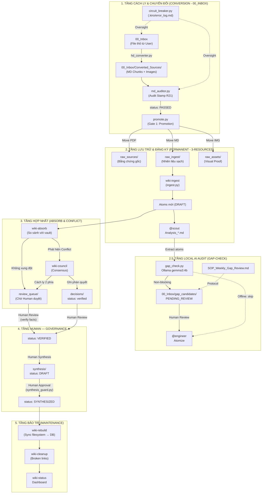

# 🗺️ WORKSPACE OVERVIEW — NoteBookLLM_Br
> [!IMPORTANT]
> **MANDATORY READ FOR ALL AGENTS**: Tài liệu này cùng với `AGENTS.md` và `GEMINI.md` là bộ ba "Source of Truth" tối cao. Mọi hành động Ingest/Atomize phải đối soát với sơ đồ tại Mục 2 và SOP tại Mục 3.
> **Cập nhật**: 2026-05-13 | Schema v7.0 (Knowledge OS — Kernel Bridge Hardening)

---

## 1. Cấu trúc thư mục (Directory Map)

```
NoteBookLLM_Br/
│
├── 📥 00_Inbox/                  ← QUARANTINE: Khu vực cách ly & xử lý thô.
│   ├── 📁 Converted_Sources/     ← Output từ PDF Router (Markdown HD + Images).
│   ├── 📁 gap_candidates/        ← Local AI audit output (PENDING_REVIEW).
│   ├── 📁 failed_queue/          ← Dead-Letter Queue (DLQ) — Chứa các chunk lỗi.
│   └── 📁 _deprecated/           ← Bản lưu tạm trước khi xóa Inbox.
│
├── 📁 1-projects/                ← ACTIVE PROJECTS: Drafts & Analysis.
│   └── 📄 Analysis_[ID]_*.md     ← Scout analysis drafts (Thiết kế Atom).
│
├── 📁 2-areas/                   ← Vùng quản lý liên tục (Profiles, Assessment).
│
├── 📁 3-resources/               ← HẠ TẦNG TRI THỨC (Source of Truth)
│   ├── 📂 raw_sources/           ← EVIDENCE — PDF/Video gốc. IMMUTABLE (R1).
│   ├── 📂 raw_ingest/            ← FUEL — MD đã qua Audit (R21). Sẵn sàng bóc tách.
│   ├── 📂 raw_assets/            ← VISUAL PROOF — Hình ảnh/Biểu đồ phẳng.
│   ├── 📂 _deprecated/           ← ARCHIVE — Các file cũ hoặc bị lỗi link đã thay thế.
│   │
│   └── 📂 wiki/                  ← KHO WIKI 2.0 (Atomic Knowledge — v3.0)
│       ├── index.md              ← SOURCE OF TRUTH (generated by wiki-rebuild)
│       ├── log.md                ← INDEX — Link đến nhật ký ngày (R14)
│       ├── logs/                 ← ARCHIVE — log_YYYY_MM_DD.md
│       │
│       ├── concepts/             ← "Viên gạch" — CONCEPT_[PREFIX]_*.md
│       ├── entities/             ← "Hồ sơ" — ENTITY_*.md
│       ├── sources/              ← "Điểm neo" — SOURCE_[PREFIX]_*.md
│       ├── comparisons/          ← "Thuốc giải" — COMPARE_*.md
│       ├── synthesis/            ← "Sản phẩm" — SYNTHESIS_*.md (Master Schema v3)
│       │
│       ├── review_queue/         ← "Bàn làm việc" — Atom mới chờ Human Gate (R8)
│       ├── decisions/            ← "Nhật ký phán quyết" — DECISION_*.md
│       ├── queries/              ← "Thư viện truy vấn" — QUERY_*.md
│       └── session_insights/     ← "Nhật ký trưởng thành" — Insight phiên làm việc
│
├── 📁 4-archive/                 ← Lưu trữ vĩnh viễn.
│
├── 📁 .agent/                    ← Cấu hình & Kỹ năng (Skills)
│   ├── skills/                   ← Bộ kỹ năng v3.0 (TDD enforced)
│   └── workflows/                ← Các quy trình tự động hóa (/ingest, /lint)
│
├── 📁 .kiro/                     ← Agent Kiro Infrastructure (Circuit Breaker & Logs).
│
├── AGENTS.md                     ← BỘ LUẬT SWARM (BẮT BUỘC ĐỌC)
├── GEMINI.md                     ← HIẾN PHÁP (R1-R21) — Tối cao
├── task_plan.md                  ← Kế hoạch hiện tại (v6.0 — Phase 4 Hardening)
└── WORKSPACE_OVERVIEW.md         ← File này
```

---

## 2. Kiến trúc Hệ thống Wiki 2.0 (Pipeline V2.0)

Mọi Agent phải tuân thủ luồng runtime này.



---

## 3. Quy tắc Ingest chuẩn (Pipeline V2.0 SOP)

Mọi dữ liệu phải tuân thủ quy trình "Cách ly tuyệt đối" trước khi trở thành Source of Truth:

1.  **Giai đoạn 1: Chuyển đổi (Conversion - 00_Inbox)**:
    -   **HD Convert**: Chạy `hd_converter.py` với Docling. Toàn bộ Markdown và Hình ảnh (`images/`) phải nằm trong thư mục con của `00_Inbox/Converted_Sources/[SOURCE_NAME]/`.
    -   **Audit**: Chạy `md_auditor.py --fix` trên các file Markdown tại chỗ. Kiểm tra tính toàn vẹn và đóng dấu **Audit Stamp**.
2.  **Giai đoạn 2: Nhập kho (Promotion - Gate 1)**:
    -   Chạy `promote.py`. Script này di chuyển nguyên tử (Atomic Move) từ Inbox vào `raw_*`.
3.  **Giai đoạn 3: Đăng ký (Ingestion)**:
    -   `ingest.py` đăng ký "Nhiên liệu sạch" từ `raw_ingest` vào Database Wiki.
4.  **Giai đoạn 4: Phân tích (Atomization)**:
    -   `@scout` phân tích Atoms dựa trên bản nạp đã được đăng ký.

---

## 4. Skill Registry (v3.0 — High-Fidelity)

| Tầng | Skill / Tool | Vai trò | Input → Output | Path |
|:---|:---|:---|:---|:---|
| **Conversion** | `hd_converter.py`| **HD Docling**: PDF/Office → MD Chunks | PDF → `00_Inbox/` | `.agent/skills/wiki-hd-convert/scripts/` |
| **Audit** | `md_auditor.py` | **Audit Stamp**: Xác thực chuẩn R21 | MD → `Audit Block` | `scripts/maintenance/` |
| **Promotion** | `promote.py` | **Promotion**: Di chuyển file an toàn | `00_Inbox` → `3-resources` | `scripts/maintenance/` |
| **VRAM Guard** | `vram_guard.py` | **Isolation**: Atomic Lock cho GPU | Command → Protected Execution | `scripts/maintenance/` |
| **Gap-Check** | `gap_check.py` | **Local Audit**: Phát hiện tri thức bỏ sót | `Atoms` → `00_Inbox/gap_candidates/` | `.agent/skills/wiki-ingest/scripts/` |
| **Governance** | `synthesis_guard.py`| **R8 Enforcement**: Chống Agent tự synthesize | `Proposed` → `Revert/Approve` | `scripts/maintenance/` |
| **Maintenance** | `wiki-status` | **Dashboard**: Báo cáo sức khỏe | `/status` | `scripts/` |
| **Ingest** | `wiki-ingest` | **Ingestion**: Nạp tài liệu & atom hóa | `/ingest` | `.agent/skills/wiki-ingest/scripts/` |
| **Monitor** | `circuit_breaker.py`| **Circuit Breaker**: Giám sát lỗi | Process → `error_log.md` | `.kiro/` |
| **Maintenance** | `wiki-rebuild` | **Rebuild**: Sync filesystem → DB | Vault → DB | `scripts/` |

---

## 5. Các lệnh vận hành (v6.1)

```powershell
# 1. HD Convert & Chunking
python .agent/skills/wiki-hd-convert/scripts/hd_converter.py "00_Inbox/[FILE].pdf" --chunk-size 15

# 2. Audit & Promote (Gate 1)
python scripts/maintenance/md_auditor.py "00_Inbox/Converted_Sources/[SOURCE_NAME]/" --fix
python .kiro/circuit_breaker.py promote --source "00_Inbox/Converted_Sources/[SOURCE_NAME]/" --target "3-resources/raw_ingest"

# 3. Đăng ký Ingest & Gap-Check
python .agent/skills/wiki-ingest/scripts/ingest.py "3-resources/raw_ingest/[SOURCE_FILE].md"  # Checks audit_stamp
python .agent/skills/wiki-ingest/scripts/gap_check.py --source "[SOURCE_NAME]" --chunk [N] --atoms '[JSON_LIST]'

# 4. Gap Review & DLQ (SOP)
/gap-summary
/gap-promote [NAME]
/gap-retry       # Thử lại các chunk trong failed_queue

# 5. Đồng bộ Database & Index (R15)
python .agent/skills/wiki-rebuild/scripts/rebuild.py
obsidian reload

# 6. Governance & R8 Enforcement
python scripts/maintenance/synthesis_guard.py scan              # Quét toàn wiki tìm vi phạm R8
python scripts/maintenance/synthesis_guard.py approve <file>    # Phê duyệt (CHỈ Human chạy terminal)
```

# 7. Resource Management
python scripts/maintenance/vram_guard.py <command>               # Chạy task AI với VRAM Lock

---
*File này được bảo trì bởi @pm. Lần cuối cập nhật: 2026-05-13.*
