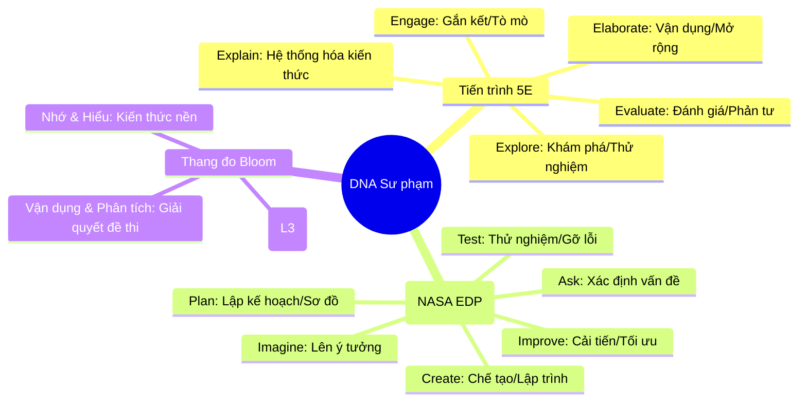

# 🧠 LMS Subject Knowledge Base (Cẩm nang Tri thức Nền tảng)

> **Người thực hiện**: @librarian (Knowledge Manager)
> **Mục tiêu**: Hệ thống hóa kiến thức nền, bản đồ tư duy và các sai lầm thường gặp (Misconceptions) từ 59 bộ đề LMS.
> **Nền tảng**: mBlock, Ohstem, Scratch, Tynker, Raise MIT.

---

## 🧭 1. Kim chỉ nam Sư phạm (Pedagogy Master Mindmap)

Đây là khung phương pháp luận áp dụng chung cho tất cả các môn học công nghệ. Giáo viên cần nắm vững sơ đồ này trước khi đi sâu vào chuyên môn từng môn.



---

## 🤖 2. Module: Trí tuệ Nhân tạo (AI)

### 🗺️ Bản đồ Tư duy (AI & Data Science)
```mermaid
mindmap
  root((Module AI))
    Lõi Kiến thức
      Turing Test
      Phân loại AI: Weak AI vs Strong AI
      ML Pipeline: Thu thập - Huấn luyện - Ứng dụng
    Lĩnh vực chuyên sâu
      Computer Vision (CV): Nhận diện hình ảnh
      NLP: Hiểu ngôn ngữ tự nhiên
      Machine Learning: Học máy từ dữ liệu
    Nền tảng thực thi
      mBlock5: AI Blocks (Cognitive Services)
      Raise MIT: AI Playground (Logic & Sandbox)
      Ohstem: AI Dashboard & Sensors
```

### ✅ Checklist Kiến thức & Kỹ năng
- [ ] **Khái niệm**: Phân biệt được AI và tự động hóa thông thường (Automation).
- [ ] **ML Pipeline**: Hiểu tầm quan trọng của chất lượng dữ liệu (Data Quality) đối với mô hình.
- [ ] **Platform Mastery**:
    - Sử dụng thành thạo các Extension AI trong **mBlock5** (Face/Voice recognition).
    - Thao tác trên **Raise MIT Playground** để kiểm chứng logic AI.
- [ ] **Giải quyết vấn đề**: Biết cách xử lý khi mô hình nhận diện sai (Data retraining).

### ⚠️ Sai lầm thường gặp (Misconceptions)
- **Lầm tưởng 1**: "AI có thể làm mọi thứ ngay lập tức". *Thực tế*: AI cần dữ liệu huấn luyện và chỉ mạnh trong một phạm vi cụ thể.
- **Lầm tưởng 2**: "Mô hình càng phức tạp càng tốt". *Thực tế*: Dễ dẫn đến hiện tượng **Overfitting** (Học tủ), cần cân bằng độ chính xác.

---

## 🎨 3. Module: Lập trình Logic (Coding)

### 🗺️ Bản đồ Tư duy (Visual Programming)
```mermaid
mindmap
  root((Module Coding))
    Cấu trúc Logic
      Tuần tự (Sequence)
      Điều kiện (If-Then-Else)
      Vòng lặp (Loops)
      Sự kiện (Events)
    Quản lý Dữ liệu
      Biến (Variables): Lưu trữ đơn lẻ
      Danh sách (Lists): Lưu trữ chuỗi
      Mảng/Tọa độ (X, Y)
    Tương tác & Mở rộng
      Hàm tự tạo (My Blocks): Tái sử dụng code
      Clones: Nhân bản nhân vật
      Broadcast: Gửi/Nhận thông điệp
```

### ✅ Checklist Kiến thức & Kỹ năng
- [ ] **Logic**: Master các câu lệnh rẽ nhánh và vòng lặp lồng nhau (Nested loops).
- [ ] **Platform Mastery**:
    - **Scratch/mBlock**: Quản lý trang phục (Costumes), phông nền và âm thanh.
    - **Tynker**: Xây dựng kịch bản tương tác game và vật lý (Physics engine).
- [ ] **Hàm**: Biết cách gom nhóm code lặp lại vào **My Blocks** để tối ưu hóa.

### ⚠️ Sai lầm thường gặp (Misconceptions)
- **Lỗi logic vòng lặp**: Nhầm lẫn giữa "Repeat" (Lặp số lần) và "Repeat Until" (Lặp đến khi).
- **Lỗi Broadcast**: Gửi thông điệp quá dày đặc gây hiện tượng giật/lag hoặc mất đồng bộ nhân vật.

---

## 🏎️ 4. Module: Robotics (Robot & Điều khiển)

### 🗺️ Bản đồ Tư duy (Robotics Systems)
```mermaid
mindmap
  root((Module Robotics))
    Phần cứng (Hardware)
      Mainboard: CyberPi / CyberPi+Extension
      Động cơ (Motors): Encoder vs DC
      Hiển thị: LED Matrix / RGB Screen
    Cảm biến (Sensors)
      Siêu âm (Ultrasonic): Đo khoảng cách
      Dò đường (Line Follower): Đọc giá trị RGB
      Con quay hồi chuyển (Gyro): Góc nghiêng/Cân bằng
    Vận hành An toàn
      Pin & Nguồn: Cực tính & Dung lượng
      Kết nối: Jumper/Grove Safety
```

### ✅ Checklist Kiến thức & Kỹ năng
- [ ] **Hardware ID**: Nhận diện đúng các chân kết nối (Port 1-4) và các linh kiện đi kèm.
- [ ] **Control Logic**: Lập trình được thuật toán dò đường cơ bản và tránh vật cản.
- [ ] **Device Safety**: Thành thạo quy trình tắt/mở nguồn và kiểm tra dây cắm trước khi kết nối.

### ⚠️ Sai lầm thường gặp (Misconceptions)
- **Sai lầm cảm biến**: Cho rằng cảm biến siêu âm hoạt động tốt trên mọi bề mặt (Thực tế: Bề mặt mềm/nghiêng sẽ gây nhiễu).
- **Sai lầm về Pin**: Không kiểm tra mức pin gây ra lỗi logic (Robot quay yếu, cảm biến đọc sai giá trị).

---

## ⚡ 5. Module: IoT & Tự động hóa

### 🗺️ Bản đồ Tư duy (IoT Ecosystem)
```mermaid
mindmap
  root((Module IoT))
    Kết nối (Connectivity)
      WiFi: Trạm phát & Trạm thu
      MQTT: Giao diện điều khiển (Dashboard)
      Cloud: Lưu trữ dữ liệu trực tuyến
    Thiết bị Ngoại vi
      Màn hình: LCD 1602 / OLED I2C
      Cơ cấu chấp hành: Servo (Góc quay) / Relay
      Cảm biến: DHT11 (Nhiệt/Ẩm) / Cảm biến Mưa
    An toàn & Tùy biến
      Kết nối Grove: Chống cắm ngược
      Jumper wires: Mapping đúng sơ đồ chân
```

### ✅ Checklist Kiến thức & Kỹ năng
- [ ] **Communication**: Cấu hình được WiFi và kết nối thành công với Dashboard (Ohstem App).
- [ ] **Hardware Control**: Hiểu bản chất các chân Analog (A) và Digital (D) trên YoloBit/Arduino.
- [ ] **Device Safety**: **Ưu tiên sử dụng Grove**. Nếu dùng Jumper, phải kiểm tra kỹ chân VCC/GND để tránh cháy mạch.

### ⚠️ Sai lầm thường gặp (Misconceptions)
- **Lỗi I2C**: Quên chưa khai báo địa chỉ (Address) cho thiết bị I2C (như LCD) dẫn đến lỗi không hiển thị.
- **Lỗi Logic IoT**: Không xử lý "độ trễ" (Delay) khi gửi dữ liệu lên Cloud, gây tràn hàng đợi (Overload).

---
*Hoàn tất chưng cất tri thức bởi @librarian v5.1*
