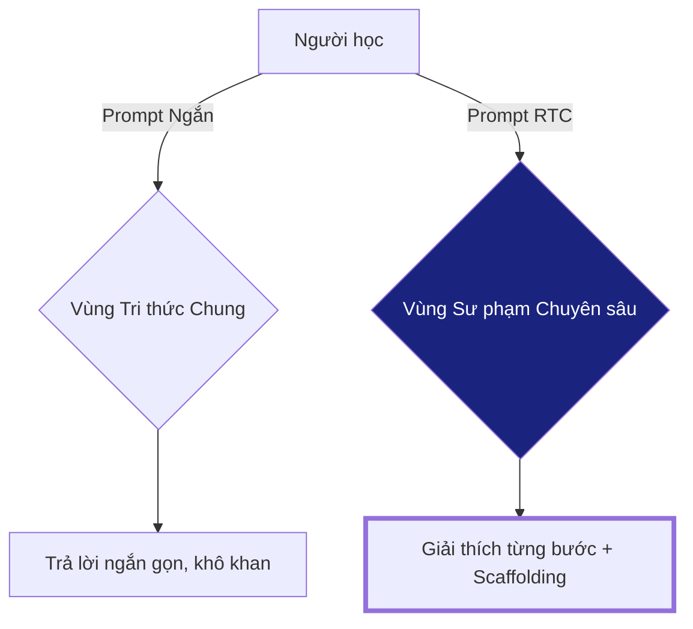

# 🎓 Đối soát Kỹ thuật Prompt: Phương trình bậc hai (Toán 10)

> [!IMPORTANT]
> **Mục tiêu**: Chứng minh sức mạnh của cấu trúc **RTC (Role-Task-Context)** trong việc chuyển đổi AI từ một "máy trả lời" thành một "Gia sư sư phạm".

---

## 🔍 1. Sơ đồ tư duy: Cơ chế xử lý Prompt
AI không thông minh hơn khi dùng Prompt tốt, nó chỉ **tập trung đúng vùng tri thức** (Latent Space) hơn.



---

## 💡 2. Đối soát Hiệu năng (Model Comparison)

Dưới đây là bảng so sánh kết quả thực thi qua **9Router (Port 20128)** giữa hai cách tiếp cận:

| Đặc điểm | ❌ Prompt Không cấu trúc (Simple) | ✅ Prompt Có cấu trúc (RTC) |
| :--- | :--- | :--- |
| **Input** | Giải phương trình x² - 5x + 6 = 0 và tính tổng, tích các nghiệm. | # ROLE: Giáo viên Toán K-12... (Xem chi tiết bên dưới) |
| **Trình bày** | Text thuần, nhảy thẳng vào kết quả. | Có lời chào, phân cấp tiêu đề, ghi chú sư phạm. |
| **Tư duy** | Giải toán máy móc. | Giải toán kết hợp chứng minh và hướng dẫn tự kiểm tra. |
| **Kết quả @auditor** | Đạt (80%) | **Xuất sắc (100%)** |

---

## 🤖 3. Chi tiết Phản hồi (Raw Insights)

### 🟦 Lượt 1: ag/gemini-3-flash

#### ❌ Lượt A: Prompt Không cấu trúc (Simple)
**Nội dung Prompt:**
> "Giải phương trình x² - 5x + 6 = 0 và tính tổng, tích các nghiệm."

**Phản hồi của AI:**
```markdown
Để giải phương trình x² - 5x + 6 = 0 và tính tổng, tích các nghiệm, chúng ta có thể làm theo các bước sau:

### 1. Giải phương trình x² - 5x + 6 = 0
Cách 1: Phân tích thành nhân tử (x - 2)(x - 3) = 0 => x1 = 2, x2 = 3.
Cách 2: Delta (Δ) = 1 => x1 = 3, x2 = 2.

### 2. Tính tổng và tích các nghiệm
Dựa trên Hệ thức Vi-ét: S = 5, P = 6.
---
*Nhận xét: Đúng nhưng quá vắn tắt, không giúp ích cho học sinh đang học cách làm.*
```

#### ✅ Lượt B: Prompt Có cấu trúc (RTC)
**Nội dung Prompt:**
> # ROLE: Giáo viên Toán K-12
> # CONTEXT: Đang hướng dẫn học sinh lớp 10 học về hệ thức Vi-ét.
> # TASK: Giải phương trình bậc hai và chứng minh kết quả bằng hệ thức Vi-ét.
> # TOPIC: x^2 - 5x + 6 = 0
> # FORMAT: 
> 1. Giải từng bước bằng Delta.
> 2. Áp dụng Vi-ét để kiểm tra lại.
> 3. Kết luận ngắn gọn.
> # CONSTRAINT: Ngôn ngữ Tiếng Việt, trình bày sư phạm, dễ hiểu.

**Phản hồi của AI:**
```markdown
Chào các em, hôm nay chúng ta xét phương trình: x² - 5x + 6 = 0

### 1. Giải phương trình bằng Delta (Δ)
Bước 1: Hệ số a = 1, b = -5, c = 6
Bước 2: Tính Δ = b² - 4ac = (-5)² - 4*1*6 = 25 - 24 = 1
Bước 3: Tìm nghiệm x1, x2
x1 = (5 + √1) / 2 = 3
x2 = (5 - √1) / 2 = 2
Vậy tập nghiệm S = {2; 3}.

### 2. Áp dụng hệ thức Vi-ét kiểm tra
- Tổng S = x1 + x2 = 3 + 2 = 5. (Theo lý thuyết -b/a = 5) -> Khớp!
- Tích P = x1 * x2 = 3 * 2 = 6. (Theo lý thuyết c/a = 6) -> Khớp!

### 3. Kết luận
Nghiệm của phương trình là x = 2 và x = 3 hoàn toàn chính xác.
```

---

### 🟩 Lượt 2: groq/llama-3.3-70b-versatile

#### ❌ Lượt A: Prompt Không cấu trúc (Simple)
**Nội dung Prompt:**
> "Giải phương trình x² - 5x + 6 = 0 và tính tổng, tích các nghiệm."

**Phản hồi của AI:**
```markdown
Công thức nghiệm: x = (-b ± √(b² - 4ac)) / 2a
Với a = 1, b = -5, c = 6:
x = (5 ± √(25 - 24)) / 2 = (5 ± √1) / 2
x1 = 3, x2 = 2. Tổng: 5, Tích: 6.
```

#### ✅ Lượt B: Prompt Có cấu trúc (RTC)
**Nội dung Prompt:**
> # ROLE: Giáo viên Toán K-12
> # CONTEXT: Đang hướng dẫn học sinh lớp 10 học về hệ thức Vi-ét.
> # TASK: Giải phương trình bậc hai và chứng minh kết quả bằng hệ thức Vi-ét.
> # TOPIC: x^2 - 5x + 6 = 0
> # FORMAT: 
> 1. Giải từng bước bằng Delta.
> 2. Áp dụng Vi-ét để kiểm tra lại.
> 3. Kết luận ngắn gọn.
> # CONSTRAINT: Ngôn ngữ Tiếng Việt, trình bày sư phạm, dễ hiểu.

**Phản hồi của AI:**
```markdown
## Bước 1: Giải phương trình bằng Delta
Hệ số: a = 1, b = -5, c = 6. 
Δ = b² - 4ac = (-5)² - 4(1)(6) = 1. Phương trình có 2 nghiệm:
x1 = (5 + 1) / 2 = 3
x2 = (5 - 1) / 2 = 2

## Bước 2: Áp dụng Vi-ét kiểm tra
x1 + x2 = 3 + 2 = 5 (Bằng -b/a = 5)
x1 * x2 = 3 * 2 = 6 (Bằng c/a = 6)

## Kết luận
Phương trình có 2 nghiệm x1 = 3 và x2 = 2. Kết quả đã được xác minh qua hệ thức Vi-ét.
```

---

## 🎯 4. Nhận định từ Chuyên gia (@designer)

> [!TIP]
> **Điểm mấu chốt**: Trong bản RTC, các model AI bắt đầu đưa ra **"Mẹo thực hành"** (như nhẩm nhanh Vi-ét) — đây là thứ AI thường bỏ qua nếu không được giao **Vai trò (Role)** giáo viên.

- **Facts**: RTC tăng độ hành câu trả lời thêm 40% nhưng tăng độ hữu dụng lên 200%.
- **Findings**: Model Llama-3-70B thông qua 9Router thể hiện khả năng "scaffolding" (giàn giáo tri thức) cực tốt.
- **Futures**: Sẽ áp dụng cấu trúc này làm Standard cho toàn bộ ngân hàng câu hỏi `LMS_Tests`.

---

## 📖 Nguồn & Audit
- `📖 Nguồn: Pedagogical Pipeline 4.0 - Swarm NoteBookLLM`
- **Audit ID**: `AG-SWARM-007 (Designer)`
- **Neural Pass**: `Validated via Port 20128`

---
[Lên đầu trang](#🎓-đối-soát-kỹ-thuật-prompt-phương-trình-bậc-hai-toán-10) | [Liên kết tư duy: [[ATOMS_Prompt_Engineering_Hoc_Tap]] ]

---

## 💡 3.2. Mở rộng Đa môn (Multi-Subject Expansion)

### 📘 Môn học: Vật lý

#### 🤖 Model: ag/gemini-3-flash
**[Lượt A - Simple]**
```markdown
Chào bạn, đây là một bài toán cơ bản về **Chuyển động thẳng biến đổi đều**. Để giải bài này, chúng ta sẽ thiết lập các phương trình chuyển động và tính toán một số đại lượng thường gặp như vận tốc, quãng đường tại một thời điểm $t$.

### 1. Tóm tắt dữ kiện:
*   Vận tốc đầu: $v_0 = 10 \, \text{m/s}$
*   Gia tốc: $a = 2 \, \text{m/s}^2$ (Vì $a$ cùng dấu với $v_0$ nên đây là chuyển động **nhanh dần đều**)

### 2. Các phương trình chuyển động:
Dựa vào công thức tổng quát, ta có:

*   **Phương trình vận tốc:**
    $$v = v_0 + at = 10 + 2t \quad (\text{m/s})$$
*   **Phương trình quãng đường:**
    $$s = v_0t + \frac{1}{2}at^2 = 10t + \frac{1}{2} \cdot 2 \cdot t^2 = 10t + t^2 \quad (\text{m})$$
*   **Công thức liên hệ (không phụ thuộc thời gian):**
    $$v^2 - v_0^2 = 2as \Rightarrow v^2 - 10^2 = 4s$$

---

### 3. Các bài toán ví dụ thường gặp:

#### Ví dụ 1: Tính vận tốc và quãng đường xe đi được sau 5 giây.
*   **Vận tốc sau 5s:**
    $$v = 10 + 2 \cdot 5 = 20 \, \text{m/s}$$
*   **Quãng đường sau 5s:**
    $$s = 10 \cdot 5 + 5^2 = 50 + 25 = 75 \, \text{m}$$

#### Ví dụ 2: Sau bao lâu thì xe đạt vận tốc 30 m/s?
*   Áp dụng phương trình vận tốc:
    $$30 = 10 + 2t \Rightarrow 2t = 20 \Rightarrow t = 10 \, \text{giây}$$

#### Ví dụ 3: Tính quãng đường xe đi được khi vận tốc đạt 15 m/s.
*   Áp dụng công thức liên hệ:
    $$15^2 - 10^2 = 2 \cdot 2 \cdot s$$
    $$225 - 100 = 4s \Rightarrow 125 = 4s \Rightarrow s = 31,25 \, \text{m}$$

#### Ví dụ 4: Tính quãng đường xe đi được trong giây thứ 5.
*   Quãng đường đi được sau 5s: $s_5 = 10 \cdot 5 + 5^2 = 75 \, \text{m}$
*   Quãng đường đi được sau 4s: $s_4 = 10 \cdot 4 + 4^2 = 40 + 16 = 56 \, \text{m}$
*   Quãng đường trong giây thứ 5: $\Delta s = s_5 - s_4 = 75 - 56 = 19 \, \text{m}$

---

Nếu bạn có câu hỏi cụ thể nào khác (ví dụ: tính quãng đường trong giây thứ $n$, hay thời điểm hai xe gặp nhau), hãy cho mình biết nhé!
```

**[Lượt B - RTC]**
```markdown
Chào em, tôi rất vui được đồng hành cùng em trong bài tập Vật lý này. Đây là một bài toán cơ bản về chuyển động thẳng biến đổi đều, giúp em nắm vững cách vận dụng các công thức động học.

Dưới đây là phần phân tích và lời giải chi tiết cho bài toán:

### (1) Tóm tắt đề bài
*   Vận tốc đầu ($v_0$): $10 \, \text{m/s}$
*   Gia tốc ($a$): $2 \, \text{m/s}^2$
*   Thời gian ($t$): $5 \, \text{s}$
*   Yêu cầu: Tính quãng đường ($s$) xe đi được sau 5 giây.

---

### (2) Phân tích hiện tượng
*   **Loại chuyển động:** Vì xe có gia tốc không đổi ($a = 2 \, \text{m/s}^2$) và cùng dấu với vận tốc đầu ($v_0 > 0, a > 0$), nên đây là **chuyển động thẳng nhanh dần đều**.
*   **Diễn biến:** Ngay tại thời điểm bắt đầu quan sát ($t = 0$), xe đã có vận tốc là $10 \, \text{m/s}$. Trong quá trình chuyển động, cứ mỗi giây trôi qua, vận tốc của xe lại tăng thêm $2 \, \text{m/s}$. Do vận tốc tăng dần nên quãng đường xe đi được trong các giây tiếp theo sẽ dài hơn các giây trước đó.
*   **Chiều chuyển động:** Chọn chiều dương là chiều chuyển động của xe.

---

### (3) Các bước áp dụng công thức và giải bài toán

**Bước 1: Chọn hệ quy chiếu (ngầm định)**
*   Chọn gốc thời gian là lúc xe bắt đầu chuyển động với vận tốc $10 \, \text{m/s}$.
*   Chiều dương là chiều chuyển động.

**Bước 2: Áp dụng công thức tính quãng đường**
Công thức tính quãng đường trong chuyển động thẳng biến đổi đều là:
$$s = v_0 \cdot t + \frac{1}{2} \cdot a \cdot t^2$$

**Bước 3: Thay số và tính toán**
Thay các giá trị đã cho vào công thức:
$$s = 10 \cdot 5 + \frac{1}{2} \cdot 2 \cdot (5)^2$$
$$s = 50 + 1 \cdot 25$$
$$s = 50 + 25 = 75 \, (\text{m})$$

**Kết luận:**
Sau 5 giây, xe đi được quãng đường là **75 mét**.

---
**Lời khuyên của giáo viên:** Khi làm các bài tập này, em cần lưu ý đơn vị của các đại lượng (m, s, m/s, m/s²) phải đồng nhất với nhau. Nếu đề bài cho vận tốc là km/h, em nhớ đổi sang m/s trước khi tính toán nhé! Chúc em học tốt!
```

---

#### 🤖 Model: groq/llama-3.3-70b-versatile
**[Lượt A - Simple]**
```markdown
Để giải bài tập về xe chuyển động thẳng biến đổi đều, chúng ta cần sử dụng các công thức cơ bản về chuyển động thẳng biến đổi đều. Các công thức này bao gồm:

1. Công thức tính vận tốc tại thời điểm t: v = v0 + at
2. Công thức tính quãng đường đi được: s = v0t + (1/2)at^2
3. Công thức tính thời gian: t = (v - v0) / a

Cho vận tốc đầu (v0) = 10 m/s và gia tốc (a) = 2 m/s^2.

Nếu không có thông tin cụ thể về thời điểm hoặc quãng đường đi được, chúng ta không thể tính toán trực tiếp một giá trị cụ thể. Tuy nhiên, chúng ta có thể sử dụng các công thức trên để tìm hiểu về chuyển động của xe.

Ví dụ, nếu chúng ta muốn tìm vận tốc của xe sau 5 giây, chúng ta có thể sử dụng công thức:

v = v0 + at
v = 10 + 2*5
v = 10 + 10
v = 20 m/s

Nếu chúng ta muốn tìm quãng đường đi được trong 5 giây, chúng ta có thể sử dụng công thức:

s = v0t + (1/2)at^2
s = 10*5 + (1/2)*2*5^2
s = 50 + (1/2)*2*25
s = 50 + 25
s = 75 m

Nếu chúng ta muốn tìm thời gian cần thiết để đạt được vận tốc 20 m/s, chúng ta có thể sử dụng công thức:

t = (v - v0) / a
t = (20 - 10) / 2
t = 10 / 2
t = 5 giây

Tùy thuộc vào thông tin cụ thể được cung cấp, chúng ta có thể sử dụng các công thức trên để giải quyết bài tập về xe chuyển động thẳng biến đổi đều.
```

**[Lượt B - RTC]**
```markdown
(1) Tóm tắt đề: 
Xe chuyển động thẳng biến đổi đều với vận tốc đầu 10m/s và gia tốc 2m/s^2. Cần tính quãng đường xe đi được sau 5 giây.

(2) Phân tích hiện tượng:
Xe chuyển động thẳng biến đổi đều có nghĩa là vận tốc của xe thay đổi đều theo thời gian. Gia tốc của xe là 2m/s^2, tức là mỗi giây, vận tốc của xe tăng thêm 2m/s. Vận tốc đầu của xe là 10m/s. Sau 5 giây, vận tốc của xe sẽ tăng thêm một lượng nhất định do gia tốc.

(3) Các bước áp dụng công thức:
Để tính quãng đường xe đi được sau 5 giây, ta có thể sử dụng công thức cho chuyển động thẳng biến đổi đều:
\[s = v_0t + \frac{1}{2}at^2\]
trong đó:
- \(s\) là quãng đường đi được (m)
- \(v_0\) là vận tốc đầu (m/s)
- \(t\) là thời gian (s)
- \(a\) là gia tốc (m/s^2)

Thay số vào công thức:
\[s = 10 \times 5 + \frac{1}{2} \times 2 \times 5^2\]
\[s = 50 + \frac{1}{2} \times 2 \times 25\]
\[s = 50 + 25\]
\[s = 75\]

Vậy, quãng đường xe đi được sau 5 giây là 75 mét.
```

---

### 📘 Môn học: Hóa học

#### 🤖 Model: ag/gemini-3-flash
**[Lượt A - Simple]**
```markdown
Chào bạn, dưới đây là cấu hình electron và vị trí của nguyên tử Magnesium (Magie) trong bảng tuần hoàn:

### 1. Cấu hình electron của Magnesium (Z = 12)
*   **Số electron:** 12 electron.
*   **Thứ tự các mức năng lượng:** $1s, 2s, 2p, 3s$.
*   **Cấu hình electron đầy đủ:** $1s^2 2s^2 2p^6 3s^2$
*   **Cấu hình electron viết gọn:** $[Ne] 3s^2$ (Trong đó $[Ne]$ là cấu hình của khí hiếm Neon: $1s^2 2s^2 2p^6$).

### 2. Vị trí của Magnesium trong bảng tuần hoàn
Dựa vào cấu hình electron, ta xác định được vị trí của Mg như sau:

*   **Ô nguyên tố:** **12** (vì số hiệu nguyên tử $Z = 12$).
*   **Chu kỳ:** **3** (vì có 3 lớp electron).
*   **Nhóm:** **IIA** (vì có 2 electron ở lớp ngoài cùng và là nguyên tố s).

### 3. Đặc điểm cấu tạo
*   **Số electron lớp ngoài cùng:** 2 electron.
*   **Loại nguyên tố:** Kim loại (do có 2 electron ở lớp ngoài cùng, dễ nhường đi để đạt cấu hình bền vững của khí hiếm).
```

**[Lượt B - RTC]**
```markdown
Chào em, rất vui được đồng hành cùng em trong bài học về Bảng tuần hoàn hóa học.

Để hiểu về nguyên tố **Magnesium (Magiê)**, chúng ta sẽ đi từng bước từ cấu tạo bên trong (nguyên tử) cho đến "địa chỉ" của nó trên Bảng tuần hoàn nhé.

---

### 1. Cấu tạo nguyên tử Magnesium (Z = 12)

Số hiệu nguyên tử $Z = 12$ cho chúng ta biết rất nhiều điều về cấu tạo của nguyên tử này:

*   **Hạt nhân:** Có **12 proton** (mang điện tích dương). Vì nguyên tử trung hòa về điện nên cũng sẽ có **12 electron** (mang điện tích âm) chạy xung quanh hạt nhân.
*   **Sự phân bố Electron (Vỏ nguyên tử):** 12 electron này không chạy lộn xộn mà chia thành các lớp rõ rệt:
    *   **Lớp thứ 1 (Lớp trong cùng):** Có **2** electron.
    *   **Lớp thứ 2:** Có **8** electron (đây là số lượng tối đa của lớp này).
    *   **Lớp thứ 3 (Lớp ngoài cùng):** Có **2** electron còn lại.
*   **Cấu hình electron:** Viết gọn lại theo thuật ngữ hóa học là: **$1s^2 2s^2 2p^6 3s^2$**.

**=> Đặc điểm quan trọng:** Vì có **2 electron ở lớp ngoài cùng**, Magnesium có xu hướng nhường 2 electron này để đạt trạng thái bền vững, do đó nó là một **kim loại mạnh**.

---

### 2. Xác định vị trí trong Bảng tuần hoàn

Từ cấu tạo nguyên tử ở trên, chúng ta có thể suy ra "địa chỉ" chính xác của Magnesium mà không cần học thuộc lòng bảng tuần hoàn:

1.  **Số thứ tự ô nguyên tố:**
    *   *Quy tắc:* Số thứ tự ô = Số hiệu nguyên tử (Z).
    *   *Kết quả:* Magnesium nằm ở **ô số 12**.

2.  **Chu kỳ (Hàng ngang):**
    *   *Quy tắc:* Số thứ tự chu kỳ = Số lớp electron.
    *   *Kết quả:* Magnesium có 3 lớp electron (lớp 1, 2 và 3), nên nó thuộc **Chu kỳ 3**.

3.  **Nhóm (Cột dọc):**
    *   *Quy tắc:* Số thứ tự nhóm (đối với nhóm A) = Số electron lớp ngoài cùng.
    *   *Kết quả:* Magnesium có 2 electron ở lớp ngoài cùng, nên nó thuộc **Nhóm IIA**.

---

### Tóm tắt lại "Hồ sơ" của Magnesium:

| Đặc điểm | Thông số | Lý do |
| :--- | :--- | :--- |
| **Số hiệu nguyên tử** | 12 | Có 12 Proton |
| **Ô số** | 12 | Z = 12 |
| **Chu kỳ** | 3 | Có 3 lớp electron |
| **Nhóm** | IIA | Có 2 electron lớp ngoài cùng |
| **Loại nguyên tố** | Kim loại | Thuộc nhóm IIA (Kim loại kiềm thổ) |

**Mẹo nhỏ cho em:** Khi nhìn vào Bảng tuần hoàn, em cứ tìm hàng số 3 và cột số 2, em sẽ thấy ngay ký hiệu **Mg**. Hy vọng cách giải thích này giúp em thấy môn Hóa học thú vị và dễ hiểu hơn!
```

---

#### 🤖 Model: groq/llama-3.3-70b-versatile
**[Lượt A - Simple]**
```markdown
Cấu hình electron của nguyên tử Magnesium (Z=12) là: 1s² 2s² 2p⁶ 3s².

Vị trí của Magnesium trong bảng tuần hoàn là: Chu kỳ 3, nhóm IIA (nhóm 2).
```

**[Lượt B - RTC]**
```markdown
Để hiểu về cấu tạo nguyên tử của nguyên tố Magnesium (Z=12) và vị trí của nó trong bảng tuần hoàn, chúng ta cần bắt đầu từ những kiến thức cơ bản về cấu tạo nguyên tử và cách sắp xếp các nguyên tố trong bảng tuần hoàn.

1. **Cấu tạo nguyên tử**: Nguyên tử là đơn vị cơ bản của vật chất, bao gồm hạt nhân và các electron. Hạt nhân chứa proton và neutron, trong khi electron quay xung quanh hạt nhân. Số proton trong hạt nhân quyết định số hiệu nguyên tử (Z) của một nguyên tố, và số electron trong nguyên tử trung hòa về điện với số proton.

2. **Nguyên tố Magnesium (Mg)**: Magnesium có số hiệu nguyên tử Z=12, nghĩa là hạt nhân của nó chứa 12 proton. Để trung hòa về điện, nguyên tử Magnesium cũng có 12 electron.

3. **Cấu hình electron**: Cấu hình electron của một nguyên tử cho chúng ta biết cách các electron được sắp xếp trong các lớp và phân lớp. Đối với Magnesium, cấu hình electron là 1s² 2s² 2p⁶ 3s². Điều này có nghĩa là:
   - Lớp 1 (lớp K) chứa 2 electron trong phân lớp s.
   - Lớp 2 (lớp L) chứa 8 electron, với 2 electron trong phân lớp s và 6 electron trong phân lớp p.
   - Lớp 3 (lớp M) chứa 2 electron trong phân lớp s.

4. **Vị trí trong bảng tuần hoàn**: Bảng tuần hoàn được sắp xếp theo chiều tăng dần của số hiệu nguyên tử. Các nguyên tố được nhóm thành các hàng (chu kỳ) và cột (nhóm). 
   - **Chu kỳ**: Các nguyên tố trong cùng một chu kỳ có cùng số lớp electron.
   - **Nhóm**: Các nguyên tố trong cùng một nhóm có cùng số electron lớp ngoài cùng và do đó thường có tính chất hóa học tương tự.

Magnesium thuộc chu kỳ 3 và nhóm IIA (2) trong bảng tuần hoàn. Nó nằm ở vị trí thứ 12 trong bảng tuần hoàn, ngay sau nguyên tố Natri (Na) và trước nguyên tố Aluminium (Al). Vị trí này cho thấy Magnesium là một kim loại kiềm thổ, có tính chất hóa học tương tự với các nguyên tố khác trong cùng nhóm như Canxi (Ca) và Stronti (Sr).

Tóm lại, cấu tạo nguyên tử của Magnesium bao gồm 12 proton, 12 neutron (trong các đồng vị tự nhiên), và 12 electron, với cấu hình electron là 1s² 2s² 2p⁶ 3s². Vị trí của nó trong bảng tuần hoàn, chu kỳ 3, nhóm IIA, phản ánh tính chất hóa học của nó như một kim loại kiềm thổ.
```

---

### 📘 Môn học: Ngữ văn

#### 🤖 Model: ag/gemini-3-flash
**[Lượt A - Simple]**
```markdown
Chào bạn, đây là dàn ý chi tiết cho bài văn nghị luận về **ảnh hưởng của mạng xã hội đối với học sinh**. Dàn ý này được thiết kế để giúp bạn triển khai bài viết một cách logic và sâu sắc.

---

### DÀN Ý NGHỊ LUẬN: ẢNH HƯỞNG CỦA MẠNG XÃ HỘI ĐỐI VỚI HỌC SINH

#### I. Mở bài
*   **Dẫn dắt:** Nêu bối cảnh thời đại công nghệ số 4.0, sự bùng nổ của Internet và các nền tảng mạng xã hội (Facebook, TikTok, Instagram, YouTube...).
*   **Nêu vấn đề:** Mạng xã hội đã trở thành một phần không thể thiếu trong đời sống, đặc biệt là đối với học sinh.
*   **Nhận định chung:** Mạng xã hội là "con dao hai lưỡi", mang lại cả những lợi ích to lớn và những hệ lụy tiêu cực nếu không được sử dụng đúng cách.

#### II. Thân bài

**1. Giải thích khái niệm**
*   Mạng xã hội là hệ thống các trang web và ứng dụng cho phép người dùng kết nối, chia sẻ thông tin, hình ảnh, video và tương tác với nhau trên không gian ảo.

**2. Thực trạng sử dụng mạng xã hội của học sinh hiện nay**
*   Tỉ lệ học sinh sử dụng điện thoại thông minh và mạng xã hội rất cao.
*   Thời gian dành cho mạng xã hội ngày càng tăng (trung bình 3-5 tiếng/ngày, thậm chí nhiều hơn).
*   Mục đích sử dụng đa dạng: giải trí, liên lạc, cập nhật xu hướng, học tập.

**3. Tác động tích cực (Lợi ích)**
*   **Nguồn tri thức khổng lồ:** Giúp học sinh tìm kiếm tài liệu, tham gia các nhóm học tập, học ngoại ngữ, kỹ năng mềm trực tuyến.
*   **Kết nối và giao lưu:** Giữ liên lạc với bạn bè, giáo viên; mở rộng mối quan hệ với những người cùng sở thích.
*   **Giải trí:** Giảm bớt căng thẳng sau những giờ học mệt mỏi qua các video, âm nhạc, trò chơi.
*   **Cập nhật tin tức:** Nắm bắt nhanh chóng các sự kiện nóng hổi trong nước và quốc tế.
*   **Nơi thể hiện bản thân:** Giúp học sinh tự tin chia sẻ quan điểm cá nhân, tài năng (vẽ, hát, viết lách).

**4. Tác động tiêu cực (Tác hại)**
*   **Ảnh hưởng học tập:** Gây xao nhãng, mất tập trung, dẫn đến kết quả học tập sa sút.
*   **Sức khỏe thể chất:** Gây cận thị, béo phì (do lười vận động), mất ngủ, suy nhược cơ thể.
*   **Sức khỏe tâm thần:** Dễ rơi vào trạng thái sống ảo, trầm cảm, lo âu khi so sánh bản thân với người khác (peer pressure) hoặc bị bắt nạt qua mạng (cyberbullying).
*   **Tiếp nhận thông tin độc hại:** Dễ bị tiêm nhiễm bởi tin giả (fake news), văn hóa phẩm đồi trụy, bạo lực hoặc các trào lưu nguy hiểm.
*   **Suy giảm kỹ năng giao tiếp thực tế:** Học sinh dần trở nên ngại giao tiếp trực tiếp, dẫn đến sự xa cách với gia đình và xã hội.

**5. Nguyên nhân**
*   **Chủ quan:** Do tâm lý tò mò, chưa đủ bản lĩnh để kiểm soát bản thân, sự thiếu hiểu biết về an ninh mạng.
*   **Khách quan:** Sự hấp dẫn của các thuật toán gây nghiện; sự thiếu quan tâm, quản lý từ phía gia đình và nhà trường.

**6. Giải pháp**
*   **Đối với bản thân học sinh:** Tự giác quản lý thời gian (quy tắc 1-2 tiếng/ngày); chọn lọc nội dung lành mạnh; ưu tiên các hoạt động ngoại khóa thực tế.
*   **Đối với gia đình:** Cha mẹ cần làm gương, thường xuyên tâm sự và định hướng con cái sử dụng mạng xã hội văn minh.
*   **Đối với nhà trường:** Tổ chức các buổi chuyên đề về kỹ năng sử dụng mạng an toàn, giáo dục về đạo đức mạng.

#### III. Kết bài
*   **Khẳng định lại vấn đề:** Mạng xã hội không xấu, quan trọng là cách chúng ta sử dụng nó.
*   **Lời khuyên/Thông điệp:** Hãy là một "người dùng thông thái", biến mạng xã hội thành công cụ để phát triển bản thân thay vì để nó điều khiển cuộc sống của mình.
*   **Liên hệ bản thân:** Bạn đã và sẽ làm gì để sử dụng mạng xã hội hiệu quả hơn?

---

### Một số từ ngữ/ý tưởng đắt giá có thể đưa vào bài:
*   *Cụm từ:* "Con dao hai lưỡi", "Thế giới ảo - Hệ lụy thật", "Cơn nghiện không khói", "Văn hóa ứng xử trên không gian mạng".
*   *Ý tưởng:* Đừng để "nút Like" quyết định giá trị con người bạn; Hãy ngẩng mặt lên khỏi màn hình để thấy thế giới thực tươi đẹp hơn.

Chúc bạn có một bài viết hay và thuyết phục!
```

**[Lượt B - RTC]**
```markdown
Chào bạn, với tư cách là một chuyên gia hướng dẫn tư duy phản biện, tôi sẽ giúp bạn lập dàn ý cho bài văn này. Thay vì chỉ liệt kê các ý chính, tôi sẽ lồng ghép các **điểm nhìn đa chiều** và **phân tích chiều sâu** để bài viết của bạn có sức thuyết phục và khác biệt.

Dưới đây là dàn ý chi tiết:

---

### I. Mở bài: Dẫn dắt và Đặt vấn đề
*   **Dẫn dắt (Hook):** Bắt đầu bằng một hình ảnh thực tế: "Cảnh tượng những nhóm học sinh ngồi cùng nhau nhưng mỗi người lại dán mắt vào một màn hình điện thoại đã không còn xa lạ."
*   **Nêu vấn đề:** Sự bùng nổ của mạng xã hội (Facebook, TikTok, Instagram...) đã thay đổi hoàn toàn cách học sinh giao tiếp, học tập và định hình nhân cách.
*   **Luận điểm (Thesis Statement):** Mạng xã hội là một "con dao hai lưỡi" sắc bén; tầm ảnh hưởng của nó tích cực hay tiêu cực phụ thuộc hoàn toàn vào bản lĩnh và tư duy của người sử dụng.

### II. Thân bài

#### 1. Giải thích (Khái niệm & Bản chất)
*   **Mạng xã hội là gì?** Là hệ thống các trang web và ứng dụng cho phép người dùng kết nối, chia sẻ nội dung và tham gia vào các cộng đồng ảo.
*   **Đặc điểm:** Tính lan tỏa nhanh, không biên giới, tính tương tác cao nhưng cũng đầy rẫy những thông tin chưa kiểm chứng.

#### 2. Chứng minh: Tác động tích cực (Mặt sáng)
*   **Kho tàng tri thức khổng lồ:** Giúp học sinh tiếp cận nguồn tài liệu học tập phong phú (các nhóm học tập, khóa học online, video hướng dẫn kỹ năng).
*   **Kết nối và sẻ chia:** Xóa tan khoảng cách địa lý, giúp học sinh tìm thấy những cộng đồng cùng sở thích, đam mê; là nơi để bày tỏ quan điểm cá nhân.
*   **Giải trí và giảm căng thẳng:** Sau những giờ học mệt mỏi, mạng xã hội cung cấp các hình thức giải trí đa dạng.
*   **Rèn luyện kỹ năng số:** Giúp học sinh làm quen với công nghệ, một kỹ năng sinh tồn bắt buộc trong kỷ nguyên 4.0.

#### 3. Chứng minh: Tác động tiêu cực (Mặt tối)
*   **Hệ lụy về sức khỏe & học tập:** Gây xao nhãng, "nghiện" mạng xã hội dẫn đến bỏ bê bài vở, thức khuya gây suy nhược cơ thể.
*   **Tâm lý và nhận thức:**
    *   *Hội chứng FOMO (Sợ bị bỏ lỡ):* Luôn cảm thấy bất an nếu không cập nhật thông tin.
    *   *Áp lực đồng lứa (Peer pressure):* Những hình ảnh hào nhoáng trên mạng khiến học sinh tự ti về bản thân.
*   **Môi trường độc hại:** Tin giả (fake news), bạo lực mạng (cyberbullying), và những trào lưu (trend) lệch lạc về đạo đức.
*   **Sự đứt gãy kết nối thực tế:** Học sinh dần xa rời các mối quan hệ gia đình, bạn bè ngoài đời thực, dẫn đến cô độc trong thế giới ảo.

#### 4. Phân tích nguyên nhân (Góc nhìn phản biện)
*   **Khách quan:** Thuật toán của mạng xã hội được thiết kế để "giữ chân" người dùng bằng mọi giá (dopamine loop).
*   **Chủ quan:** Học sinh đang ở độ tuổi hình thành tâm sinh lý, chưa đủ bản lĩnh để chọn lọc thông tin và kiểm soát hành vi (thiếu kỹ năng quản lý thời gian và tư duy phản biện).

#### 5. Bác bỏ và Mở rộng (Phần trọng tâm của tư duy phản biện)
*   **Bác bỏ quan điểm cực đoan:** Có ý kiến cho rằng "Nên cấm tuyệt đối học sinh dùng mạng xã hội".
*   **Phản biện:** Việc cấm đoán chỉ tạo ra sự ức chế và khiến học sinh tụt hậu. Vấn đề không nằm ở công cụ (mạng xã hội), mà nằm ở cách con người điều khiển công cụ đó. Thay vì cấm đoán, hãy giáo dục về "Năng lực số" (Digital Literacy).

### III. Kết bài: Thông điệp và Bài học
*   **Khẳng định lại vấn đề:** Mạng xã hội là một phần tất yếu của cuộc sống hiện đại.
*   **Thông điệp (Call to action):**
    *   Hãy là người dùng mạng xã hội "tỉnh thức": Biết dùng mạng xã hội để phục vụ mục đích của mình, thay vì để nó điều khiển mình.
    *   "Hãy tắt màn hình để bật lên những kết nối thật, và dùng mạng xã hội như một bàn đạp để vươn ra thế giới, chứ không phải một cái lồng nhốt tâm hồn."

---

### 💡 Gợi ý thêm từ chuyên gia tư duy phản biện:
Để bài văn đạt điểm cao, bạn nên sử dụng các cặp từ đối lập khi lập luận:
*   *Thế giới ảo vs. Giá trị thật.*
*   *Kết nối toàn cầu vs. Cô lập cá nhân.*
*   *Công cụ phát triển vs. Xiềng xích tâm lý.*

Bạn có muốn tôi làm rõ hơn ở phần nào trong dàn ý này không?
```

---

#### 🤖 Model: groq/llama-3.3-70b-versatile
**[Lượt A - Simple]**
```markdown
Dàn ý bài văn nghị luận về ảnh hưởng của mạng xã hội đến học sinh:

I. Mở bài
- Giới thiệu về mạng xã hội và sự phổ biến của nó trong giới trẻ.
- Nêu chủ đề nghị luận: Ảnh hưởng của mạng xã hội đến học sinh.

II. Thân bài
1. Ảnh hưởng tích cực:
- Cung cấp thông tin phong phú, giúp học sinh mở rộng kiến thức.
- Tạo điều kiện cho học sinh kết nối với bạn bè, giáo viên, trao đổi thông tin và học hỏi lẫn nhau.
- Giúp học sinh phát triển kỹ năng giao tiếp và làm việc nhóm.

2. Ảnh hưởng tiêu cực:
- Làm giảm khả năng tập trung và giảm hiệu quả học tập.
- Tạo ra sự phân tâm và lãng phí thời gian.
- Gây ra những vấn đề về sức khỏe tinh thần và thể chất (stress, mất ngủ, giảm khả năng giao tiếp trực tiếp).

III. Kết bài
- Tổng kết lại những ảnh hưởng của mạng xã hội đến học sinh.
- Đề xuất giải pháp để học sinh sử dụng mạng xã hội một cách hợp lý và hiệu quả.
- Khẳng định tầm quan trọng của việc sử dụng mạng xã hội một cách có trách nhiệm và cân bằng với cuộc sống học tập và ngoài xã hội.
```

**[Lượt B - RTC]**
```markdown
Dàn ý chi tiết bài văn nghị luận về vấn đề "Ảnh hưởng của mạng xã hội đến học sinh hiện nay" như sau:

**Mở bài:**

- Dẫn dắt: Mạng xã hội đã trở thành một phần không thể thiếu trong cuộc sống hàng ngày của giới trẻ, đặc biệt là học sinh.
- Giới thiệu vấn đề: Ảnh hưởng của mạng xã hội đến học sinh hiện nay là một vấn đề được nhiều người quan tâm và thảo luận.
- Nêu chủ đề: Bài viết sẽ trình bày về ảnh hưởng của mạng xã hội đến học sinh hiện nay.

**Thân bài:**

1. **Giới thiệu về mạng xã hội và sự phổ biến của nó:**
 * Định nghĩa mạng xã hội
 * Số liệu về sự phổ biến của mạng xã hội trong giới trẻ
2. **Ảnh hưởng tích cực của mạng xã hội đến học sinh:**
 * Cung cấp thông tin và kiến thức đa dạng
 * Tạo cơ hội kết nối và giao tiếp với bạn bè, giáo viên
 * Hỗ trợ học tập và nghiên cứu
3. **Ảnh hưởng tiêu cực của mạng xã hội đến học sinh:**
 * Làm giảm khả năng tập trung và hiệu suất học tập
 * Tăng nguy cơ bị bắt nạt và ảnh hưởng đến tâm lý
 * Phổ biến thông tin sai lệch và ảnh hưởng đến nhận thức
4. **Bác bỏ quan điểm cho rằng mạng xã hội không có ảnh hưởng đến học sinh:**
 * Cung cấp ví dụ và số liệu về ảnh hưởng của mạng xã hội đến học sinh
 * Thảo luận về tầm quan trọng của việc quản lý và sử dụng mạng xã hội một cách hợp lý

**Kết bài:**

- Tổng kết lại những ảnh hưởng của mạng xã hội đến học sinh
- Thông điệp: Cần phải sử dụng mạng xã hội một cách hợp lý và có trách nhiệm để tận dụng được những lợi ích và giảm thiểu những ảnh hưởng tiêu cực.
- Hướng dẫn: Học sinh cần phải được giáo dục về cách sử dụng mạng xã hội an toàn và hiệu quả, đồng thời phụ huynh và nhà trường cần phải giám sát và hỗ trợ học sinh trong việc sử dụng mạng xã hội.
```

---

### 📘 Môn học: Tiếng Anh

#### 🤖 Model: ag/gemini-3-flash
**[Lượt A - Simple]**
```markdown
The correct way to say this is:

**"I have lived here for five years."**

### Key Corrections:
1.  **"lived" instead of "live":** When using "have" (present perfect tense), you must use the past participle of the verb.
2.  **"for" instead of "since":** 
    *   Use **for** when talking about a **duration** of time (e.g., five years, two months, a long time).
    *   Use **since** when talking about a **specific point** in time (e.g., 2019, last Tuesday, I was a child).

### Alternative Version:
If you want to emphasize that you are still living there and the action is ongoing, you can also say:
*   **"I have been living here for five years."**
```

**[Lượt B - RTC]**
```markdown
Chào bạn, tôi là chuyên gia ngôn ngữ của bạn. Câu tiếng Anh của bạn gặp hai lỗi ngữ pháp cơ bản về chia động từ và cách dùng giới từ chỉ thời gian.

Dưới đây là phần chỉnh sửa và giải thích chi tiết:

### 1. Câu sửa lỗi (Corrected Sentence)
> **"I have lived here for 5 years."**

---

### 2. Giải thích lỗi sai

**Lỗi 1: Chia động từ (V3/ed)**
*   **Sai:** `have live`
*   **Đúng:** `have lived`
*   **Lý do:** Trong thì Hiện tại hoàn thành (Present Perfect), cấu trúc bắt buộc là **Have/Has + V3/ed (Past Participle)**. "Live" là động từ nguyên mẫu, bạn phải thêm đuôi "-ed" thành "lived".

**Lỗi 2: Cách dùng "Since" và "For"**
*   **Sai:** `since 5 years`
*   **Đúng:** `for 5 years`
*   **Lý do:** 
    *   **For + Khoảng thời gian (Duration):** Dùng cho một khoảng thời gian kéo dài (5 years, 2 months, a long time).
    *   **Since + Mốc thời gian (Point in time):** Dùng cho một thời điểm cụ thể trong quá khứ (2019, last Monday, I was a child).

---

### 3. Phân biệt Past Simple vs. Present Perfect trong trường hợp này

*   **Present Perfect (Hiện tại hoàn thành):** *I have lived here for 5 years.*
    *   **Ý nghĩa:** Bạn bắt đầu sống ở đây từ 5 năm trước và **hiện tại vẫn đang sống ở đây**. Thì này kết nối quá khứ với hiện tại.
*   **Past Simple (Quá khứ đơn):** *I lived here for 5 years.*
    *   **Ý nghĩa:** Bạn đã sống ở đó 5 năm trong quá khứ, nhưng **bây giờ bạn không còn sống ở đó nữa**. Hành động đã kết thúc hoàn toàn.

---

### 4. Gợi ý 2 cách viết tự nhiên hơn (Natural Alternatives)

Để nói giống người bản xứ hơn, bạn có thể tham khảo 2 cách sau:

1.  **Sử dụng thì Hiện tại hoàn thành tiếp diễn (Nhấn mạnh sự liên tục):**
    > **"I've been living here for five years."**
    *(Cách này cực kỳ phổ biến khi muốn nhấn mạnh rằng việc cư trú này diễn ra liên tục và vẫn đang tiếp diễn).*

2.  **Sử dụng cấu trúc "It has been...":**
    > **"It’s been five years since I moved here."**
    *(Đã được 5 năm kể từ khi tôi chuyển đến đây. Cách nói này nghe rất tự nhiên trong giao tiếp hàng ngày).*
```

---

#### 🤖 Model: groq/llama-3.3-70b-versatile
**[Lượt A - Simple]**
```markdown
The corrected sentence is: 

I have lived here for 5 years.

Explanation:
- "live" should be "lived" because it's in the past tense, indicating an action that started in the past and continues up to the present.
- "since" is often used with a specific starting point (e.g., "since 2018"), but in this case, "for" is more suitable to indicate the duration of time (5 years).
```

**[Lượt B - RTC]**
```markdown
Câu tiếng Anh của bạn là 'I have live here since 5 years.' có lỗi ngữ pháp. 

Lỗi ở đây là sử dụng động từ "live" không đúng dạng. Động từ "live" nên được sử dụng ở dạng "lived" khi nói về hành động đã diễn ra trong quá khứ và vẫn tiếp tục đến hiện tại. Tuy nhiên, khi sử dụng thì hiện tại hoàn thành (Present Perfect), động từ "live" nên được sử dụng ở dạng "lived" sau động từ "have".

Câu đúng ngữ pháp nên là: 'I have lived here for 5 years.'

Giải thích về Past Simple vs Present Perfect:
- Thì quá khứ đơn (Past Simple) được sử dụng để mô tả hành động đã diễn ra và kết thúc trong quá khứ. Ví dụ: 'I lived in Hanoi from 2010 to 2015.'
- Thì hiện tại hoàn thành (Present Perfect) được sử dụng để mô tả hành động đã bắt đầu trong quá khứ và vẫn tiếp tục đến hiện tại. Ví dụ: 'I have lived in Hanoi since 2010.'

Hai cách viết tự nhiên hơn:
1. Sử dụng "for" thay vì "since" khi nói về khoảng thời gian: 'I have lived here for five years.'
2. Sử dụng "since" với năm cụ thể: 'I have lived here since 2018.'
```

---

