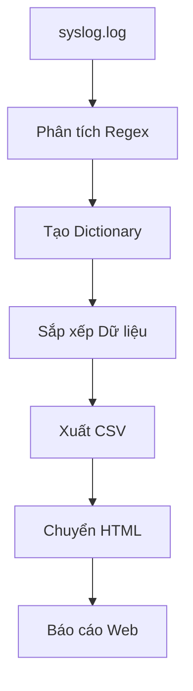

# CONV Atoms atoms v10 15

# Module 7: Dự án Ticky Check - Phân tích Log Hệ thống

## Tổng quan Bài học

| Thuộc tính | Giá trị |
|------------|---------|
| **Tên Module** | Ticky Check - Final Project |
| **Loại Nội dung** | Lab Tổng Hợp |
| **Mức Độ** | Nâng cao |
| **Thời lượng** | 4-6 giờ |
| **Kỹ năng Chính** | Regex, Dictionary, Xử lý CSV/HTML |

---

## Mục tiêu Học tập

Sau khi hoàn thành module này, học viên sẽ có khả năng:

- **Phân tích log hệ thống** sử dụng biểu thức chính quy (Regex)
- **Xử lý dữ liệu lớn** thông qua cấu trúc Dictionary
- **Tạo báo cáo tự động** từ dữ liệu thô sang định dạng HTML
- **Tích hợp đa kỹ năng lập trình** Python trong dự án thực tế

---

## Bối cảnh Vấn đề

Đội ngũ kỹ thuật đang gặp khó khăn trong việc theo dõi và phân tích các lỗi hệ thống từ phần mềm quản lý vé `ticky`. File log `syslog.log` chứa hàng nghìn dòng thông tin nhưng không có công cụ trực quan để tổng hợp và báo cáo hiệu quả.

> **Vấn đề:** Làm thế nào để chuyển đổi dữ liệu log thô thành báo cáo có thể đọc và phân tích nhanh chóng?

---

## Cấu trúc Dữ liệu Log

### Định dạng Dòng Log

```
Jan 31 00:09:39 ubuntu.local ticky: ERROR Permission denied while closing ticket (ac)
```

### Các Thành phần Chính

| Thành phần | Mô tả | Ví dụ |
|------------|-------|-------|
| **Thời gian** | Ngày/giờ sự kiện | Jan 31 00:09:39 |
| **Máy chủ** | Tên thiết bị | ubuntu.local |
| **Dịch vụ** | Tên ứng dụng | ticky |
| **Loại thông báo** | INFO/ERROR | ERROR |
| **Nội dung** | Mô tả sự kiện | Permission denied while closing ticket |
| **Người dùng** | Người liên quan | (ac) |

---

## Biểu thức Chính quy (Regex)

### Regex Trích xuất Nội dung Lỗi

```python
pattern = r"ticky: ERROR ([\w ]*) "
```

- **Giải thích:** 
  - `ticky: ERROR` - khớp chuỗi cố định
  - `([\w ]*)` - nhóm bắt dữ liệu gồm chữ cái, số, dấu cách
  - Kết quả: `"Permission denied while closing ticket"`

### Regex Trích xuất Người dùng

```python
pattern = r"\((.*)\)"
```

- **Giải thích:**
  - `\(` - khớp dấu ngoặc mở
  - `(.*)` - nhóm bắt bất kỳ ký tự nào
  - `\)` - khớp dấu ngoặc đóng
  - Kết quả: `"ac"`

---

## Cấu trúc Dữ liệu

### Dictionary Theo dõi Lỗi

```python
errors = {
    "Permission denied while closing ticket": 1,
    "Timeout while retrieving information": 1
}
```

### Dictionary Thống kê Người dùng

```python
user_stats = {
    "ac": {"INFO": 0, "ERROR": 1},
    "mdouglas": {"INFO": 1, "ERROR": 0}
}
```

---

## Sắp xếp Dữ liệu với Operator

### Sắp xếp theo Giá trị (Value)

```python
import operator

sorted_errors = sorted(errors.items(), 
                      key=operator.itemgetter(1), 
                      reverse=True)
```

### Sắp xếp theo Khóa (Key)

```python
sorted_users = sorted(user_stats.items(), 
                     key=operator.itemgetter(0))
```

---

## Quy trình Xử lý Dữ liệu



---

## Tạo File dữ liệu Mẫu

### Script tạo syslog.log

```bash
cat << 'EOF' > syslog.log
Jan 31 00:09:39 ubuntu.local ticky: INFO Created ticket [#4217] (mdouglas)
Jan 31 00:16:25 ubuntu.local ticky: INFO Closed ticket [#1754] (noel)
Jan 31 00:21:30 ubuntu.local ticky: ERROR The ticket was modified while updating (breee)
Jan 31 00:44:34 ubuntu.local ticky: ERROR Permission denied while closing ticket (ac)
Jan 31 01:33:12 ubuntu.local ticky: ERROR Tried to add information to closed ticket (mcintosh)
Jan 31 02:30:04 ubuntu.local ticky: ERROR Timeout while retrieving information (oren)
EOF
```

---

## Mô hình Giải pháp Hoàn chỉnh

```python
import re
import operator
import csv

def analyze_log():
    errors = {}
    user_stats = {}

    with open("syslog.log", "r") as f:
        for line in f:
            # Trích xuất người dùng
            user_match = re.search(r"\((.*)\)", line)
            if user_match:
                user = user_match.group(1)
                
                # Khởi tạo nếu người dùng chưa tồn tại
                if user not in user_stats:
                    user_stats[user] = {"INFO": 0, "ERROR": 0}
                
                # Phân loại và đếm
                if "INFO" in line:
                    user_stats[user]["INFO"] += 1
                elif "ERROR" in line:
                    user_stats[user]["ERROR"] += 1
                    
                    # Trích xuất nội dung lỗi
                    error_match = re.search(r"ticky: ERROR ([\w ]*) ", line)
                    if error_match:
                        error_msg = error_match.group(1).strip()
                        errors[error_msg] = errors.get(error_msg, 0) + 1

    # Sắp xếp dữ liệu
    sorted_errors = sorted(errors.items(), 
                          key=operator.itemgetter(1), 
                          reverse=True)
    sorted_users = sorted(user_stats.items(), 
                         key=operator.itemgetter(0))

    return sorted_errors, sorted_users
```

---

## Xuất dữ liệu sang CSV

### File lỗi (error_message.csv)

```python
def write_error_csv(sorted_errors):
    with open('error_message.csv', 'w', newline='') as file:
        writer = csv.writer(file)
        writer.writerow(["Error", "Count"])
        for error, count in sorted_errors:
            writer.writerow([error, count])
```

### File người dùng (user_statistics.csv)

```python
def write_user_csv(sorted_users):
    with open('user_statistics.csv', 'w', newline='') as file:
        writer = csv.writer(file)
        writer.writerow(["Username", "INFO", "ERROR"])
        for user, stats in sorted_users:
            writer.writerow([user, stats["INFO"], stats["ERROR"]])
```

---

## Chuyển đổi CSV sang HTML

### Script chuyển đổi

```bash
python3 csv_to_html.py error_message.csv /var/www/html/error.html
python3 csv_to_html.py user_statistics.csv /var/www/html/user.html
```

---

## Worksheet Thực hành

### Bài 1: Phân tích Regex

**Yêu cầu:** Viết regex để trích xuất các thành phần sau từ dòng log:
- Nội dung lỗi
- Tên người dùng
- Loại thông báo (INFO/ERROR)

**Gợi ý:** Sử dụng các pattern đã học ở trên.

### Bài 2: Xây dựng Dictionary

**Yêu cầu:** 
- Đếm số lượng lỗi theo từng loại
- Đếm số lần hoạt động của mỗi người dùng
- Phân biệt giữa INFO và ERROR

### Bài 3: Sắp xếp và Xuất CSV

**Yêu cầu:**
- Sắp xếp lỗi theo số lượng giảm dần
- Sắp xếp người dùng theo tên alphabet
- Xuất ra 2 file CSV như mô tả

---

## Quiz Kiểm tra

### Câu 1
Biểu thức regex nào sau đây đúng để trích xuất nội dung lỗi?
- A) `r"ERROR (.*)" `
- B) `r"ticky: ERROR ([\w ]*) " `
- C) `r"ERROR \[(.*)\]" `
- D) `r"ticky: (.*)" `

### Câu 2
Hàm nào dùng để sắp xếp dictionary theo giá trị?
- A) `sorted(dict, key=dict.get)`
- B) `sorted(dict.items(), key=operator.itemgetter(1))`
- C) `dict.sort(key=lambda x: x[1])`
- D) `list.sort(key=operator.itemgetter(0))`

### Câu 3
Tại sao cần sử dụng `reverse=True` trong hàm sorted?
- A) Để sắp xếp tăng dần
- B) Để sắp xếp giảm dần
- C) Để đảo ngược danh sách
- D) Để tối ưu hiệu suất

---

## Scenario Thực tế

### Tình huống
Bạn là kỹ sư hệ thống tại công ty ABC. Hệ thống quản lý vé đang gặp sự cố thường xuyên nhưng không có công cụ theo dõi hiệu quả. Quản lý yêu cầu bạn tạo báo cáo hàng tuần về:

1. **Top 10 lỗi phổ biến nhất**
2. **Người dùng gặp nhiều lỗi nhất**
3. **Người dùng thực hiện nhiều thao tác thành công nhất**

### Yêu cầu
- Viết script Python xử lý file log 1GB
- Tạo báo cáo HTML gửi email tự động
- Thiết kế giao diện thân thiện cho quản lý không chuyên kỹ thuật

---

## Tài nguyên Bổ sung

- [Regex Tester Online](https://regex101.com/)
- [Python CSV Documentation](https://docs.python.org/3/library/csv.html)
- [Operator Module Guide](https://docs.python.org/3/library/operator.html)

---

## Đánh giá Cuối khóa

### Tiêu chí Đánh giá
- **Chính xác Regex** (25%)
- **Xử lý Dictionary hiệu quả** (25%)
- **Xuất CSV đúng định dạng** (25%)
- **Tích hợp toàn bộ quy trình** (25%)

### Bài nộp
- File Python hoàn chỉnh
- 2 file CSV đầu ra
- 2 file HTML báo cáo
- Báo cáo phân tích ngắn gọn

---

## Ghi chú Quan trọng

> ⚠️ **Lưu ý:** Khi làm việc với file log lớn, cần tối ưu hóa hiệu suất bằng cách:
> - Sử dụng generator thay vì load toàn bộ vào RAM
> - Áp dụng các phương pháp xử lý luồng (streaming)
> - Kiểm tra lỗi cú pháp và exception handling

---

## Tài liệu Tham khảo

- [Regex Patterns for Log Analysis](../raw/MASTER_SOURCE_INDEX.md)
- [Dictionary Best Practices](../raw/MASTER_SOURCE_INDEX.md)
- [CSV to HTML Conversion Guide](../raw/MASTER_SOURCE_INDEX.md)

---

**© 2024 Content Engineering Team - LOM v4.4 Supreme Standard**