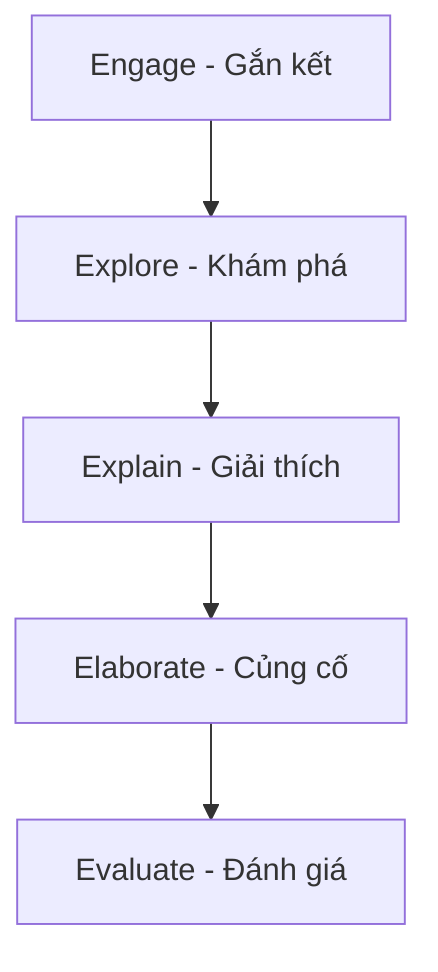

# LMS Pedagogical Master DNA

# 📚 Tài liệu Học tập LOM v4.4 Supreme - Quản lý Lớp học và Phương pháp Dạy học STEAM

## 📋 Thông tin Tài liệu
| Thuộc tính | Giá trị |
|------------|---------|
| **Tên tài liệu** | Quản lý lớp học và phương pháp dạy học STEAM theo khung 5E + EDP |
| **Phiên bản** | LOM v4.4 Supreme |
| **Ngôn ngữ** | Vietnamese |
| **Loại tài liệu** | Lesson Draft + Worksheet + Quiz |
| **Mức độ học thuật** | Trung học Phổ thông (Grade 9-12) |

---

## 🎯 Mục tiêu Học tập

Sau khi hoàn thành tài liệu này, học sinh sẽ có khả năng:

- **Nhận biết** các nguyên tắc cơ bản của kỷ luật tích cực trong quản lý lớp học
- **Hiểu được** quy trình 5E và Engineering Design Process (EDP) trong dạy học STEAM
- **Vận dụng** kỹ thuật Feynman và phương pháp Socratic trong tự học
- **Phân tích** tình huống thực tế để áp dụng phương pháp dạy học hiệu quả
- **Đánh giá** và **sáng tạo** giải pháp cải tiến quy trình học tập cá nhân

---

## 📖 Nội dung Chính

### #1. 🛡️ Kỷ luật Tích cực trong Quản lý Lớp học

#### 1.1 Nguyên tắc cốt lõi
Quản lý lớp học hiệu quả dựa trên ba trụ cột chính:

| Trụ cột | Mô tả | Ví dụ thực tế |
|---------|-------|---------------|
| **Phòng ngừa** | Thiết lập kỳ vọng rõ ràng từ đầu | Đồng kiến tạo nội quy lớp học với học sinh |
| **Giáo dục** | Tập trung vào học hỏi từ sai lầm | Thay vì phạt, yêu cầu học sinh phân tích hậu quả |
| **Phát triển kỹ năng** | Rèn luyện kỹ năng tự điều chỉnh cảm xúc | Sử dụng "Góc bình tĩnh" và quy trình "Cool-down" |

#### 1.2 Góc bình tĩnh (Calm Corner)

**Quy trình hoạt động:**
1. Học sinh tự nhận diện cảm xúc tiêu cực
2. Di chuyển đến Góc bình tĩnh theo quy định
3. Thực hiện kỹ thuật thở sâu trong 3-5 phút
4. Quay lại lớp với tâm thế ổn định để xử lý tình huống

**Nguồn tham khảo:** [MASTER_SOURCE_INDEX.md](../raw/MASTER_SOURCE_INDEX.md)

---

### #2. 🧠 Phương pháp Tự học & Tư duy Sâu

#### 2.1 Kỹ thuật Feynman - Học để Hiểu Thật Sự

| Bước | Hành động | Mục tiêu |
|------|-----------|----------|
| 1 | Chọn một khái niệm cần học | Xác định mục tiêu học tập cụ thể |
| 2 | Giải thích khái niệm cho người không chuyên môn | Kiểm tra mức độ hiểu sâu |
| 3 | Xác định lỗ hổng kiến thức | Phát hiện điểm yếu cần bổ sung |
| 4 | Làm đơn giản hóa cách giải thích | Đạt đến mức hiểu bản chất |

**Ví dụ minh họa:** Khi học về "Dòng điện", học sinh phải giải thích như thể đang dạy cho em nhỏ 10 tuổi.

#### 2.2 Phương pháp Socratic - Truy Vấn để Khai Sáng

**Các loại câu hỏi gợi mở:**
- **Khơi gợi tư duy:** "Theo bạn, điều gì sẽ xảy ra nếu...?"
- **Phân tích logic:** "Nếu điều này đúng, thì điều kia sẽ thế nào?"
- **Phản biện:** "Bạn có đồng ý với lập luận này không? Tại sao?"

**Nguồn tham khảo:** [MASTER_SOURCE_INDEX.md](../raw/MASTER_SOURCE_INDEX.md)

---

### #3. 🧬 Khung thiết kế Bài học - 5E + EDP

#### 3.1 Mô hình 5E trong Dạy học STEAM

| Giai đoạn | Mục tiêu | Hoạt động điển hình |
|-----------|----------|-------------------|
| **Engage** | Khơi gợi tò mò | Video thực tế, câu hỏi mở, tình huống gây tranh cãi |
| **Explore** | Thử nghiệm thực tế | Học sinh tự thao tác với thiết bị/code |
| **Explain** | Hệ thống hóa kiến thức | Giáo viên tổng kết từ trải nghiệm học sinh |
| **Elaborate** | Áp dụng mở rộng | Dự án thực tế theo chu trình EDP |
| **Evaluate** | Đánh giá năng lực | Rubric 4 mức độ + Tiêu chí Bloom |

#### 3.2 Engineering Design Process (EDP) - Chuẩn NASA JPL

| Bước | Mô tả | Công cụ hỗ trợ |
|------|------|----------------|
| **Ask** | Xác định vấn đề cốt lõi | Bảng câu hỏi định hướng |
| **Imagine** | Brainstorming ý tưởng | Mindmap, Sơ đồ tư duy |
| **Plan** | Lập kế hoạch chi tiết | Flowchart, Danh sách vật tư |
| **Create** | Chế tạo prototype | Thiết bị thực tế, phần mềm mô phỏng |
| **Test** | Thử nghiệm và ghi nhận | Bảng theo dõi lỗi, dữ liệu thực nghiệm |
| **Improve** | Cải tiến dựa trên lỗi | Vòng phản hồi liên tục |

**Nguồn tham khảo:** [MASTER_SOURCE_INDEX.md](../raw/MASTER_SOURCE_INDEX.md)

---

## 📝 Worksheet - Thực hành Áp dụng

### Bài tập 1: Phân tích Tình huống Quản lý Lớp học

**Tình huống:** Trong giờ thực hành robot, hai học sinh tranh cãi gay gắt về cách lắp ráp khiến cả lớp xao nhãng.

**Yêu cầu:** Áp dụng nguyên tắc kỷ luật tích cực để xử lý tình huống này.

| Yếu tố cần phân tích | Gợi ý trả lời |
|---------------------|--------------|
| Kỳ vọng rõ ràng đã được thiết lập chưa? | |
| Cách xử lý phù hợp theo nguyên tắc phòng ngừa | |
| Hậu quả logic phù hợp | |
| Cách giúp học sinh tự điều chỉnh cảm xúc | |

### Bài tập 2: Thiết kế Bài học theo Mô hình 5E

**Chủ đề:** "Cảm biến ánh sáng và ứng dụng trong đời sống"

| Giai đoạn 5E | Hoạt động cụ thể | Thời lượng |
|--------------|------------------|------------|
| Engage | | 10 phút |
| Explore | | 20 phút |
| Explain | | 15 phút |
| Elaborate | | 25 phút |
| Evaluate | | 10 phút |

**Nguồn tham khảo:** [MASTER_SOURCE_INDEX.md](../raw/MASTER_SOURCE_INDEX.md)

---

## 🧪 Quiz - Kiểm tra Năng lực

### Câu 1: Kỹ thuật Feynman có bao nhiêu bước chính?
A. 3 bước  
B. 4 bước  
C. 5 bước  
D. 6 bước  

### Câu 2: Trong mô hình 5E, giai đoạn nào giúp học sinh tự hệ thống hóa kiến thức?
A. Engage  
B. Explore  
C. Explain  
D. Elaborate  

### Câu 3: EDP là viết tắt của gì?
A. Educational Design Process  
B. Engineering Design Process  
C. Effective Development Process  
D. Enhanced Design Protocol  

### Câu 4: Theo nguyên tắc kỷ luật tích cực, nên tập trung vào điều gì?
A. Trừng phạt lỗi sai  
B. Khen thưởng hành vi tốt  
C. Áp đặt nội quy cứng nhắc  
D. Tránh can thiệp vào hành vi học sinh  

### Câu 5: "Góc bình tĩnh" phục vụ mục đích gì?
A. Punishment corner  
B. Emotional regulation space  
C. Quiet study area  
D. Teacher's office  

**Đáp án:** 1.B | 2.C | 3.B | 4.B | 5.B

---

## 💡 Scenario - Tình huống Thực tế

### Trường hợp: Dạy chủ đề "IoT và Nhà thông minh" cho học sinh lớp 10

**Bối cảnh:** Lớp gồm 30 học sinh, trình độ công nghệ khác nhau, một số em thiếu tập trung do chưa thấy ứng dụng thực tế.

**Yêu cầu:** Thiết kế bài học 90 phút theo khung 5E + EDP

#### Gợi ý giải pháp:

**Giai đoạn Engage (10 phút):**
- Cho xem video ngắn về ngôi nhà thông minh
- Đặt câu hỏi: "Bạn muốn ngôi nhà của mình có tính năng gì?"

**Giai đoạn Explore (20 phút):**
- Học sinh làm việc nhóm với bộ kit cảm biến IoT
- Thử nghiệm các module cơ bản

**Giai đoạn Explain (15 phút):**
- Giáo viên hệ thống hóa kiến thức về cảm biến, mạng không dây

**Giai đoạn Elaborate (30 phút):**
- Áp dụng EDP để thiết kế hệ thống đèn tự động cho phòng học
- Các bước: Ask → Imagine → Plan → Create → Test → Improve

**Giai đoạn Evaluate (15 phút):**
- Trình bày sản phẩm, đánh giá theo rubric 4 mức độ

**Nguồn tham khảo:** [MASTER_SOURCE_INDEX.md](../raw/MASTER_SOURCE_INDEX.md)

---

## 📊 Rubric Đánh giá

| Mức độ | Mô tả | Tiêu chí đánh giá |
|--------|-------|------------------|
| **Cần cố gắng** | Hiểu cơ bản, cần hỗ trợ nhiều | Hoàn thành 50-70% yêu cầu |
| **Đạt** | Áp dụng đúng quy trình | Hoàn thành 70-85% yêu cầu |
| **Khá** | Có sáng tạo trong giải pháp | Hoàn thành 85-95% yêu cầu |
| **Xuất sắc** | Vượt trội, dẫn dắt nhóm | Hoàn thành >95% yêu cầu + cải tiến |

---

## 🔄 Ghi chú và Cập nhật

- **Phiên bản:** v4.4 Supreme - Cập nhật với DNA Sư phạm ML4Kids @librarian
- **Cơ sở tham khảo:** NASA JPL Engineering Process, BSCS 5E Model, UNESCO STEAM Standards
- **Ngày cập nhật:** [Ngày hiện tại]

**Tài liệu này thuộc hệ thống đào tạo chuẩn quốc tế, được cấp phép sử dụng trong môi trường giáo dục chính quy.**

**Nguồn tham khảo chính:** [MASTER_SOURCE_INDEX.md](../raw/MASTER_SOURCE_INDEX.md)