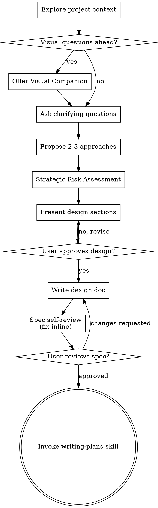

# SPEC-SPG-001: Adopt Superpowers brainstorming as Phase 0 Core Skill

> **Trạng thái:** DỰ THẢO (Chờ phê duyệt - Requires AN GO)
> **Mã hiệu:** SPEC-SPG-001
> **Giai đoạn:** Giai đoạn 2 — Core Phase 0 Adoption (Kích hoạt cổng chào)
> **Mục tiêu:** Port và chuẩn hóa `brainstorming` của Superpowers làm Phase 0 chính thức của vault, gộp logic phân tích rủi ro của `cm-planning` cũ thành phần thích nghi (adaptation section).

---

## 1. Bối cảnh & Lý do
Trong mô hình cũ, vault sử dụng `cm-planning` để lập kế hoạch triển khai. Tuy nhiên, để đồng bộ hóa với hệ thống kỹ năng Superpowers nâng cao, chúng ta chọn **Superpowers `brainstorming` làm chuẩn chính cho Phase 0** (khám phá ý định người dùng và phác thảo thiết kế nháp). 

Logic phân tích rủi ro và các cảnh báo nguy hại (Red Flags) cực kỳ xuất sắc của `cm-planning` cũ sẽ không bị bỏ phí mà được tích hợp trực tiếp thành **lớp thích nghi cục bộ** (Adaptation Layer) ngay bên trong `brainstorming`.

---

## 2. Mã nguồn nguồn & Đích đến
*   **Mã nguồn tham chiếu (Source):** `workspaces/refs/superpowers/skills/brainstorming/SKILL.md`
*   **Tệp tin cũ gộp vào (Legacy Source):** `.agent/skills/cm-planning/SKILL.md`
*   **Tệp tin đích (Target Destination):** `.agent/skills/brainstorming/SKILL.md`

---

## 3. Nội dung thiết kế kỹ thuật (Implementation Details)

Tệp tin đích `.agent/skills/brainstorming/SKILL.md` sẽ lấy 100% triết lý và checklist 9 bước của Superpowers làm nền tảng, đồng thời gộp các phần thích nghi sau:

### A. Triết lý gốc (Canonical Standard)
- Kích hoạt trước bất kỳ công việc sáng tạo, phát triển hoặc refactor nào.
- Đọc hiểu context dự án, đặt câu hỏi làm rõ **từng câu một (one question at a time)**.
- Phác thảo 2-3 hướng đi kèm trade-offs và đề xuất của Agent.
- Viết tài liệu thiết kế (Spec) ra tệp tin Markdown cục bộ trước khi chuyển sang kỹ năng tiếp theo (`writing-plans`).
- **Cấm tuyệt đối** việc viết code logic hay chỉnh sửa file chính khi chưa được người dùng phê duyệt thiết kế nháp.

### B. Phần thích nghi từ `cm-planning` (Adaptation Layer)
Chúng ta tích hợp logic của `cm-planning` vào các phần tương ứng:
1.  **Strategic Risk Assessment (Đánh giá rủi ro chiến lược)**:
    - Trong bước đề xuất thiết kế, Agent bắt buộc phải bổ sung phần đánh giá rủi ro:
        - **Impact Level** (Low/Med/High): Số lượng file và module bị ảnh hưởng.
        - **Breaking Changes**: Liệu thay đổi có nguy cơ phá vỡ tính năng đang chạy bình thường không?
        - **Security & Data Safety**: Rủi ro về rò rỉ dữ liệu hoặc lỗ hổng bảo mật.
2.  **Two-Phase Execution Rule (Quy tắc thực thi hai pha)**:
    - Đối với các dự án refactor hoặc di trú lớn, tài liệu thiết kế bắt buộc phải phân rã thành 2 luồng độc lập:
        - **Track A (Stabilize):** Chỉ tập trung vào tính tương thích và kiểm thử an toàn.
        - **Track B (Refactor):** Chứa các thay đổi có nguy cơ xung đột kèm bản đồ khôi phục (rollback map).
3.  **NoteBookLLM_Br Domain Boundary Guard**:
    - **Tuyệt đối cấm** kỹ năng brainstorming tự động tạo mới, thăng cấp (promote), hoặc ghi đè canonical atom lên `3-resources/`. Brainstorming chỉ dùng để thiết kế nháp trong chat và lưu spec cục bộ dưới dạng markdown. Mọi canonical atom bắt buộc phải qua ingest/absorb workflow chính quy và có AN GO.

---

## 4. Dự thảo nội dung tệp tin đích `.agent/skills/brainstorming/SKILL.md`

```markdown
---
name: brainstorming
description: Dùng trước công việc sáng tạo (tính năng, component). Khám phá ý định người dùng, yêu cầu và thiết kế trước khi lập trình.
---

Help turn ideas into fully formed designs and specs through natural collaborative dialogue.

Start by understanding the current project context, then ask questions one at a time to refine the idea. Once you understand what you're building, present the design and get user approval.

<HARD-GATE>
Do NOT invoke any implementation skill, write any code, scaffold any project, or take any implementation action until you have presented a design and the user has approved it. This applies to EVERY project regardless of perceived simplicity.
</HARD-GATE>

## Checklist
You MUST create a task for each of these items and complete them in order:

1. **Explore project context** — check files, docs, recent commits
2. **Offer visual companion** (if visual questions are ahead) — must be its own separate message
3. **Ask clarifying questions** — one at a time, focus on purpose/constraints/success criteria
4. **Propose 2-3 approaches** — with trade-offs and your recommendation
5. **Strategic Risk Assessment** — Assess Impact Level, Breaking Changes, and Security
6. **Present design** — in sections, get user approval after each section
7. **Write design doc** — save to `docs/superpowers/specs/YYYY-MM-DD-<topic>-design.md` and commit
8. **Spec self-review** — check for placeholders, contradictions, ambiguity, scope
9. **User reviews written spec** — ask user to review the spec file before proceeding
10. **Transition to implementation** — invoke writing-plans skill to create implementation plan

## Process Flow


## NoteBookLLM_Br Override & Risk Boundaries

- **Atomic Steps:** Mỗi bước trong kế hoạch triển khai nháp phải đạt tiêu chí nhỏ gọn (hoàn thành trong ≤ 30 phút).
- **Ranh giới Ingest:** Kỹ năng brainstorming chỉ được phép dùng cho exploration/design nháp và ghi spec markdown cục bộ. **Cấm tuyệt đối** brainstorming tự động tạo, promote, hoặc ghi đè canonical atom trực tiếp lên `3-resources/`.
- **Two-Phase Execution Rule:** Đối với các dự án di trú lớn hoặc refactor diện rộng, tài liệu thiết kế phải phân rã độc lập thành Track A (Stabilize - tương thích & kiểm thử) và Track B (Refactor - thay đổi có nguy cơ kèm rollback map).

## The Process

**Understanding the idea:**
- Check out the current project state first (files, docs, recent commits).
- Before asking detailed questions, assess scope. If too large, decompose first.
- Ask questions one at a time - focus on purpose, constraints, success criteria.
- Prefer multiple choice questions when possible.

**Exploring approaches & Risk Assessment:**
- Propose 2-3 different approaches with trade-offs. Lead with your recommended option.
- **Assess Risks:**
    - *Impact Level:* (Low/Med/High) — How many files/modules does this affect?
    - *Breaking Changes:* Will this break any currently working features?
    - *Security:* Does this create vulnerabilities?

**Presenting the design:**
- Once you believe you understand what you're building, present the design.
- Scale each section to its complexity. Cover: architecture, components, data flow, error handling, testing.
- Ask after each section whether it looks right so far.

## After the Design
- **Documentation:** Write the validated design (spec) to `docs/superpowers/specs/YYYY-MM-DD-<topic>-design.md`.
- **Spec Self-Review:** Check for placeholders, internal consistency, scope, and ambiguity. Fix inline.
- **User Review Gate:** Ask user to review the written spec. Wait for approval.
- **Implementation:** Invoke the `writing-plans` skill to create a detailed implementation plan. Do NOT invoke any other skill.
```

---

## 5. Kế hoạch khôi phục (Rollback Plan)
*   **Backup**: Trước khi ghi đè tệp tin đích `.agent/skills/brainstorming/SKILL.md`, Agent bắt buộc phải sao lưu tệp tin hiện tại sang:
    `.agent/skills/brainstorming/SKILL.md.bak` bằng công cụ tạo file.
*   **Restore**: Nếu Agent vận hành không ổn định hoặc gặp lỗi định tuyến, thực hiện khôi phục nguyên trạng tệp tin cũ bằng cách ghi đè nội dung từ `.agent/skills/brainstorming/SKILL.md.bak` quay lại `.agent/skills/brainstorming/SKILL.md` và xóa tệp tin backup.

---

## 6. Kế hoạch kiểm thử (Test Plan)
Sau khi port thành công, Agent bắt buộc phải kiểm tra lại hệ thống định tuyến bằng cách:
1.  Chạy/đọc kịch bản test case **`T001_planning_trigger.md`** dưới `.agent/tests/skill-triggering/` để xác nhận Agent tự động gọi `brainstorming` chuẩn Phase 0 khi nhận được yêu cầu phát triển mới.
2.  Xác nhận Agent nạp chính xác các chốt chặn rủi ro và **tuyệt đối không kích hoạt bất kỳ canonical write nào** lên `3-resources/` hay tự động tạo Atom.
