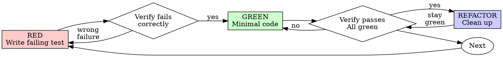

# SPEC-SPG-002: Port Superpowers test-driven-development as testing standard

> **Trạng thái:** DỰ THẢO (Chờ phê duyệt - Requires AN GO)
> **Mã hiệu:** SPEC-SPG-002
> **Giai đoạn:** Giai đoạn 3 — Verification, TDD & Systematic Debugging
> **Mục tiêu:** Port và chuẩn hóa `test-driven-development` của Superpowers làm chuẩn kiểm thử chính thức của vault, gộp logic tự sửa lỗi đệ quy của `cm-tdd` cũ thành phần thích nghi (adaptation section).

---

## 1. Bối cảnh & Lý do
Quy trình TDD (Test-Driven Development) của Superpowers là chuẩn mực kiểm thử vô cùng nghiêm ngặt ("sắt đá"). Việc di trú sang chuẩn TDD mới giúp Agent kiểm soát tuyệt đối lỗi hồi quy và đảm bảo độ tin cậy của mã nguồn logic. 

Đồng thời, cơ chế tự động sửa lỗi đệ quy (**Recursive Self-Healing**) và bộ ngắt mạch an toàn (**Circuit Breaker**) của `cm-tdd` cũ sẽ được tích hợp để hỗ trợ Agent tự động vượt qua các bài kiểm thử RED một cách tự chủ, an toàn.

---

## 2. Mã nguồn nguồn & Đích đến
*   **Mã nguồn tham chiếu (Source):** `workspaces/refs/superpowers/skills/test-driven-development/SKILL.md`
*   **Tệp tin cũ gộp vào (Legacy Source):** `.agent/skills/cm-tdd/SKILL.md`
*   **Tệp tin đích (Target Destination):** `.agent/skills/test-driven-development/SKILL.md` [NEW]

---

## 3. Nội dung thiết kế kỹ thuật (Implementation Details)

Tệp tin đích `.agent/skills/test-driven-development/SKILL.md` sẽ lấy 100% triết lý Red-Green-Refactor của Superpowers làm nền tảng, đồng thời gộp các phần thích nghi sau:

### A. Triết lý gốc (Canonical Standard)
- Luật sắt bất biến: **`NO PRODUCTION CODE WITHOUT A FAILING TEST FIRST`** (Không viết code production trước khi có test case chạy RED).
- Viết code trước test? Xóa sạch, không thương lượng và không giữ lại "tham khảo".
- Tuân thủ nghiêm ngặt chu trình: RED -> Verify RED -> GREEN -> Verify GREEN -> Refactor -> Repeat.

### B. Lớp thích nghi cục bộ (Adaptation Layer từ `cm-tdd`)
1.  **Phase 0: Thinking Stage (Giai đoạn suy nghĩ bắt buộc)**:
    - Trước khi viết bất kỳ dòng mã test nào, Agent phải:
        - Xác định rõ hành vi (Behavior) duy nhất cần test.
        - Liệt kê đầy đủ các Edge Cases (dữ liệu rỗng, sai định dạng, giá trị biên).
        - Thiết lập chiến lược Mocking (chỉ dùng khi thực sự cần cô lập logic).
2.  **Recursive Self-Healing Logic (Max 3 Loops)**:
    - Khi mã nguồn pass test ở GREEN bị lỗi runtime hoặc không pass, Agent tự chạy vòng lặp sửa lỗi đệ quy (tối đa 3 lần):
        - *Phân tích:* Đọc kỹ log lỗi để định vị nguyên nhân.
        - *Giả định:* Đưa ra giả định sửa đổi chính xác.
        - *Vá lỗi:* Dùng các công cụ edit chính xác (`replace_file_content`).
3.  **Circuit Breaker (Chốt ngắt mạch an toàn)**:
    - Nếu sau 3 lần self-healing liên tiếp test vẫn báo **FAIL**, Agent bắt buộc phải **DỪNG LẠI** và báo cáo chi tiết cho bạn kèm phân tích của từng lượt sửa lỗi, cấm lặp vô hạn gây tốn Token Budget.
4.  **Verification Guard**:
    - Agent tuyệt đối cấm báo cáo hoàn thành nhiệm vụ (DONE) hoặc chốt task khi toàn bộ test suite chưa đạt trạng thái xanh (GREEN).

---

## 4. Dự thảo nội dung tệp tin đích `.agent/skills/test-driven-development/SKILL.md`

```markdown
---
name: test-driven-development
description: Use when implementing any feature or bugfix, before writing implementation code
---

# Test-Driven Development (TDD)

Write the test first. Watch it fail. Write minimal code to pass.

**Core principle:** If you didn't watch the test fail, you don't know if it tests the right thing.

<EXTREMELY-IMPORTANT>
NO PRODUCTION CODE WITHOUT A FAILING TEST FIRST

Nếu lỡ viết code trước test? Xóa sạch và làm lại từ đầu. Delete means delete.
</EXTREMELY-IMPORTANT>

## Phase 0: Thinking Stage (Giai đoạn suy nghĩ bắt buộc)

Trước khi viết bất kỳ dòng test code nào, agent bắt buộc phải:
1. Xác định hành vi (Behavior) cụ thể cần được kiểm tra.
2. Liệt kê toàn bộ các Edge Cases (dữ liệu rỗng, sai định dạng, giá trị biên).
3. Thiết lập chiến lược Mocking (hạn chế tối đa mock trừ khi không thể cô lập).

## Red-Green-Refactor Cycle



### 1. RED - Write Failing Test
Write one minimal test showing what should happen. Edge cases and clean names are mandatory.

### 2. Verify RED - Watch It Fail
MANDATORY. Run the test suite and confirm it fails due to missing features or reproducing the exact bug (not typos).

### 3. GREEN - Minimal Code
Write the simplest and minimal production code to pass the test. Do not over-engineer. Follow YAGNI strictly.

### 4. Verify GREEN & Recursive Self-Healing (Max 3 Loops)
Run the test again. 
- If the test **passes**, proceed to Refactor.
- If the test **fails**, trigger the **Recursive Self-Healing Loop**:
    1. **Analyze:** Read the error log carefully to locate the bug.
    2. **Hypothesize:** Formulate a solid hypothesis on why the code failed.
    3. **Patch:** Apply a precise fix using precise edit tools.
    4. **Circuit Breaker:** Nếu sau **3 lần tự vá lỗi liên tiếp** test vẫn FAIL, agent **BẮT BUỘC PHẢI DỪNG LẠI** và báo cáo lỗi cho con người kèm phân tích chi tiết của 3 nỗ lực.

### 5. REFACTOR - Clean Up
Remove duplication, improve names, and simplify structure. Ensure tests remain green.

## Rules of Discipline
- **Zero Placeholder:** Cấm sử dụng "TODO" hoặc stub code trong các production files.
- **Verification Guard:** Tuyệt đối không báo DONE hoặc chốt task khi toàn bộ test suite chưa đạt trạng thái xanh (GREEN).
- **Isolated Tests:** Mỗi test file phải độc lập, không phụ thuộc vào trạng thái test trước đó.
- **No Test Altering:** Tuyệt đối cấm sửa đổi Test Case để làm nó pass thay vì sửa production code.
```

---

## 5. Kế hoạch khôi phục (Rollback Plan)
*   **Backup**: Vì đây là tệp tin mới tinh (`[NEW]`), phương án khôi phục là xóa tệp tin mới tạo:
    `.agent/skills/test-driven-development/SKILL.md` và dọn dẹp thư mục nếu rỗng.

---

## 6. Kế hoạch kiểm thử (Test Plan)
Sau khi port thành công, Agent bắt buộc phải kiểm tra lại hệ thống định tuyến bằng cách:
1.  Chạy/đọc kịch bản test case **`T003_tdd_trigger.md`** dưới `.agent/tests/skill-triggering/` để xác nhận Agent tự động gọi `test-driven-development` chuẩn Phase 3 khi nhận được yêu cầu viết logic mới.
2.  Xác nhận Agent nạp chính xác chốt mạch an toàn và **tuyệt đối không kích hoạt bất kỳ canonical write nào** lên `3-resources/` khi chạy thử kịch bản test.
