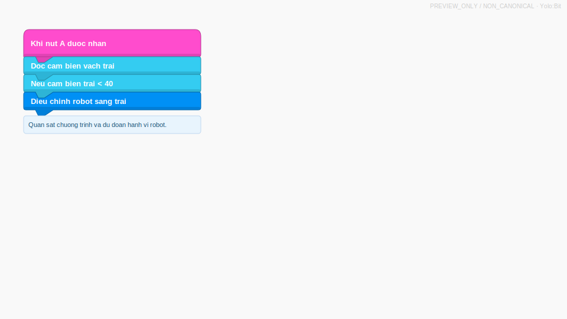

::: {.callout-note}
Status: `PREVIEW_ASSESSMENT`, `PREVIEW_ONLY`, `NON_CANONICAL`.
:::

## Media Prompt

Quan sat chuong trinh va du doan hanh vi robot.

{fig-alt="So do khoi OhStem dieu khien robot bam vach."}

## Export Commands

```powershell
quarto render exam_export.qmd --to html
quarto render exam_export.qmd --to docx
```
