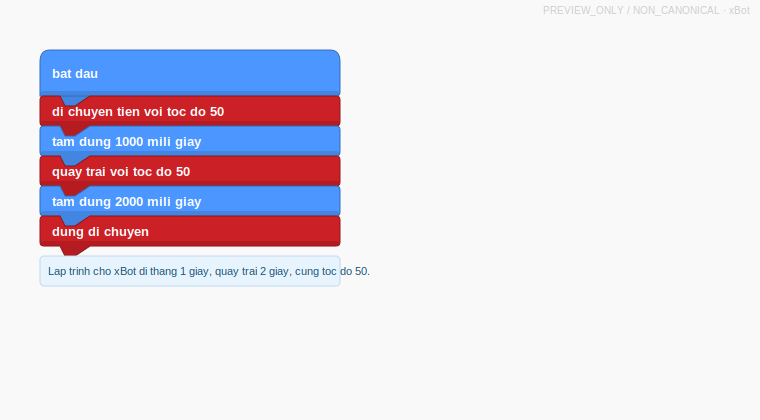

::: {.callout-note}
Status: `PREVIEW_ASSESSMENT`, `PREVIEW_ONLY`, `NON_CANONICAL`.
:::

## Media Prompt

Lap trinh cho xBot di thang 1 giay, quay trai 2 giay, cung toc do 50.

{fig-alt="So do khoi OhStem preview cho xBot di thang 1 giay roi quay trai 2 giay voi toc do 50."}

## Export Commands

```powershell
quarto render exam_export.qmd --to html
quarto render exam_export.qmd --to docx
```
