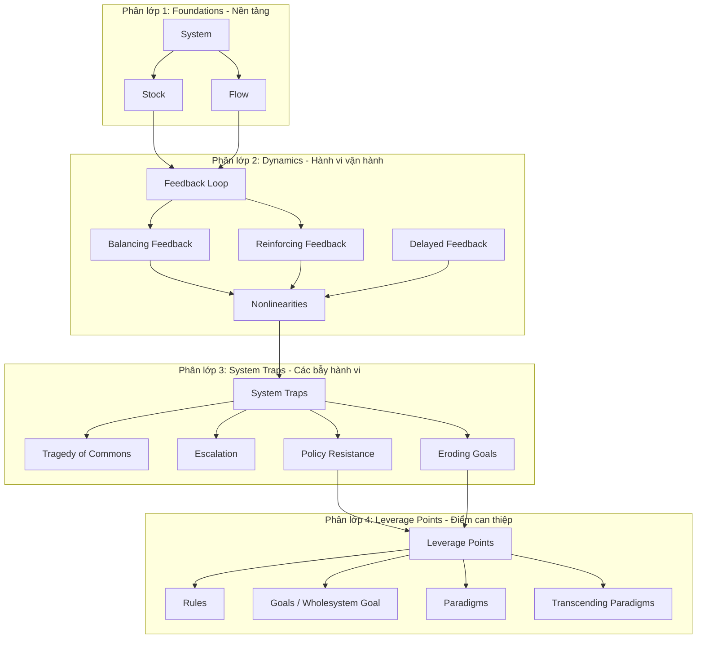

# Kế Hoạch Triển Khai: Cấu Trúc Lại Workflow & Thiết Lập Sơ Đồ Tri Thức Phi Tuyến Tính (ARCH_TIS)

Bản kế hoạch chi tiết nhằm tái cấu trúc lại workflow trong Vault để chuyển dịch từ cách học **tuyến tính (theo chương sách)** sang cách học **phi tuyến tính (theo mạng lưới ngữ nghĩa / Semantic Graph)**.

Kế hoạch này phân định cực kỳ nghiêm ngặt **CÁC NỘI DUNG ĐƯỢC LƯU Ở ĐÂU** trong Vault Obsidian để bảo vệ tính ngăn nắp và cấu trúc hệ thống của anh.

---

## 1. Thiết Kế Sơ Đồ Tri Thức Phi Tuyến Tính (Semantic Network)

Tư duy hệ thống bản chất là phi tuyến tính. Sơ đồ tri thức tổng sẽ liên kết 29 Atom hiện có và 18 Atom mới thành một mạng lưới logic gồm 4 phân lớp rõ ràng:

---

## 2. Kế Hoạch Tái Cấu Trúc Workflow & Tinh Gọn Hệ Thống

Để giải quyết triệt để lo ngại của anh về việc **có quá nhiều workflow cồng kềnh (15 file)**, chúng ta sẽ áp dụng triết lý thiết kế bậc cao: **"Giảm bề mặt tiếp xúc người dùng (User-facing Surface), đưa các Stage Gates kỹ thuật ra khỏi thư mục quy trình và chuyển thành Hợp đồng Đặc tả Nội bộ"**.

Chúng ta sẽ di chuyển 6 tệp stage con ra khỏi `.agent/workflows/` và gom chúng vào một tệp đặc tả hợp đồng duy nhất. Thư mục `.agent/workflows/` từ nay chỉ chứa đúng **7 file quy trình cốt lõi** có thể gọi trực tiếp.

Dưới đây là các cấu phần chi tiết và **địa chỉ lưu trữ chính xác** của chúng trong Vault:

### Bước 1: Nâng cấp Workflow mặc định (Tích hợp Semantic Learning Map Mode)
*   **Nhiệm vụ:** Định nghĩa quy chuẩn, giao thức kết nối chéo giữa các Atom và thuật toán xây dựng sơ đồ ngữ nghĩa trực tiếp bên trong workflow mặc định.
*   **Nơi lưu trữ trong Vault:**
    👉 **`d:\NoteBookLLM_Br\.agent\workflows\learning-first.md`**
    *(Tích hợp chế độ `Semantic Learning Map Mode` trong tệp quy trình sẵn có để tránh phình to hệ thống, quy định output cấm ghi đè vào `3-resources/`).*

### Bước 2: Thiết lập Hợp đồng Stage Gates nội bộ (The Ingest Stage Contracts)
*   **Nhiệm vụ:** Tệp đặc tả kỹ thuật nội bộ duy nhất lưu giữ toàn bộ 6 cổng kiểm soát (Gates) của Ingest Lifecycle để chống ảo tưởng, kiểm chứng dữ liệu, chống nạp trùng nguồn tri thức và cho phép khôi phục chính xác (resume).
*   **Nơi lưu trữ trong Vault:**
    👉 **`d:\NoteBookLLM_Br\.agent\contracts\ingest-stage-contracts.md`**
    *(Lưu trữ ngoài thư mục workflows, làm giảm thực tế số lượng workflow tệp tin, giúp Agent và người dùng không bị nhiễu thông tin).*

### Bước 3: Thiết lập các Lộ trình Học phi tuyến (Non-Linear Learning Paths)
*   **Nhiệm vụ:** Xây dựng các lộ trình học cá nhân hóa phi tuyến tính nháp (Chẩn đoán bẫy, Thiết kế đòn bẩy...) cho iPad/di động.
*   **Nơi lưu trữ trong Vault:**
    👉 **`d:\NoteBookLLM_Br\1-projects\learning_maps\`**
    *(Lưu trữ dưới dạng tệp non-canonical preview, tuyệt đối cấm ghi trực tiếp vào `3-resources/`).*

---

## 3. Chiến Dịch Tinh Gọn Workflow (Workflow Cleanup Manifest)

Chúng ta thực hiện dọn dẹp triệt để thư mục `.agent/workflows/` như sau:

1.  **Di chuyển 6 tệp Stage Gates con** ra khỏi `.agent/workflows/` và gộp vào **`d:\NoteBookLLM_Br\.agent\contracts\ingest-stage-contracts.md`**.
2.  **`setup-notebooklm-mcp.md`** -> Di chuyển sang `.agent/docs/setup-guides/` (SOP cài đặt một lần).
3.  **`source-first-ingest.md`** -> Di chuyển sang `.agent/docs/references/` (Tài liệu triết lý cũ).
4.  **`autonomous-dev-task.md`** -> **Giữ nguyên** tại `.agent/workflows/` để tránh gãy các liên kết routing và overlay hiện có của `dev-lab`.

### Kết quả danh mục 7 workflows cốt lõi có thể gọi trực tiếp:
1.  `knowledge-intake.md` (Định tuyến)
2.  `learning-first.md` (Học mặc định & Semantic Learning Map)
3.  `ingest-lifecycle.md` (Nạp chính thức - Điều phối trỏ về tệp contracts)
4.  `incremental-ingest.md` (Nạp bổ sung Atom)
5.  `file-back.md` (Thăng cấp note lên wiki)
6.  `lint.md` (Kiểm toán hệ thống)
7.  `autonomous-dev-task.md` (Tác vụ dev tự động)

---

## 4. Ranh Giới An Toàn & Đóng Băng Đường Dẫn (Guardrails)

*   **Không vi phạm Core Freeze:** Không sửa đổi, đổi tên các thư mục đóng băng. Mọi tệp tin được lưu đúng thư mục chức năng đã quy định.
*   **Ranh giới cấm ghi:** `learning-first` chỉ được ghi nháp vào `1-projects/learning_maps/`, cấm ghi `3-resources/`. Việc tạo tệp sơ đồ vĩ mô chính thức sẽ tách thành task riêng ở tương lai có `synthesis_guard.py` và cần exact-path GO riêng.
