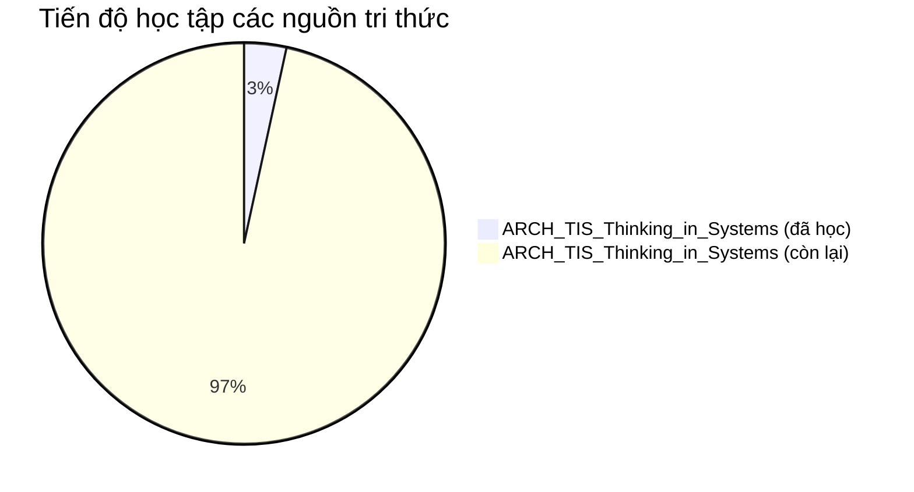

# 📊 HỆ THỐNG GIÁM SÁT TIẾN ĐỘ HỌC TẬP — LEARNING DASHBOARD
> [!NOTE]
> Cập nhật tự động vào: **2026-05-20 16:13:14**.
> File này chứa bảng theo dõi tiến độ thời gian thực (Mermaid + DataviewJS) và hàng đợi ôn tập thông minh (SM-2 Spaced Repetition).

## 📈 Tiến độ học tập theo Nguồn tri thức
| Nguồn học tập | Tiến trình (%) | Lộ trình | Giao diện đọc (HTML / EPUB) |
| :--- | :--- | :--- | :--- |
| **Thinking in Systems: A Primer** (SOURCE_ARCH_TIS_Thinking_in_Systems) | `░░░░░░░░░░` 3.4% | [📝 Mở Lộ trình](paths/LEARNING_PATH_SOURCE_ARCH_TIS_Thinking_in_Systems.md) | [🌐 HTML Reader](file:///D:/NoteBookLLM_Br/workspaces/learning/dashboard/packs/html/LEARNING_PACK_SOURCE_ARCH_TIS_Thinking_in_Systems.html) / [📚 Sách EPUB](file:///D:/NoteBookLLM_Br/workspaces/learning/dashboard/packs/epub/LEARNING_PACK_SOURCE_ARCH_TIS_Thinking_in_Systems.epub) |

### 📊 Biểu đồ so sánh Tiến độ các nguồn


## 🔄 Hàng đợi Ôn tập Hôm nay (Spaced Repetition Queue)
Áp dụng thuật toán **SuperMemo SM-2** để tối ưu hóa trí nhớ dài hạn:

| Concept Atom | Trạng thái học | Ngày ôn tập kế tiếp | Ease Factor | Khoảng cách (ngày) | Lộ trình nguồn |
| :--- | :---: | :---: | :---: | :---: | :--- |
| [[CONCEPT_ARCH_TIS_Stock]] | `IN_PROGRESS` | `2026-05-21` | `2.18` | `1` | [Thinking in Systems: A Primer](paths/LEARNING_PATH_SOURCE_ARCH_TIS_Thinking_in_Systems.md) |
| [[CONCEPT_ARCH_TIS_System]] | `LEARNED` | `2026-05-26` | `2.50` | `6` | [Thinking in Systems: A Primer](paths/LEARNING_PATH_SOURCE_ARCH_TIS_Thinking_in_Systems.md) |

## 🔌 Obsidian DataviewJS Integration (Thời gian thực)
> [!TIP]
> Nếu AN đã cài Community Plugin **Dataview** và **Heatmap Tracker**, Obsidian sẽ tự động vẽ biểu đồ nhiệt tiến trình commit học tập cực đẹp giống hệt GitHub:

```dataviewjs
const calendarData = {
    year: new Date().getFullYear(),
    colors: {
        blue: ["#eff6ff", "#dbeafe", "#bfdbfe", "#60a5fa", "#1d4ed8"],
    },
    entries: []
}

// Quét toàn bộ Concept Atoms có ghi nhận thực hành MASTERED hoặc LEARNED
for (let page of dv.pages('"3-resources/wiki"')) {
    if (page.learning_status && page.last_reviewed) {
        let intensity = 2;
        if (page.learning_status === "MASTERED") intensity = 4;
        else if (page.learning_status === "LEARNED") intensity = 3;
        
        calendarData.entries.push({
            date: page.last_reviewed.split(" ")[0],
            intensity: intensity,
            content: page.learning_status + ": " + page.file.name
        });
    }
}

if (typeof renderHeatmapCalendar !== "undefined") {
    renderHeatmapCalendar(this.container, calendarData);
} else {
    dv.paragraph("⚠️ *Lưu ý: Để hiển thị biểu đồ nhiệt (Heatmap) dạng ô vuông màu sắc giống GitHub, bạn hãy cài đặt plugin **Heatmap Calendar** trong Obsidian settings.*");
    
    // Fallback: Vẽ một bảng danh sách commit học tập đơn giản nhưng đẹp mắt
    if (calendarData.entries.length > 0) {
        dv.header(3, "📅 Nhật ký thực hành gần đây");
        dv.table(
            ["Ngày học", "Trạng thái", "Tên Concept Atom"], 
            calendarData.entries.map(e => [e.date, e.content.split(": ")[0], e.content.split(": ")[1]])
        );
    } else {
        dv.paragraph("*Chưa có lịch sử học tập nào được ghi nhận dưới dạng LEARNED hoặc MASTERED.*");
    }
}
```
